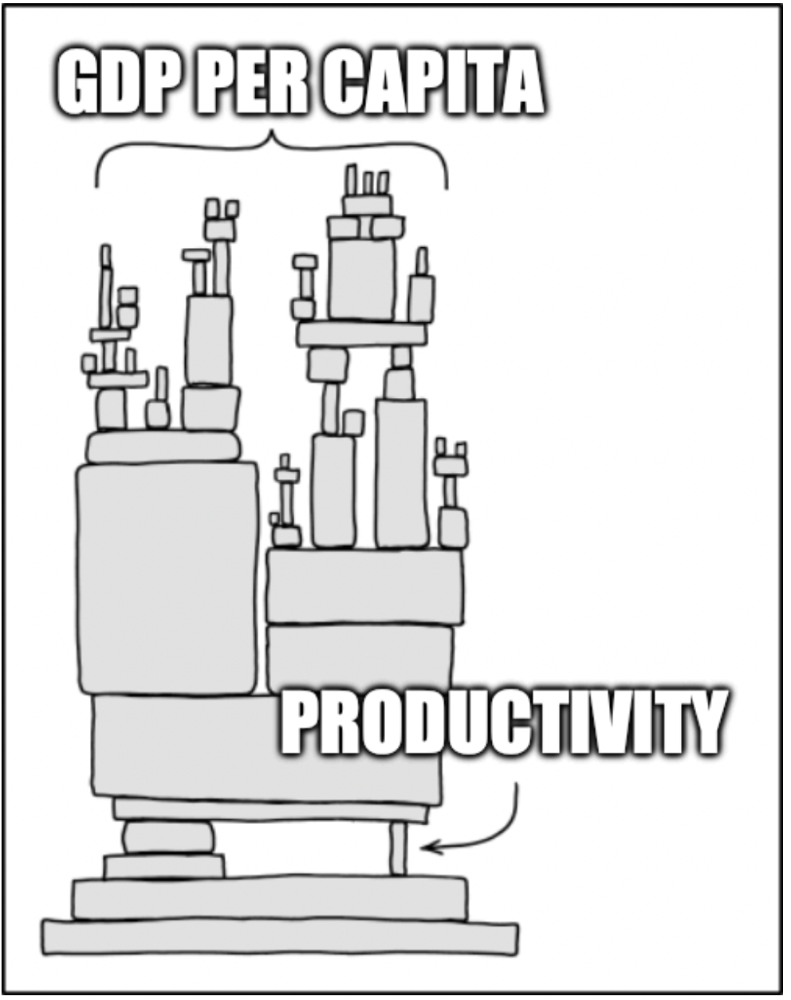

# Development accounting
{: .no_toc }

1. TOC 
{:toc}

## Comparisons across countries
To start let's be more systematic about comparing countries and what drives differences in their GDP per capita. All we need for this at the moment is the production function

$$
Y_i = K_i^{\alpha} (A_i h_i L_i)^{1-\alpha}. 
$$

The value $i$ just refers to some specific country. This looks the same as our normal production function, except that we've got the $h_i$ in there accounting for human capital per person. You can look back at how we measure [human capital](https://growthecon.com/StudyGuide/solow/human.html) to understand that term. Basically, it measures "skills" by using data on years of schooling. 

We want to put this into a form measuring GDP per capita, where $N$ is the number of *people*, while we continue to use $L$ to measure the number of *workers*. Part of the reason for variation across countries will be variation in their employment ratio, $L/N$.

We also want to do this in a smart way so that each element describing GDP per capita in a country ($Y_i/N_i$) has a clear connection to the models we've developed so far. 

First we're going to divide through as follows

$$
Y_i = \left(\frac{K_i}{A_i h_i L_i} \right)^{\alpha} A_i h_i L_i,
$$

Then you're going to note that

$$
\frac{K_i}{Y_i} = \frac{K_i}{K_i^{\alpha} (A_i h_i L_i)^{1-\alpha}} = \left(\frac{K_i}{A_i h_i L_i} \right)^{1-\alpha}.
$$

This means we can write

$$
Y_i = \left(\frac{K_i}{Y_i}\right)^{\alpha/(1-\alpha)} A_i h_i L_i. 
$$

and that GDP per capita, $y_i = Y_i/N_i$, for a given country $i$ is

{: .important}
$$
y_i = \left(\frac{K_i}{Y_i}\right)^{\alpha/(1-\alpha)} A_i h_i \frac{L_i}{N_i}
$$

This tells us that several components explain GDP per capita in a country, and that these same components can help us understand why some countries are richer than others.

1. $(K_i/Y_i)^{\alpha/(1-\alpha)}$ is the capital/output ratio, and we know that this reflects choices in the economy about how much to devote to building capital, $s_I$, as well as depreciation, population growth, and the growth rate of productivity.
2. $h_i$ is the measure of human capital or skills per person. 
3. $L_i/N_i$ is the employment ratio.
4. $A_i$ is productivity, or how well the country uses all of those factors of production. 

Each of those components could be a reason for why one country is rich while another is poor. But the raw numbers measuring each aren't that informative. The raw numbers are down in the final section of this page. So what we're going to do to clarify things is measure every country relative to some baseline. In this case we'll use the US as the baseline, but we could use any country. All we want to do is scale everything by a common reference point. 

For each country we look at the ratio $y_i/y_{US}$, or GDP per capita in country $i$ relative to the US. If that number is 0.78, then we know GDP per capita is 78% of that in the US. If we use the above equation to describe GDP per capita, we get that this ratio is

{: .important}
$$
	\frac{y_i}{y_{US}} = \left[\frac{(K/Y)_i}{(K/Y)_{US}}\right]^{\alpha/(1-\alpha)} \frac{A_i}{A_{US}} \frac{h_i}{h_{US}} \frac{(L_i/N_i)}{(L_{US}/N_{US})}
$$

That means we can use the raw data to calculate each ratio you see on the right-hand side. The combination of these gives us information on which component - capital, human capital, employment ratio, or productivity - is driving differences between countries.

## Results
This will make more sense by looking at the actual data. This table gives you the results for every country with sufficient data from 2019. It uses the [Penn World Tables](https://www.rug.nl/ggdc/productivity/pwt/) which are a standard source for cross-country information because they have explicitly done the price adjustments we talked about in the [Measuring GDP](https://growthecon.com/StudyGuide/gdp/gdp.html) section so that GDP is comparable across countries.

<iframe width="900" height="600" frameborder="0" scrolling="yes" src="../plotly/pwt-dev-acct.html"></iframe>

On the first page of that table you can see United Arab Emirates (or should). The number for "GDP p.c." is the ratio $y_i/y_{US}$. That number is 1.061, meaning that GDP per capita in UAE is a little higher (about 6.1%) than in the US. Why? Well, UAE has a capital/output ratio term that by itself would give them living standards 1.359 higher than in the US. UAE has a lot of capital. But in human capital, the number is only $h_i/h_{US} = 0.733$, so the rough skills of workers in the UAE is lower than in the US. The employment ratio of 1.236 means they have more workers per person, which helps to make them richer. And productivity is 0.862, so that $A_i$ is not quite as high. Even if UAE had all the same factors as the US, it would still be poorer because it apparently doesn't quite use them as efficiently. Note that these work together according to the equation above. Note that $1.061 = 1.359 \times 0.733 \times 1.236 \times 0.862$. 

Now look at a relatively poor country, like Albania. Their GDP per capita is 0.207, or about 20% of that in the US. Why? Their K/Y ratio would give them *higher* GDP per capita, 1.281, so the answer lies elsewhere. Human capital is only 0.791, and the employment ratio is only 0.776. But really the biggest source of lower living standards is the productivity term 0.263. For a given set of factors, Albania would only get about 26% as much output from them as the US. For *some* reason they don't use factors efficiently. Other sections will look at why, but first let's establish some regularities to this importance of productivity.

## Productivity matters
If you scroll through the table or look at particularly poor countries, you'll start to see a few things. Mainly, that it looks like the $A_i/A_{US}$ terms seem to explain quite a bit. We can plot these out to see this more clearly.

This first figure shows how the values of the relative K/Y terms compar to the relative size of GDP per capita. Note that whatever the relative GDP per capita, the values of relative K/Y are all around 1, meaning that every country has a pretty similar K/Y ratio. Or, rather, there is variation in K/Y, but as a rule it doesn't line up exactly with how rich a country is. There are lots of poor countries with high values of K/Y. So this isn't a major explanation for relative GDP per capita.

<iframe width="900" height="600" frameborder="0" scrolling="yes" src="../plotly/pwt-dev-ky.html"></iframe>

Next is human capital. Same kind of figure, but here there is a little more information. Note that for very poor countries, they do have relatively low values of $hc_i/hc_{US}$. So there is some explanatory power for human capital. But outside of very poor countries, most countries have values similar to the US. 

<iframe width="900" height="600" frameborder="0" scrolling="yes" src="../plotly/pwt-dev-hc.html"></iframe>

Finally, take a look at productivity. In this case relative $A_i/A_{US}$ lines up almost directly with relative GDP per capita $y_i/y_{US}$. You can predict nearly exactly how rich a country will be just by knowing their relative value of $A$. In that sense productivity - or the efficiency of how a country uses factors - is the most relevant thing to study for understanding why some countries are rich and some are poor.

<iframe width="900" height="600" frameborder="0" scrolling="yes" src="../plotly/pwt-dev-tfp.html"></iframe>

That's probably so important we should set this off.

{: .important}
Differences in GDP per capita across countries are primarily due to differences in productivity, A, with smaller contributions from differences in human capital and employment ratios. Differences in capital/output ratios are not that important.

## Raw data
The raw data necessary to make all the development accounting calculations is in the following table. The human capital per capita term is given directly by the Penn World Tables. Population and employment are in millions. GDP is millions of PPP adjusted dollars, meaning this accounts for price differences across countries. K is millions of PPP adjusted dollars of capital. HC per capita uses years of schooling and Mincer equation to derive a measure of human capital.

<iframe width="900" height="600" frameborder="0" src="../plotly/pwt-dev-raw.html"></iframe>
