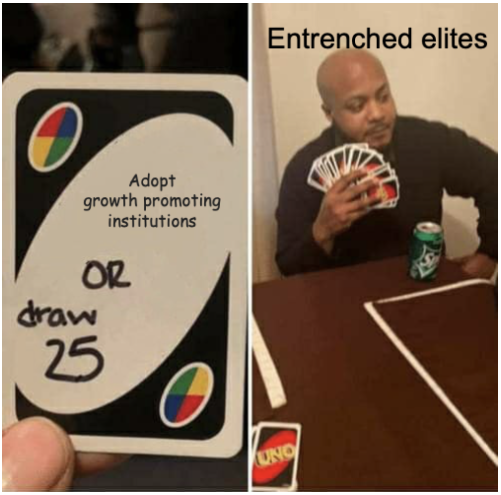

# Institutional Inertia
{: .no_toc }

1. TOC 
{:toc}

If social infrastructure or institutions are so important for development, why don't countries adopt the best version of them? These are ideas, certainly, and so are non-rival. A country can create a good social infrastructure without lowering the social infrastructure in another. What is stopping places from making these changes? 

This gets to very long-run questions about why some places ended up rich relative to others. Douglass North, in *Structure and Change in Economic History* (1981) laid it out this way:
> From the redistributive societies of ancient Egyptian dynasties through the slavery system of the Greek and Roman world to the medieval manor, there was a persistent tension between the ownership structure which maximized the rents to the ruler (and his group) and an efficient system that reduced transaction costs and encouraged economic growth. This fundamental dichotomy is the root cause of the failure of societies to experience sustained economic growth. (p. 25)

Here we want to lay out some logic about how economies can get "stuck" with bad institutions and stay relatively poor, and that also helps us see how they could get out of that bad position and grow.

## Misallocation again
Let's go back to the misallocation model to understand *one* way of thinking about the incentives for institutions. There, we thought about a model where there are $N$ different varieties that *could* be used, but only $M$ of the are used. That made the economy worse off. In that section I just said, "eh, institutions?" as an explanation for why. 

Here, let's be more specific. Let's say that whatever the specific institutional structure, it is the case that the *incumbent* varieties have to agree to let a new variety join the economy. This could be existing producers lobbying Congress to enact regulations that stop new entrants, or it could be incumbents colluding to patent troll the new variety or engage in frivilous lawsuits. Whatever the particulars, the incumbents have some ability to block new varieties. Why would they do so? 

To answer that we have to be specific about profits. In the ideas section we discussed profit shares as a way of thinking about firms deciding to do R&D. We said that $s_{\pi}$ was the share of GDP that went to economic profits. Let's keep that same notation. But now note that we're talking about the economic profits going to the incumbent varieties. There are $M$ varieties, so the profits to any individual variety (firm) $i$ are

$$
\pi_i = s_{\pi} \frac{Y}{M}
$$

where I've assumed they all earn an equal share of the total profits. 

What is going to happen if they let in a new variety? If they do, $Y$ will go up, we know that because of the production function with varieties. But $M$ will go up meaning those total profits get diluted a little more. 

So for the incumbents to allow a new variety in, the gain in output would have to be more than the loss in profits due to the increase in $M$. 

Plug in the production function $Y = K^{\alpha}(ML)^{1-\alpha}$ from the misallocation section to this equation for profits. You get

$$
\pi_i = s_{\pi} \frac{K^{\alpha}(ML)^{1-\alpha}}{M} = s_{\pi} \left(\frac{K}{M}\right)^{\alpha}L^{1-\alpha}.
$$

You can probably already see the problem. What happens to $\pi_i$, the profits of an incumbent, if the size of $M$ is allowed to go up? It falls. The dilution across varieties is stronger than the addition being made to output. There are diminishing returns to $M$, so the increase in output can't keep up with having to spread the profits out across more varieties. None of the incumbents have an incentive to vote "Yes" to allow in a new variety. 

One other thing to note about this is that the effect of increasing $M$ on profits gets *smaller* as $M$ increases. It's always negative, but the negative effect becomes tiny if $M$ is already big. If there are thousands of firms to share with, then sharing with thousands plus one isn't a big difference. You can see this by looking at the derivative of $\pi_i$ with respect to $M$

$$
\frac{\partial \pi_i}{\partial M} = -\alpha s_{\pi} \frac{K^{\alpha}L^{1-\alpha}}{M^{1+\alpha}}.
$$

This derivative is less than zero (so incumbents vote no) but note that as $M$ gets bigger this derivative itself gets closer to one. Once the economy is diversified a lot, the strength of the "no" vote gets weaker. 

## Bargaining, the third stage of grief
So we're doomed? If the incumbents have a veto on new varieties, there doesn't seem to be a way to add them. Invariably their profits go down. What are some ways out of this? 

The first and most obvious would be to remove the veto from existing varieties. In principle, with a set of rules protecting private property and institutions that make starting new businesses easy, there should not be a way for existing varieties to stop new ones from entering. You might call that the free market ideal - free entry. It's doubtful that any economy really has that kind of free entry, but we do know that some places make it *very* easy to start a business while others put up a lot of frictions. Low friction places are richer, which is consistent with allowing new varieties to enter and expand output despite incumbents losing profits. 

But let's say that incumbents do have some veto power (or can at least increase the costs for potential entrants). Is there a way to bargain with the incumbents to allow the new entrant in? We - your average person in the economy - would like to have more varieties and higher GDP. So in principle we'd be willing to make this bargain if we cannot eliminate the veto power (which again, is the first best choice here).

We could say to the incumbents that if they allow new varieties to enter, then we agree to let the share of GDP going to economic profits, $s_{\pi}$, increase even further to make up for their loss. If $s_{\pi}$ goes up by enough the incumbents could keep the same level of profits, but we (might) benefit from the additional increase in GDP. Let's look at this from both sides. 

### Incumbents
How much does $s_{\pi}$ have to go up for them to keep their profits at least as large as before? Now we're changing two things, so we need to think about the total derivative of their profits with respect to a change in both the number of varieties, $dM$, and the profit share, $ds_{\pi}$. The change in the profits of an individual incumbent is

$$
d\pi_i = \frac{K^{\alpha}(ML)^{1-\alpha}}{M} ds_{\pi} - \alpha s_{\pi} \frac{K^{\alpha}L^{1-\alpha}}{M^{1+\alpha}} dM
$$

The first term on the right is the change in incumbent profit due just to the change in profit share - this just scales up their existing profits based on the original number $M$ firms. The second term on the right is the negative effect of adding new firms to their profits, taking the original profit share as given. 

Under what conditions will $d\pi_i \geq 0$? In other words, in what situations will the incumbents make at least as much as before, and presumably will support the addition of new firms? Solve the above equation for

$$
\frac{K^{\alpha}(ML)^{1-\alpha}}{M} ds_{\pi} \geq \alpha s_{\pi} \frac{K^{\alpha}L^{1-\alpha}}{M^{1+\alpha}} dM
$$

which reduces to

$$
\frac{ds_{\pi}}{s_{\pi}} \geq \alpha \frac{dM}{M}.
$$

The growth rate of the profit *share* (the left side) has to be larger than the scaled (by $\alpha$) growth rate of new varieties. If $\alpha = 0.3$ and we're talking about negotiating over a 2% increase in varieties, then the profit share has to grow at the rate 0.006, or 0.6%. That doesn't sound like much, and profit shares are already numbers between 0 and 1. If $s_{\pi}$ starts out at 0.15, then this saying that the profit share has to grow to 0.15(1+.006) = 0.1509, or from 15% to 15.1% (or more). 

### Us
Alright, so we know how much the incumbents have to get to possibly be on board with our plan to increase varieties. Is it worth it for us? We are giving up some fraction of GDP to get this. And before we start we have to be careful about what we mean by "us". I'm talking here about "us" as the remaining owners of factors in the economy - capital and labor. That includes workers and capital owners. Capital includes housing, so in large part that is going to include "regular people".

I don't know how "we" are going to divide our portion of GDP. All "we" care about is the total pie we have to divide. Our total income is:

$$
Income = (1-s_{\pi})K^{\alpha}(ML)^{1-\alpha},
$$

meaning we get the non-profit share of total GDP. Do we have more if we let $s_{\pi}$ go up (lowering our share) but in return $M$ goes up (increasing GDP)? Again, we need a total derivative. 

$$
dIncome = (1-s_{\pi})K^{\alpha}L^{1-\alpha}(1-\alpha)M^{-\alpha} dM - K^{\alpha}(ML)^{1-\alpha} ds_{\pi}.
$$

The first term on the right is the change in income we get from letting $M$ go up, and it reflects the marginal product of varieties. The second (negative) term on the right is the decrease in income we endure because we let the profit share go up. 

Under what conditions will income go up, meaning $dIncome \geq 0$? 

$$
(1-s_{\pi})K^{\alpha}L^{1-\alpha}(1-\alpha)M^{-\alpha} dM \geq K^{\alpha}(ML)^{1-\alpha} ds_{\pi}
$$

This wil hold when (simplify the above)

$$
\frac{ds_{\pi}}{s_{\pi}} \leq (1-\alpha) \frac{dM}{M} \frac{1-s_{\pi}}{s_{\pi}}
$$

In our case we need the growth rate of profits to be *less* than some number related to the growth rate of varieties. This makes sense. We can't have the profit rate go up too much or it swallows all the gains. What does this limit look like? Let's say that $\alpha = 0.3$ again, and $dM/M = 0.02$ again, and the profit share is $s_{\pi} = 0.15$ to start with again. Then this condition says that the profit share growth rate has to be less than or equal to (1-0.3)x0.02x(0.85/0.15) = 0.08. Or if the profit share grows at less than 8%, we're good. 8% growth in the profit share is 0.15(1.08) = 0.162. If we keep the profit share less than 16%, basically, we'd prefer the situation with more varieties.

### Agreement?
It seems like there is room to compromise. Using the numbers in the above sections, incumbents were willing to endure a 2% growth in varieties if the profit share went up from 15% to *at least* 15.1%. We were ready to concede some kind of increase in profit share to get that 2% increase in varieties so long as the profit share was *at most* 16%. Anything in between 15.1 and 16% profit share is the basis for an agreement. The lower the better for us, the higher the better for incumbents. But in principle we could agree. 

So if we cannot set up rules and laws and institutions that remove the veto power from incumbents, we *could* conceivably set up an agreement such that they get a bigger slice of the pie in return for letting the pie grow. In the very particular setting we used here, there is room for that. Why? Because the gains from additional varieties are so big that we (capital and labor owners) really benefit from it and are willing to concede pretty big slices to incumbents. Incumbents, for their part, have to split profits over more varieties, but in this model that cost isn't too high. 

This gives us another route for looking at development. Can we see evidence of these kinds of bargains being made over time to allow for increased varieties while protecting incumbents? Arguably, yes, this happens all the time. Tariffs on imported goods are a way to protect incumbents from new (and cheaper) varieties, costing us more but allowing that competition. We give tax breaks (implicitly raising the profit share) to incumbent firms to get them to build plants in new places - adding a "variety" to a new city or state that didn't have that before. 

## Time for some game theory
Here's the problem, though. In principle we could make an agreement with incumbents to add varieties and increase GDP. In practice that agreement requires both sides to adhere to the deal, and most likely neither can make a credible commitment to do so. 

Think of the incumbents. They could agree to the deal, and then once the new varieties enter the market, collude against them in several ways to drive them back out of business. They could hoard labor (non-competes?) and capital (lease available office space but not use it) to prevent the new varieties from setting up. They could undercut the new varieties by taking losses today, drive them out of business, and then put their own prices back up. They'd get rid of the additional competitors and keep the higher $s_{\pi}$ and be strictly better off. 

Think of us. We could agree to the deal, and then once the new varieties are set up and established, we could renege on the agreement regarding profit share. We could vote for a tax to completely offset (or over-compensate) for the increased profit rate, making the incumbents worse off. Great question is why we didn't do that before, but in either case we can't credibly commit *not* to do it in the future. 

So both sides don't really trust the other to keep the bargain, even though it invariably would raise overall GDP and average living standards. Despite the potential win-win, the threat of one side going back on the deal in the future after they get what they want prevents an agreement from happening. So we'd be back to the point where the incumbents have a veto (remember, we're starting with the presumption that they do) and can't improve the situation. 

The logic I'm describing here is based on work by Daron Acemoglu and James Robinson. Their book *Why Nations Fail* (2012) gives much of the logic we're talking about here with varieties and misallocation, but frames this more around an elite and "rest of us" who vie for political power, which in turn allows the two groups to dictate the rules on the economy. The important point they make is that even though elites and the rest of us can both see that allowing everyone to participate politically could make rules more conducive to growth, neither side can credibly commit to their side of a bargain. The elites cannot credibly commit to *not* taking all the profits as the rest of us innovate or invest, and the rest of us cannot credibly commit to not chopping off the heads of the elite if they share the power. Acemoglu and Robinson get into extra details on how the disparity in power and inequality matters for how easy it is to break out of this situation, but the core logic is the same. 

Historically, then, *one* story for why some places got rich and others remained poor is that the rich places were able to solve this coordination problem. How? A few possibilities. One is that the elites themselves were the ones innovating and/or coming up with new varieties, and hence didn't want to block themselves from entering. A second is that we didn't coordinate our way out of this at all, and in fact what happened was the elites and the rest of us fought, the elites (or some of them) were pushed aside, and the rest of us instituted new rules that favored entrance of new varieties. That is a frightening over-simplification of history, politics, and economics. But the logic of thinking about elites and the rest of us getting stuck is a useful one for thinking about development. 

