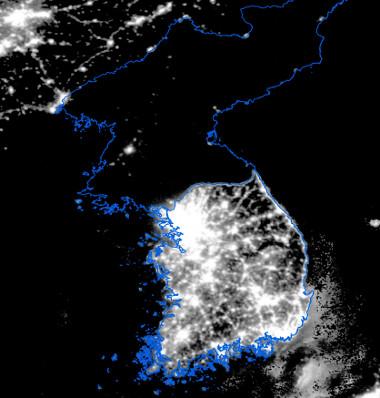

# Social Infrastructure
{: .no_toc }

1. TOC 
{:toc}

What we've established so far about comparative development is that productivity differences are the most important aspect of why some places are rich and some are poor. But as always, we don't have a great read on what productivity actually means. The prior sections offered a few different views on that. 

One was that productivity was - in part - due to diffusion of new ideas from frontier countries. Places that were either open to new ideas or had low barriers to them (think a high $\psi$ parameter) could get their number of varieties $D$ closer to the frontier. Similarly, higher human capital might also be a good explanation for diffusion, and that basically means much of what we measure with $A$ might in fact be measuring differences in $h$. 

A different approach dealt with trade. Trade allows you to import varieties of intermediate goods even if you can't produce them, improving overall GDP. This does look plausible in the data, and almost invariably places that are rich are also open to trade to a much greater degree than places that are poor. 

Last we looked at misallocation. Here, productivity may be low "artificially" because even though we have all these ideas or varieties available, *something* in the economy is keeping us from using them all. That leads to lower output and lower living standards even though we have all the pieces in place to be richer.

We keep using a common framework to describe relative development - intermediate varieties - and in each case we're still left with some questions about why some places are able to use more than others. Why are some places open to diffusion, while others are not? Why do some places open up to trade, while others don't? Why do some places allow all varieties to be used, while other put limits on? 

A very coarse answer in this section will be "social infrastructure". There isn't a textbook definition of this. It's something like the combination of laws, norms, and rules governing the economy (and society) that either allow for or but barriers on the full use of ideas (here, meaning varieties). 

## Measuring social infrastructure
It would be nice to be able to (1) cleanly measure what social infrastructure is, (2) show you that it has a clear relationship with productivity or GDP per capita ,and (3) that we can trust that this relationship is in fact *causal*, meaning that social infrastructure is driving productivity or GDP per capita. 

How does 1 out of 3 sound? That's like a Hall of Fame batting average. The problems we've got are with points (1) and (3), mainly. First, "social infrastructure" is very loose as a concept. "Law, norms, and rules" is nice, but not that much more precise. On one level, we're talking about whether an economy is a place where people feel safe to invest in things. Like new businesses, or education, or in any kind of asset that will persist over time and thus could be subject to predation by the government or others. Places that feel safe to invest will invest, while places that don't won't. All of which is just talking around the issue that we can't measure that at all.

Here's one kind of attempt to sorta measure what we're talking about. The World Bank produces a series on [Doing Business](https://archive.doingbusiness.org/en/rankings) around the world. They look at things like the ease of starting a business (e.g. how many days does it take to get a permit?) or how hard it is to register property (e.g. how long to get a title filed for your house?) or how easy it is to enforce a contract (e.g. can you get a court to help you recover damages?). Each of those is a bit of social infrastructure, arguably. 

They give you data on each component, and also construct an aggregate score. That aggregate score is plotted in the following figure against GDP per capita in 2018. There is an obvious positive relationship - so we've got (2) nailed down. Places that are rich tend to have a high "doing business" score, meaning they are relatively simple to work in and/or protect investments. If you look *way* up at the top you'll find New Zealand and Singapore (hover over points to find them), which apparently are the easiest places to do business in the world.

<iframe width="900" height="600" frameborder="0" scrolling="yes" src="../plotly/wdi-doing-business.html"></iframe>

It is true that there is no place ranked by the World Bank that is both rich and *hard* to do business in (no one in the lower right, except maybe Libya), and there are no places that are both poor and *easy* to do business in (no one in the upper left, except maybe Rwanda). 

This gets into the problems with (3), how do we know that this is causal? Even if we take the measurement seriously, and even if we take the positive correlation seriously, are we sure that being better at doing busienss by the World Bank standards will actually *make* you rich? That is, if I made changes in your rules and norms to improve the Doing Business score, could you guarantee me that the country will grow faster and get richer? 

The answer is no, because we don't have a clear way of telling what drives what. Lots of the things that are measured in the Doing Business score are measured based on rich-country standards. Why do we think that efficient registering of property is good for development? Because rich countries tend to be efficient at this. But maybe that efficiency is *because* they are rich, and can afford modern systems and making these kinds of transactions easy to do. The origin of their rich-ness might lie elsewhere, and being good at "doing business" is a byproduct of being rich, and not the other way around. We don't have a good causal identification here because we don't have a clear experiment where we compared identical places but varied their ability to do business. All we've got in the above figure is something suggestive.

Here's a different dimension of data to look on "social infrastructure" that shares all the same issues. It's about the presence of electoral democracy and GDP per capita. The index of electoral democracy basically measures how open, fair, and competitive elections are. You can kinda-sorta see a positive relationship here, and the outliers in the upper left tend to be monarchies sitting on top of giant piles of oil. 

<iframe src="https://ourworldindata.org/grapher/gdp-per-capita-vs-electoral-democracy" loading="lazy" style="width: 100%; height: 600px; border: 0px none;"></iframe>

So does this data mean that democracy *causes* countries to get rich? Does it mean that democracy is *necessary* for countries to open up to trade, or to be open to diffusion of ideas, or to allocate their factors across many varieties and allow free entry of firms? No, we can't read that much into it. It may be that places which are open to trade, ideas, and entry then become places which have open democracies; things could work the other way around. But again, we have this suggestive evidence that things like efficient processes and open political structures are associated with higher living standards. We can't prove anything, but we can see how this could work. 

## Experimenting with institutions
If we cannot be sure about anything from the cross-country data, then why would we still be ready to look at social infrastructure or institutions as an important determinant of living standards? Mainly because when we *can* find something like a real experiment, it looks like they matter, at least in a broad sense. 

Perhaps the most famous example if North and South Korea. You might have seen the following picture, which shows the Korean penninsula at night. The South is obviously lit up in the same way that any rich area of any rich country (London, New York, etc..) is lit up, while North Korea is .... not. 

As a proxy for economic development, nighttime lights are pretty decent. We know that this distinction in lights is not because of a difference in language, and while there are some geographic differences between the two, we know it isn't because of some massive difference (desert versus tropical rainforest) that determined their wealth. They have essentially the same history, and experienced similar events and cultural milestones. So everything about these two countries is very similar, except for their overall political organization. North Korea is a tightly centralized communist economy while South Korea is not. South Korea is not a New Zealand-like example of "doing business" according to the World Bank, but it is quite high on that list compared to North Korea. Because we can rule out so many other reasons, we think that this indicates that institutions - communism versus not - is what delivers the distinction in economic performance.

Examples like this are why we think that *something* about social infrastructure and institutions matter for economic development. This experiment doesn't tell us what the specifics are. Really all we can say is "don't do what North Korea did" to counsel poor countries. But it's harder to say "do what South Korea did" because it is hard to identify all the things that happened there over time and know which are most important. 

Rather than repeat myself further, here's a [link to an article I wrote](https://asteriskmag.com/issues/01/why-isn-t-the-whole-world-rich) touching on this larger topic. 
