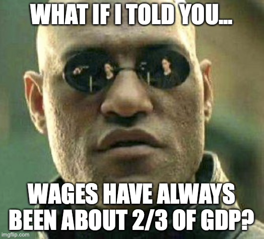

# Income and cost shares
{: .no_toc }

1. TOC 
{:toc}

## Labor's share of income
The [prior section](http://growthecon.com/StudyGuide/facts/expenditure.html) looked at the expenditure breakdown of GDP. But GDP can also be decomposed by income payments. A simplified way of doing this is $Y = W + RK + \Pi$. $W$ is total labor compensation, including both direct wages and benefits (e.g. health insurance). $RK$ is the total return paid to owners of capital, where $R$ is the return per unit of capital, and $K$ is the amount of capital. Finally, $\Pi$ are the economic profits earned when an economy is not perfectly competitive. This would includes the economic profits earned by a monopolist, for example. 

Similar to what we did with the expenditure side, we can look at a ratio of labor compensation to GDP, $W/Y$, and track that over time. This data isn't as widely available across countries, so in the figure below you'll see these long stretches of time where the ratio is perfectly stable. That is not because labor shares in Mexico were exactly 0.429 every year from 1960 to 1993, but rather the source of this data is using a later observation and assuming it held in the past. 

<iframe width="900" height="600" frameborder="0" scrolling="no" src="../plotly/pwt-stable-labs.html"></iframe>

Knowing that, you can see that at least for the last few decades there has been a tendency of the $W/Y$ ratio to decline very slightly in most of these countries. For the US and Australia, with longer time series, you can see a more obvious decline over these roughly 60 years, from about 0.65-0.70 down to just below 0.60. Neverthless, these shares stay at roughly stable levels throughout.

Notice there are significant differences in the levels of these labor shares. Some of that, as with Mexico, is likely due to the fact that a lot of labor compensation is accounted for in the $RK+\Pi$ terms, because many people may be operating self-owned businesses. In those cases, it is hard for the national accounts to know how much of the earnings of a business are compensation for the labor of the owner, versus compensation to the owner for the capital they own or the profits they earn.

We get a similar story with the second set of countries. Again, there is a tendency to see some drift downwards in recent decades in the compensation share. But you also an see that labor shares tend to remain relatively stable for long periods of time. An exception here is Nigeria, where the issues with underreporting of labor compensation would be similar to Mexico, but where there appears to be a significant change in that reporting around 2010. 

<iframe width="900" height="600" frameborder="0" scrolling="no" src="../plotly/pwt-catchup-labsh.html"></iframe>

Much like our other facts, we're going to focus on the stability here.

{: .fact }
The share of GDP accounted for by compensation of labor is stable over long periods of time in developed countries.

This fact is associated solely with labor. But what about the share of GDP paid to capital, or to profits? These are harder to measure, because unfortunately national statistical agencies do not report payments to capital and economic profits separately. The reason is that businesses do not do their accounting in these terms, and so you cannot ask them to report to the Bureau of Economic Analysis (in the US) what their payments to capital were. The accounting profits that a business reports are generally a combination of both payments to capital and economic profits, and the owners of that business may not know or care how the accounting profits are broken down.

So it isn't immediately obvious how the share of GDP being paid to capital or economic profits changed over time. Let's add a little math to the accounting to be more specific. Let $s_L = W/Y$ be the share of GDP paid to labor. Let $s_K = RK/Y$ be the share paid to capital, and $s_{\Pi} = \Pi/Y$ be the share paid in economic profits. Based on $Y = W + RK + \Pi$, it has to be that

$$
1 = s_L + (s_K + s_{\Pi}),
$$

or that these shares all add up to one. We can observe $s_L$, as in the figures above. And thus we know the *combined* shares $s_K + s_{\Pi}$. But we cannot draw a figure of $s_K$ over time individually just knowing $s_K + s_{\Pi}$. 

If - and this is a big if - you were willing to assume that $s_{\Pi}$ was constant over time, then you could assume that $s_K$ was constant over time as well. That is because if the sum $s_K + s_{\Pi}$ is stable, which would be true if the stylized fact presented above were true, and $s_{\Pi}$ were stable, then the only possible outcome for $s_K$ is to be stable as well.

There is recent research trying to make more explicit how $s_K$ changed over time, but that gets more into the weeds of national accounting than we want to get at this point. For the moment, you should know that the share of GDP going to capital, $s_K$, could maybe-sorta be stable over long periods of time. 

## Labor's share of costs
The share of labor (or capital or profits) in total GDP is interesting from the perspective of how GDP is distributed across different groups (workers, capital-owners, or rent/monopoly holders). But it isn't quite the number we're going to want in order to understand how production of GDP works. 

Later in the guide we'll talk more about why this is true, but what we really want to know is the ratio of labor compensation to total input costs: labor compensation plus payments to capital. In math, we want

$$
\phi_L = \frac{W}{W+RK}
$$

which ignores the role of economic profits. The simple reason is that we want to know how important labor and capital are relative to one another, and the size of the economic profits doesn't factor into that. The greek letter $\phi_L$ is just a shorthand for labor's share of total *costs*. The equivalent statment for capital would be $\phi_K = RK/(W+RK)$.

For the reasons given above about the difficulty in measuring $RK$, these two cost shares are not easy to pull from standard national accounts data. We're going to do something a little kludgy and imprecise to look at these cost shares. 

The source that provides the data on GDP and labor compensation (the Penn World Tables) also provides the information on the size of the capital stock, $K$. What we're going to do is assume that for all countries, in all years, the real rate of return on that capital is $R = 0.05$. That is a really heroic assumption, but what you'll see in the [next section](http://growthecon.com/StudyGuide/facts/capital.html) from a different data source is that it isn't the worst assumption we could make. There is evidence that real rates of return on capital are relatively stable over time. 

Since we know $W$ and $K$, with the assumption of $R=0.05$ we can calculate $\phi_L$, the cost share of labor. And implicitly, once we know $\phi_L$, we know $\phi_K$, because they have to add up to one.

Here's the figure showing the cost share of labor for the first set of countries. These are again pretty stable looking, and are higher than the share of compensation in GDP (that implies that economic profits are not equal to zero). There are some changes over time, as you can see the UK's $\phi_L$ drift down and then up, and Mexico's seems to drop over the whole period of time. But for the most part this labor cost share tends to hang in there around 0.7-0.8 the whole time.

<iframe width="900" height="600" frameborder="0" scrolling="no" src="../plotly/pwt-stable-phil.html"></iframe>

You get a similar story (save for Nigeria) if you look at the second set of countries. Some tendency to drift down over time across most of them, but cost shares in the 0.75-0.85 range for the most part. In Nigeria, the evidence suggests a steep drop in labor's share of costs around 1980, and then a steep climb back to around 0.80. I suspect this has as much to do with some problems with reporting actual labor compensation as it does with a real change in labor's share of costs.

<iframe width="900" height="600" frameborder="0" scrolling="no" src="../plotly/pwt-catchup-phil.html"></iframe>

Regardless, at this point we're going to go out on a limb and assert that these figures, despite being based on an assumed return to capital of 0.05, tell us something about the cost shares over time.

{: .fact }
The share of costs (W+RK) accounted for by compensation of labor (W) is stable over long periods of time in developed countries.

This will come in very handy when trying to decide how to model production of GDP using labor and capital.