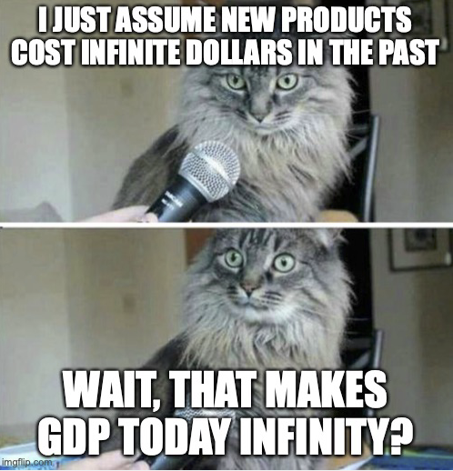

# Real GDP over time
{: .no_toc }

1. TOC 
{:toc}

## Chained real GDP
The basic way of thinking about real GDP growth was in the prior section, and we established an expression like this:

$$
g_Y =  \sum_i \left(g_{PY} - g_{Pi} \right)\frac{P_i C_i}{PY}
$$

where the growth rate of real GDP was a weighted sum of the affordability growth of all the products in the economy. 

That works well as a measure of growth over two relatively close time periods, like 2023 and 2024. But it gets harder to justify if you wanted to do something like compute $g_Y$ between 1964 and 2024, a gap of 60 years. There are a few reasons it gets harder to justify for long periods. The first is that in deriving that expression we used calculus, which is an approximation good for small changes in time. Remeber the Diet Coke example, which had this extra $1+g_P$ term floating around? We can't ignore that kind of thing over the course of 60 years. 

A second issue is that if we do want to use the above expression for growth over long periods of time, we have the problem with the expenditure shares, $P_i C_i/PY$. For close comparisons those are relatively similar, or at least aren't changing by enough to make us worry too much. But over 60 years those will change a lot. The expenditure share of food in general was like 30% in 1964, and is less than 10% now. Is it right that we use the initial 30% number? Or should we use the 10%?

A way to leverage the above equation but build indices of real GDP over time is to "chain" them together. The idea is pretty simple, but tedious. Calculate $g^{23,24}_Y$ as the growth in real GDP from 2023 to 2024 using the above equation. That uses expenditure shares from 2023, and price changes from 2023 to 2024. Then calculate $g^{22,23}_Y$ as growth in real GDP from 2022 to 2023, using 2022 expenditure shares and price growth from 2022 to 2023. Then calculate $g^{21,22}_Y$ for 2021 to 2022, and so on. 

We have separate growth rates of real GDP for each adjacent year, and those are more realistic in that they allow for expenditure shares to adapt over time. To get the growth rate of a longer period we "chain" those together. 

First, note that we can find the real GDP in a year relative to the prior one like this:

$$
\frac{Y_{2024}}{Y_{2023}} = 1 + g^{2023,2024}_{Y}
$$

which just follows from the definition of $g^{2023,2024}_{Y}$. That means we can get the ratio of real GDP in 2024 to 2022 like this:

$$
\frac{Y_{2024}}{Y_{2022}} = \frac{Y_{2024}}{Y_{2023}}\frac{Y_{2023}}{Y_{2022}} = (1 + g^{2023,2024}_{Y})\times(1 + g^{2022,2023}_{Y})
$$

You could keep going like this and extend backwards or forwards however you like. So the size of real GDP in 2024 relative to real GDP in 1964 is

$$
\frac{Y_{2024}}{Y_{1964}} = (1 + g^{2023,2024}_{Y})\times(1 + g^{2022,2023}_{Y})\times...(1 + g^{1965,1966}_{Y})\times(1 + g^{1964,1965}_{Y}).
$$

It's a long calculation, tedious but do-able. 

If you want the *average annual growth rate* from 1964 to 2024, then what you are doing is what we looked at in the preliminaries. 

$$
g_Y^{1964,2024} = \left(\frac{Y_{2024}}{Y_{1964}}\right)^{1/60} - 1.
$$

Why that "60" in exponent. Because there are 60 years in between the two endpoints. Because of how the ratio $Y_{2024}/Y_{1964}$ is constructed, you can see that the average annual growth rate from 1964 to 2024 is a geometric average of the 60 different individual annual growth rates. 

## Indices
The BEA and other agencies like to report real GDP as an index, with a base year (maybe 2015) and numbers like 100, 102.5, etc.. This is straightforward. 

Pick a base year, 2015. Whatever real GDP is in 2015, we're going to call that 100. 100 what? 100 whatevers, it doesn't matter. It's solely to serve as a reference point. 

What's real GDP in 2016? That's

$$
Y_{2016} = (1+g_Y^{2015,2016}) \times 100
$$

If the growth rate was 2%, then real GDP in 2016 is just 102. 102 whats? 102 whatevers. Again, it isn't something that has obvious units. The number 102 is there really to just make it easy for you to compare to the base year. Knowing it is 102 means you know pretty easily that real GDP in 2016 is 2% higher than in 2015. You can run this forward to 2017 by using the same chaining idea as above. If $g_Y^{2016,2017}$ was 3%, then $Y_{2017} = (1.02)(1.03)100 = 105.06$. 

How about prior years? Just run this backwards

$$
100 = (1+g_Y^{2014,2015}) Y_{2014}
$$

which is solved to 

$$
Y_{2014}= \frac{100}{1+g_Y^{2014,2015}}.
$$

If growth from 2014 to 2015 was 4%, then the level of real GDP in 2014 was $Y_{2014} = 100/(1.04) = 96.15$. 

## New products and lost products
Chaining gives us a way of piecing together a real GDP series that avoids comparing 1964 to 2024 directly. Why does that matter? Mainly because lots of products in 2024 didn't exist in 1964, and lots of products that did exist in 1964 are no longer purchased today. That is relevant to our calculation of real GDP, and it is another reason we chain things.

Go back to the calculation of a growth rate

$$
g_Y =  \sum_i \left(g_{PY} - g_{Pi} \right)\frac{P_i C_i}{PY}.
$$

We just went through chaining, but let's ignore that for the moment. Let's use this again to think about how new products over time disrupt the calculation. 

Let's say we want to compare 1964 to 2024, and the two goods we want to use are an iPhone and an [RCA Spectra 70](https://archive.computerhistory.org/resources/text/RCA/RCA.SPECTRA70.1965.102646099.pdf). The RCA was a mainframe that could be configured with either 4,096 or 8,192 bytes of RAM. That's about 0.0.000007629394 of a GB, by the way.

We can measure $g_{PY}$ between 1964 and 2024 without any trouble. What about the individual product level information? Start with the iPhone. What's the $g_{Pi}$ for the iPhone from 1964 to 2024? It didn't exist in 1964, so ..... how do we do this calculation? You *could* assume that the price was zero in 1964, and maybe 1000 dollars in 2024, but that gives you an estimated $g_{Pi}$ of ... infinity. Which means the affordability growth for an iPhone was ... negative infinity? Which then means that no matter what else happens $g_Y$ is negative infinity? Do we think the economy got infinitely smaller in 60 years?

Okay, that was dumb, you think. Let's instead assume that the price in 1964 of an iPhone was itself infinity - meaning it took infinite resources to get one. Then the $g_{Pi}$ for an iPhone is going to be zero. Okay, that seems better. The affordability of the iPhone is now $g_{PY} - 0 = g_{PY}$, which is at least a real number. 

But what was the expenditure share of the iPhone we should use? It's 0 in 1964, so in principle that means it doesn't matter at all to the calculation? In some sense no matter what we do the iPhone just doesn't count at all? That seems totally wrong, because it should account for something. 

We get a similar issue for the RCA mainframe. They don't sell them anymore, so what's $g_{Pi}$? If you think the price today is zero, then the $g_{Pi} = -1$ or -100%, and affordability growth is like $g_{PY} + 1$, a big positive number. Okay, that kind of makes sense. But it still doesn't help because we have to do the whole iPhone price growth thing. And is it true that RCA mainframes are free? Not really, you can't actually buy one. They disappeared and in that sense their price is now ... infinity? So they have negative infinity affordability growth? 

The general point is that once we have products being introduced or dropped from use over time, we run into this recurring issue of valuing real consumption/GDP from one year to the next. Even chaining doesn't help, because at some point we face this same dilemma. In 2004 no iPhone existed, and in 2005 an iPhone did exit. So what was the price in 2004? 

There is no proper solution to this issue. Without an actual price, it is impossible to do the calculation of real GDP. So how do statistical agencies get around this? The short answer (because the actual details involved in this are intricate) is that they find a *similar* product or products to the new product, and use that to figure out how much the price of an iPhone *would* have been in 2004. They might have looked at a Blackberry, for example, a relatively sophisticated smart phone for the time. If the price of a Blackberry was 400 in 2004 and 500 in 2005, for a 25% increase, then they would assume that an iPhone also had a 25% increase from 2004 to 2005. Knowing the price in 2005 was 800, they'd back out that an iPhone in 2004 would have been 640.

Does that sound like a kind of ad hoc way to do this? Yes. As I said, place like the Bureau of Economic Analysis are more sophisticated than my simple example suggests, but that is the spirit of what happens.

It means that you should keep a little skepticism in the back of your head regarding real GDP comparisons over long periods of time. With the introduction of new products and the disappearance of old ones, it isn't crystal clear how real consumption (and GDP) changed over time. The real GDP numbers we use are probably a good, rough, approximation.

