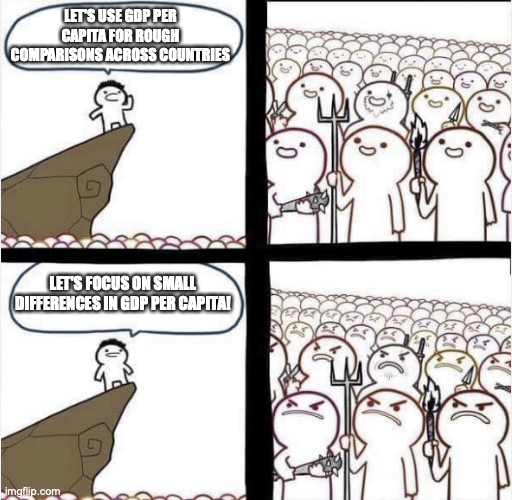

# Real GDP across countries
{: .no_toc }

1. TOC 
{:toc}

## Comparing across space versus time
The issues with comparing [real GDP over time](http://growthecon.com/StudyGuide/gdp/afford.html) for a given country come up again when trying to compare two countries with one another, even in the same year. 

We're going to do something similar here, but because we're comparing countries we're not going to try and frame things in terms of growth rates. Instead we are going to try and create a way of measuring real GDP in a single country relative to some baseline. That baseline isn't a real country itself, but it makes the most sense if you think of that baseline as a country a lot like the US or a relatively rich Western European nation. Let's just say the baseline is the US. 

What we are after is this

$$
\frac{Y_{K}}{Y_{US}}
$$

and using information on nominal spending and price levels we could compute this as

$$
\frac{Y_{K}}{Y_{US}} = \frac{PY_{K}/P_K}{PY_{US}/P_{US}}.
$$

What we want to do is figure out whether nominal Kenyan spending, $PY_{K}$, is delivering a higher or lower level of real goods and services than nominal US spending, $PY_{US}$. And that depends not the price level in Kenya, $P_K$, relative to that of the US, $P_{US}$. In principle this is straightforward; just divide nominal spending by the price level for both countries. But what price level?

If we have a very simple world where the *only* product both countries consume is Diet Coke, then the answer is pretty simple. Use the price of a Diet Coke in Kenya as $P_K$, and the price of a Diet Coke in the US as $P_{US}$, and you're done. $PY_K/P_K$ is just the number of Diet Cokes in Kenya, and similar for the US, and the ratio $Y_{K}/Y_{US}$ is just the ratio of Diet Cokes in Kenya to the US. 

That's great as a concept, but obviously both countries consume lots and lots of different products. What's the right $P$ to use for this case? In the Diet Coke world we compared the price of the *exact same* product in the two countries. In principle we want to do the same thing now, but with lots of products. We want to get the price of the same *basket* of goods in Kenya as in the United States. 

Putting together the products and prices in these baskets is a whole side industry in the world of economics. Places like the [Penn World Tables](https://www.rug.nl/ggdc/productivity/pwt/?lang=en) (which we use in this Study Guide), the OECD, and World Bank all have their own calculations. But in each case they call the price of this basket of goods a *purchasing power parity conversion rate*. This is often just abbreviated as a "PPP", and you might hear it referred to as a PPP exchange rate. 

The PPP conversion rate or exchange rate is always a comparison of one country to some baseline. Often that baseline is the US, but it doesn't have to be. The PPP for Kenya, for example, is calculated like this

$$
PPP_K = \frac{\sum_i P_{Ki} s_{PPPi}}{\sum_i P_{USi} s_{PPPi}}
$$

which in the numerator is the sum of prices in Kenya for the set of goods indexed by $i$, each weighted by the term $s_{PPPi}$. That weight is the *expenditure share* in the basket of goods that the Penn Tables or World Bank choose to set up. Where does those expenditure shares come from? That's a whole other long question, and gets very far into the weeds of how these are constructed. A good way to think about it is that they pick the expenditure shares from a baseline or reference country, and in some cases that reference country is the US. In others it is a hypothetical baseline that's sort of like an average of all the countries. 

In the denominator is the same kind of index of prices, with the *same* expenditure shares, but for the baseline country. In this case, the US. Hence the PPP for Kenya is telling us the price level of the PPP basket of goods in Kenya relative to the same basket in the US. This $PPP_K$ is a ratio of something measured in Kenyan shillings to something measured in US dollars, which means it is kind of like an exchange rate. We'll touch on that again below. 

The truly important thing about the expenditure shares is that they are the *same* for each country. What we are doing is asking "how many baskets of these specific products" could a person in a country (e.g. Kenya) buy given their nominal spending. That basket may not have much to do with their actual basket of goods purchased. We are trying to do a real "apples to apples", or "apples, pears, and Diet Coke to apples, pears, and Diet Coke" comparison. 

{: .assumption }
> The *purchasing power parity conversion rate* for a given country $X$, with a baseline country $B$, is
>
>$$
>PPP_X = \frac{\sum_i P_{Xi} s_{PPPi}}{\sum_i P_{Bi} s_{PPPi}}
>$$
>
>where $s_{PPPi}$ are expenditure shares for good $i$ in the PPP basket. 

Note that the PPP conversion rate for the baseline country is always equal to one. 

Once we have these PPP conversion rates for each country we can calculate real GDP in each relative to the baseline. In practice this is how things are calculated:

{: .important}
> *Real GDP* in country $X$ is
>
>$$
>Y_X = \frac{PY_X}{PPP_X}
>$$
>
>which is a number measured in the currency of the baseline. 

The way I set this up, this is a little different than the ratio of real GDP's we started with. Think through what is going on here. Take nominal spending in Kenyan shillings, $PY_X$, and divide by the PPP conversion rate, which is PPP shillings per dollar. This ends up being in dollars.

In Diet Coke world, we're dividing Kenyan nominal spending by the Kenyan price for Diet Cokes, giving us some number of Diet Cokes (let's say 1,000). Then we multiply that 1,000 by the price of a Diet Coke in the US (say 50 cents) to get a measure of real GDP in Kenya of 500 dollars. Kenyan real GDP is measuring Kenya's GDP equivalent in dollars (the baseline). 

## What about exchange rates?
A good question is why we don't do this just using market exchange rates. We could look at currency transactions to find out how many shillings would trade for a dollar, and instead of the PPP, we could calculate real GDP as $Y_X = PY_X/Exch_X$, where $Exch_X$ is shilling/dollar rate. 

We could do that, and it is a lot easier to find that data than to construct these PPP indices. But the problem is that the market exchange rates aren't based on people in both places buying the same basket of goods. The exchange rates are skewed by policies on trade, in particular, and tend to be weighted towards the relative value of tradable goods in the two countries. Things that are non-traded (lots of services like haircuts or economics lectures or housing) won't show up in the market exhange rate. 

In practice the market exchange rates tend to make poor countries look even poorer. Some intuition for why is that the market exchange rate is measuring relative prices for poor countries compared to rich countries in the subset of products that are *particularly* expensive in poor countries. Think of cars. Most developing poor countries do not produce their own cars, they have to import them. Because of the shipping costs, tariffs, and so on, the price of imported cars in these poor countries are very high relative to their other goods and services. At the same time, the market exchange rate is going to be heavily dependent on car prices and sales because the *only* way to get a car in these countries is import it. All the things that are relatively cheap in poor countries - local foods, personal services, etc. - don't need currency exchanges and so don't factor into the market exchange rate. 

This is a little easier to see in practice. The table below gives you some data on a handful of countries from 2017. The first column is the PPP conversion rate, indicating the price of a common basket of goods in local currency relative to that price in US dollars. It takes 4.2 yuan in China to buy the same amount of goods as 1 dollar does in the US, for example. However, the market exchange rate for China is 6.8 yuan to the dollar, meaning the yuan is *less* valuable on the foreign exchange market than it is in China itself. If you look down the list you'll see that this is the case for each country on this list, except for the US. In the US the PPP and exchange rate are exactly 1, because the US is the baseline country. 

<iframe width="900" height="400" frameborder="0" src="../plotly/pwt-ppp-acct.html"></iframe>

This matters for how we value GDP. The fourth column shows you GDP (per capita) using PPP rates, or the equation I gave you above $Y_X = PY_X/PPP_X$. These numbers are in dollars, so you con compare them to the US. Real GDP per capita in China, for example, is 13854/60117 = 0.23, or about 23% of the US standard of living. But notice that if you value China's GDP per capita using exchange rates, you only get a number of 8663, which is only 14% of the US value. Market exchange rates make China look relatively poor compared to the US. 

The same holds for each country in the table (and nearly every country overall), which is a direct result of the difference in the PPP and market exchange rates.

## Price levels
The middle column of that table shows something called the *relative price level*, which is the math is 

$$
PL_X = \frac{PPP_X}{XR_X} 
$$

The $PL_X$ is telling us whether the "basket" is, in some kind of absolute terms, more or less expensive in country X than in the US. To see this, break apart the PPP and XR terms. 

$$
PL_X = \frac{P_X/CurrX}{P_{US}/Dollars}
$$

where $P_X$ and $P_{US}$ are the prices of the common baskets, as before. $Dollars$ and $CurrX$ are from the exchange rate. In the numerator is "how many baskets of the common goods can you buy with one unit of X currency" and in the denominator is "how many basket of the common goods can you buy with US dollars". The $PL_X$ is sometimes called the *real exchange rate* because it in one sense tells you how many baskets you can get in country X compared to the baseline for a unit of currency. 

When $PL_X<1$, this means in some sense that the cost of living is cheaper in country X than in the US. And this gets back to the earlier point about costs in say, Mexico, or parts of Europe. If you go there you can get "more for your money" once you've exchanged your dollars for local currency. 

This tendency for poor countries to have lower price levels is pretty universal across countries and time, and it is sometimes referred to as the "Balassa-Samuelson effect" after two economists who first noted the pattern. It has to do with the same issues of non-traded goods discussed before. Lots of things are expensive in poor countries - cars, computers - but way more things are very cheap - like housing and personal services. 

<iframe width="900" height="600" frameborder="0" src="../plotly/pwt-ppp-realxr.html"></iframe>

The figure shows you the price level in 2017 across countries, and on the x-axis is the (log) of their GDP per capita. You can see that there is a flat area around 0.5 for relatively low GDP per capita. These poor countries have price levels about half that in the US. Once countries get rich the price level trends up and for the richest countries this number is around 1. In the table above you can see that Japan's relative price is close to one, and Korea's is getting close.

