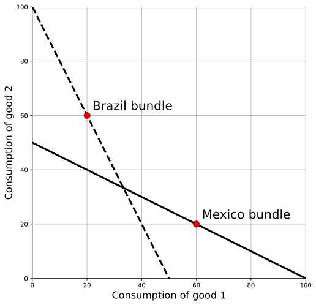

# Real GDP across countries
{: .no_toc }

1. TOC 
{:toc}

## Who are you calling rich?
The issues with comparing [real GDP over time](http://growthecon.com/StudyGuide/gdp/twogoods.html) for a given country come up again when trying to compare two countries with one another, even in the same year. Let's say that we're trying to compare the real consumption (or GDP) of Mexico and Brazil. And further, let's say that we only care about two consumption goods, $c_1$ and $c_2$. 

Let's start with an obvious example. In this figure, Brazil's consumption bundle is noted, and the dashed line indicates the relative price of goods 1 and 2 in Brazil, $-p_1/p_2$. Similar for Mexico, only the dark line indicates the relative price of the goods. 

Here, given the relative prices in Brazil, Brazilians *could* have consumed more of both goods than Mexicans no matter what. No choice the Mexicans could have made at their relative prices would have been unavailable to Brazilians. We still don't know how to quantify the difference in real consumption of the two countries, but the ranking is obvious. 

Just like the time-based case, this gets more complicated when the choices available to the two countries overlap. In the figure below, now it isn't obvious at all which country has higher real consumption. If we valued everything at the relative prices *in Brazil*, then Mexico looks better off: the Mexican bundle isn't available to Brazilians at the current Brazilian prices. But if we value everything at the relative prices *in Mexico*, then Brazil looks better off: the Brazilian bundle isn't available to Mexicans at the current Mexican prices.

Just like we did with respect to time, we want to think about figuring out ratios of real consumption from both perspectives, and then averaging them. The problem is that rather than two time periods (past and present) we've got *lots* of countries. We want to come up with a way of comparing all the countries with one another on a common scale, and so we need to take into account all the possible pairs of comparison (Brazil with Mexico, Mexico with the US, Brazil with the US, South Korea with Mexico, South Korea with the US, and so on and so on). 

## A numeric example
For the moment, let's stick with two countries and put some numbers on this. I'm going to switch to the USA and Nigeria, so that we can illustrate how important the prices used will be. For cell phones, think of the consumption amount as per capita. For teachers, think of this as something like number of teachers per capita. I know, the numbers don't make a lot of sense, but we're not after realism at the moment.

The data and calculations are all available in this [spreadsheet](twogoodtwocountry.xlsx). Download to work with the data.

| Country | p(Cell) | c(Cell) | p(Teacher) | c(Teacher) |
|:-----   |:-----|:-----|:-----|:-----|
| Nigeria | $200  | 0.5 | $100  | 0.8 |
| USA     | $100  | 1  | $400  | 1 |

It is pretty clear that US is better off in absolute terms. It has 1 cell phone per person, and has 1 teacher per person. Both are higher than in Nigeria. so we already know that the US real GDP per capita must be higher. But *how much* higher?

We have to apply the same ideas as in the section on [two goods and time periods](http://growthecon.com/StudyGuide/gdp/twogoods.html), except now rather than comparing time periods $t$ and $s$ we're comparing Nigeria and the US. But the equations are *identical*, just with different subscripts. 

First, compute $Y(US)/Y(Nig)$ using Nigeria's prices. $Y(US) = 200 \times 1 + 100 \times 1 = 300$, and $Y(Nig) = 200 \times 0.5 + 100 \times 0.8 = 180$. Their ratio is 300/180 = 1.67. Using Nigeria's prices, the US has a real GDP per capita 1.67 times higher than Nigeria's. 

Now flip this around and compute $Y(US)/Y(Nig)$ using the US prices. This turns out to be 500/370 = 1.35. The US still has a higher real GDP per capita, but it is only 1.35 times higher. Nigeria looks richer relative to the US if we value everything using the US prices. 

Before we combine those, let's think about why that is. Notice that the thing Nigerians have *relatively* a lot of is teaching. The ratio of teachers to cell phones is 0.8/0.5 = 1.6, but that ratio is only 1/1 = 1 in the US. However, the relative *price* of teachers is high in the US. So when we consider things from the "rich country" perspective, it makes Nigeria look relatively rich. 

In contrast, when we considered things from the "poor country" perspective, using Nigeria's prices, then US looked even richer. This phenomenon occurs even when we use real data on lots of products. It turns out that in the data, within countries the relative price of a product is lower the more abundant that product is. So almost every country looks better from the perspective of everyone else's prices. If you really think on it, you'll see that this implies differences in the ability to supply products across countries (technology, capital, etc..) are more important than differences in the demand for products across countries. 

Okay, back to comparing Nigeria and the US. Just like with two periods, we want to allow for the fact that both ratios we calculated (1.67 and 1.35) are valid. There is no reason to prefer one country's prices to another. So we'll combine then in a Fisher index to get $Y(US)/Y(Nig) = \sqrt{1.67 \times 1.35} = 1.50$. On average, the US has a real GDP per capita 1.5 times higher than Nigeria in this little example.

## Extending to multiple countries
We could take the same principle just discussed and apply it to all pairs of countries. Combining those into a single set of comparable numbers for real GDP per capita is not straightforward. The math is tedious and is not worth digging through when you are first studying economic growth. Let me walk you through the issue and give you an idea of how this gets worked out.

The major problem is that the ratios aren't transitive. What I mean is this. If the US/Nigeria Fisher ratio is 1.50, and the Nigeria/China ratio is 0.9, this does *not* mean that the US/China Fisher ratio is 1.50 times 0.9, or 1.35. The US/China Fisher ratio has to be calculated directly, and could be 1.4, or 1.2, or 0.8 for all we know. 

How do you get around this? Well, for a given country you take all the bilateral ratios you have: Nigeria/China, Nigeria/Germany, Nigeria/Kenya, etc. etc. Then you take the geometric average of all of those ratios. It's a Fisher ratio of Fisher ratios, so to speak. 

The one big catch to this is that you need to pick one country as the baseline. So in the end you cannot solve the issue that you have to choose one set of prices to compare everyone against. No matter what, you're back to a question something like: should we use Nigeria or the US for our reference prices? 

What does this mean? It means you should consider any comparisons of real GDP per capita to be fuzzy. This guide is going to show you a lot of data on real GDP per capita across countries, and that data should be seen as "the truth". In fact, the data set that I'll use most - something called the Penn World Tables - will give you different comparisons of real GDP per capita than other sources - like the World Bank. Why? Because they use different reference prices. 

When you see a *huge* gap in real GDP per capita, then no matter what that probably indicates a significant difference in real living standards. No choice of prices is going to change the fact that Mali consumes fewer products per capita than the US. But for countries that have similar real GDP per capita measures - say France and the UK - you shouldn't get too excited that one is slightly larger than the other. Any difference could be due to the choice of prices. 

