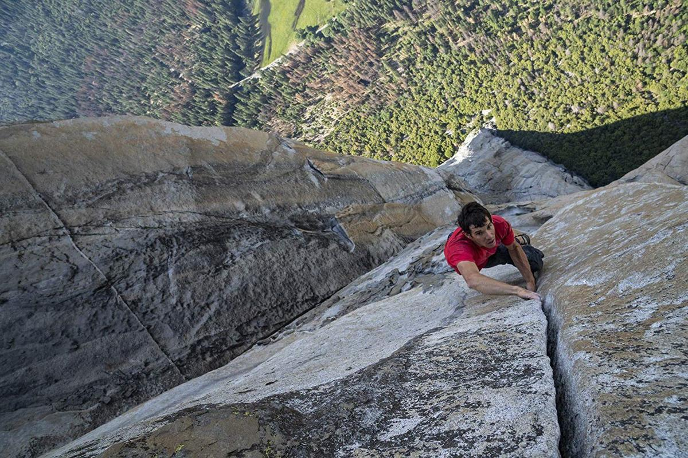

# Free Solo
{: .no_toc }

1. TOC 
{:toc}

In 2017 Alex Hannon "free-soloed" El Capitan, an essentially vertical wall of granite in Yosemite National Park. Frankly, it looks insane and the trailer for the movie here makes me want to vomit a little in my mouth. 

<iframe width="560" height="315" src="https://www.youtube.com/embed/urRVZ4SW7WU" frameborder="0" allow="accelerometer; autoplay; encrypted-media; gyroscope; picture-in-picture" allowfullscreen></iframe>

Just to make sure you all appreciate how *insane* this was, here's a still frame shot during his ascent. 

The achievement led a few people to speculate on what innovation allowed Hannon to accomplish this. The first link is to an [article by John Cochrane](https://review.chicagobooth.edu/economics/2019/article/what-success-rock-climbing-tells-us-about-economic-growth), an economist, who wonders why someone hadn't done this *before* Hannon. 

> Why weren’t such climbs done long ago? There is essentially no technology involved. OK, Honnold wears modern climbing boots, which have very sticky rubber. But that’s about it. And reasonably sticky rubber has been around for a hundred years or so too. 

Which leads him to opine that the important part of innovation is not new gadgets or machines but rather the accumulation of knowledge about how to do things. Hannon followed routes painstakingly mapped out over the years by other climbers and himself. He spent years learning how to ascend El Capitan, even though the technological equipment necessary had been there the whole time.

> Free Solo is a great example of the expansion of ability, driven purely by advances in knowledge, untethered from machines.

Okay, so innovation is about knowledge and learning from others? Maybe, but maybe it does depend on clear advances in gadgets and things. [Richard Jones](http://www.softmachines.org/wordpress/?p=2388) saw Cochrane's article and thought that Cochrane did not realize the history of the technologies involved.

> In 1982.... a then unheard of Spanish shoe company – Boreal – had recently introduced a model of their own, with a sole made of a new kind of high friction rubber. .... Boreal, by accident or design, had found a rubber compound where the friction peaked much closer to room temperature than in EBs [the previous leader]. Boreal’s new climbing boot – the “Firé” – swept the marketplace. The increased friction and the advantage this gave was obvious both to the leading climbers of the day, and the much more average performers.

Beyond better boots, Jones argues that there were other massive changes to actual gadgets that allowed Hannon to achieve what he did:

> What’s made the biggest difference – both to the wider popularity of the sport and the achievements of its leading proponents – has been the development of technologies that allow one to fall off without dying. Hold on, you might say here – wasn’t Alex Honnold climbing solo, without ropes, in a situation in which if he fell he would most certainly die? Yes, indeed, but Honnold didn’t get to be a good climber by doing a lot of soloing, he got to be a good soloist by doing a lot of climbing. Most of that climbing – especially the climbing where he was pushing himself – was done roped.

The training that Cochrane was talking about cannot happen without the better roping technologies that were developed. One in particular came around only in 1978.

> Ray Jardine, an aerospace engineer, devised an ingenious spring-loaded camming device that was easily placed and would hold a fall even if placed in a parallel sided or slightly flared crack. These were patented and commercialised as “Friends”. Many developments of this idea have since been put on the market, and these form the basis of the “rack” of anchoring equipment that climbers carry today.

Beyond the specialty equipment for climbing, Jones also attributes the improvement in climbing knowledge to .... cheap air travel. You need the best climbers to push the frontier on the toughest mountains, and that became way easier to do in the late 20th century when climbers could move around the world for relatively cheap air fares.

What's the lesson? The source of innovation is not a stark choice between learning-by-doing and new gadgets. They complement one another, and it is probably safe to say that innovation does not occur without both. In the models we write down, $R$ is some kind of summary measure of "research effort" that involves a combination of learning and inventing the plans for real gadgets. Just remember how abstract our model is.
