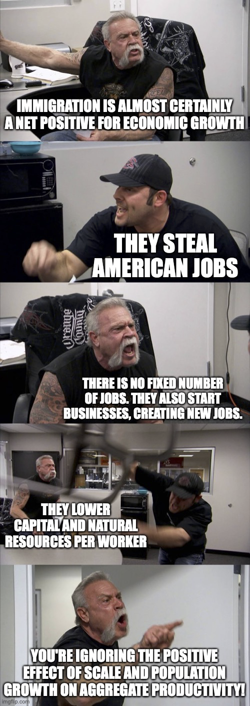
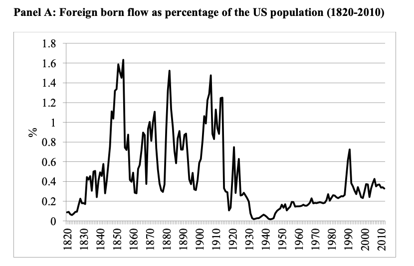
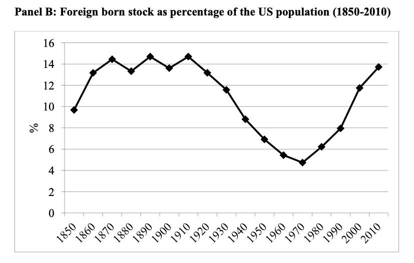
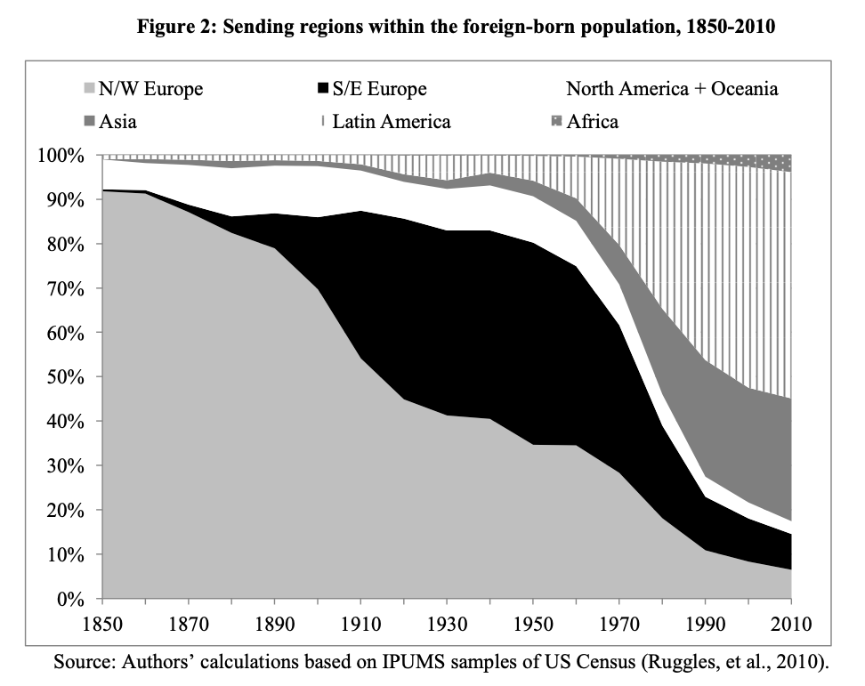

# How does immigration affect growth?
{: .no_toc }

1. TOC 
{:toc}

## Immigration facts
To start, let's get some sense of how immigration in the United States has occurred over the years. The three figures following all come from a paper by [Ran Abramitzky and Leah Platt Boustan](https://www.nber.org/papers/w21882.pdf). This is, by the way, a very readable history of immigration into the U.S. over time.

The first figure shows the flow of new immigrants into the U.S. as a percent of the total U.S. population in that year. In the middle of the 19th century this bounces around 1%, which given the typical history-book story of the U.S. may seem low. But mass immigration was very rare historically so even a relatively small movement into the U.S. seemed large by comparison. And in absolute numbers, this represented millions of people.

By the early 20th century the percentage flow of immigrants remained high, but then around 1920 this dropped dramatically as the U.S. passed new restrictions on immigration, aiming to limit the flow coming from Southern European countries (generally): Italy, Greece, and the like. The immigration flow remained quite low, but rose over time. However, even by 2010 the percentage flow of immigrants - 0.4% - was historically very small. 

Instead of looking at flows, we can instead look at how large the entire stock of immigrants to the U.S. was in relationship to the size of the population. Rather than counting *new* immigrants in each year, we're counting *all* immigrants (even if they came thirty years prior) in each year. 

This gives you a slightly different story than the first figure. Again in the 19th and early 20th century the percent of the population that was an immigrant was about 14% in any given year. Those flows, while they were not large in percent terms, added up over time. But the percent of immigrants in the population fell after the 1920's restrictions took hold, and dipped to about 5% in 1970. At that point immigration starts to rise again, and the percent of population that are immigrants is again around 14%. The reason the smaller percentage flows from recent years deliver a similar share of immigrants is that native fertility rates are quite low, so the native population is not growing nearly as fast as it did in the 19th or early 20th century.

The last major piece of information to look at is the change in the composition of immigrants, their countries of origin. 

Back in the 19th century, this was primarily Northwest Europe: England, Scotland, Germany, Sweden. In the early 20th century there is a massive shift towards Southeast Europe: Italy, Greece, Serbia. The immigrants from Southeast Europe tended to settle more in urban areas (rather than in Midwestern farms), leading to lots of "Little Italys" in cities. Godfather 2 tried to capture the essence of that kind of neighborhood in the flashback scenes:

<iframe width="560" height="315" src="https://www.youtube.com/embed/zebM1Yi7njs" frameborder="0" allow="accelerometer; autoplay; clipboard-write; encrypted-media; gyroscope; picture-in-picture" allowfullscreen></iframe>

Anyway, what fundamentally changed in the later part of the 20th century was the origin of immigrants. By the 1990s there was no longer a large immigration from Europe, but instead from Latin America and Asia. While Mexican immigrants had always been present in the U.S., it was in this period that there was substantial movements from Mexico into the U.S. At the same time, Chinese, Indian, and Vietnamese immigrants were arriving in larger numbers.

## The baseline analysis
If we want to understand what affect this immigration had on economic growth, then the first place to start is with the Solow model, and the question of what happens as you increase the population growth rate. Given that immigration is an on-going process, it makes sense to think about it as changing the growth rate of population, $g_L$, rather than as a one-time change to $L$. 

According to that data above, immigration increased the growth rate of population in the U.S. by somewhere around 1% per year in the early 20th century, and closer to about 0.4% per year more recently. Let's look more carefully at the growth rate of population of the U.S. in the last part of the 20th century.

<iframe width="900" height="600" frameborder="0" scrolling="no" src="//plotly.com/~dvollrath/163.embed"></iframe>

In the 1950s, population growth was about 1.5% per year on average, but from the 1960s forward this levelled out at about 1%, and dropped in more recent years to just over 0.5%. One thing that is apparent is that in recent years population growth is largely a function of immigration, as opposed to natural increase (e.g. births > deaths). 

Focus on the last few decades, where $g_L \approx 0.005$. We saw above that immigration was about 0.4% per year, so if we eliminated immigration, we'd have $g_L \approx 0.001$. What affect would this have? We know from studying the Solow model that from a capital/output perspective, lower population growth would make us *richer* in terms of GDP per capita, as capital accumulation was not diluted over as many people. 

What kind of effect would this have? We can plug in some numbers to see how the K/Y ratio would change. Let's start with $s_I \approx 0.2$, $g_A \approx 0.018$, and $\delta \approx 0.05$. With immigration, then, our steady state K/Y ratio is

$$
(K/Y)^{Immig} = \frac{.2}{.005 + .018 + .05} = 2.74
$$

Without immigration, the capital/output ratio would be

$$
(K/Y)^{None} = \frac{.2}{.001 + .018 + .05} = 2.90
$$

Definitely a higher capital/output ratio. What kind of impact would that have on GDP per capita? We know from our prior work that 

$$
\ln y_t = \frac{\alpha}{1-\alpha} \ln K/Y + \ln A_0 + g_A t
$$

so the diffrence in the level of GDP per capita comes from that change in K/Y. How big of a difference in GDP per capita does this create? With $\alpha = 0.3$, we'd have that

$$
\ln y_t^{None} - \ln y_t^{Immig} = \frac{.3}{.7} \ln 2.90 - \frac{.3}{.7} \ln 2.74 = .024
$$

A difference in log GDP per capita represents a percent difference, basically. So the increase in GDP per capita in steady state without immigration would be approximation 2.4% higher.

But remember, that is a difference in *steady state* level. If immigration stopped tomorrow and the value of $g_L$ fell, it would take years for the economy to transition to the new, higher BGP. The immediate increase in GDP per capita would be far, far smaller than 2.4%. It might push up GDP per capita by as little as 0.1% immediately, and there would be little increases like that each year. 

## Innovation and entrepreneurship
But it is quite possible that even that positive effect from lowering immigration, due to changes in the capital/output ratio, would be swamped by the negative effects coming from slower population growth on innovation. Recall from [this section](incentives.html#research-growth-over-time) that the growth rate of researchers, $g_R$, depends in part of the growth rate of population. So a lower population growth rate would lead to slower growth in the number of researchers, and ultimately to a lower growth rate of innovation, $g_A$. 

In that section we said that

$$
\ln R_t = \ln L_0 + \ln s_{\pi}/s_L + \ln \lambda/(1-\phi) + \ln g_L + g_L t
$$

was the level of research done. The last term indicated that research grew at the same rate as population, or $g_R = g_L$. And recall that 

$$
g_A^{BGP} = \frac{\lambda}{1-\phi}g_R =\frac{\lambda}{1-\phi}g_L
$$

so lower immigration would mean that the growth rate of productivity *falls*. 

But note from the equation regarding $\ln R_t$ that there is a *second* effect of $g_L$, on the *level* of research. If $g_L$ falls, the absolute amount of research is going to fall as well, not just its growth rate. Why? Because recall that research effort depends on profits, which depend on the scale of the economy, and by limiting immigration the size of the economy will not be as large in the future, and hence the profits available will be smaller, and hence the incentive to innovate will be low. Eliminating immigration will likely lead to slower growth. 

How much lower? Well, right now we have that $g_A = 0.018$, and $g_L \approx 0.005$, so it must be that $\lambda/(1-\phi) \approx 0.018/0.005 = 3.6$. If instead we've got that without immigration the population growth rate is only $g_L \approx 0.001$, then

$$
g_A^{None} \approx 3.6 \times 0.001 \approx 0.0036
$$

That is, the growth rate of productivity is about 1/5th the size of the growth rate with immigration. This is 0.36% per year growth, rather than 1.8% growth. That's a huge difference, and will quickly swamp any gain we get from having a higher capital/output ratio. 

Now, these rough calculations all assume that immigrants act just like the existing population, and are just as likely to be researchers. Does that make sense? Yes. In fact, immigrants appear far *more* likely to be innovators than the existing population. The U.S. has historically been an attractive spot from migrants that are highly motivated to start new businesses.

The following [link](https://knowledge.wharton.upenn.edu/article/how-immigrants-expand-the-u-s-economy/) contains a quick podcast (about 10 minutes) with a researcher named Daniel Kim about his research into the role that immigrants play in innovation. Elon Musk, for example, is an immigrant, and the point is that the contribution of people like Musk to employment, entrepreneurship, and productivity makes everyone better off.

## Two tails
These effects are about aggregate growth. Are there not differentials across groups? Probably. Immigration to the US tends to be either high-education (grad school) or low education (HS or less). Competition of the low-education immigrants with existing low-education workers should push down wages. But there is evidence that even this is not necessarily how things work. Low education existing workers seem to benefit - in some places - from the value that their language skills and knowledge of the market bring, while immigrant workers fill in lower-wage positions. At the high end, high-education workers appear to be complements with other high-education workers, and so they *all* benefit from immigration. 

<iframe src="https://player.vimeo.com/video/187080192?title=0&byline=0&portrait=0" width="640" height="360" frameborder="0" allow="autoplay; fullscreen" allowfullscreen></iframe>

<a href="https://vimeo.com/187080192">NBER SUMMER HANSON Immigration Sequence.01</a> from <a href="https://vimeo.com/user2025783">NBER</a> on <a href="https://vimeo.com">Vimeo</a>.

This video is by one of the top immigration researchers in the country, and walks you through these questions about how immigration affects different groups within the economy. 

For a larger look at the impact of immigration on growth, [this site](https://nber.org/themes/immigration/immigrationsummary.shtml#) contains links to a number of research papers on the topic.
