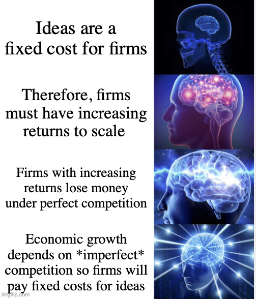

# Incentives to innovate
{: .no_toc }

1. TOC 
{:toc}

## Profits!
We know a lot about the dynamics of productivity growth and how it must settle down in the long run to depend on population growth. That was consistent with the [simple model](fixed.html) we set up earlier. But that model was predicated on the idea that firms or ideas only get added if it there are profits to be had. Remember, we said that firms or products or ideas will only enter if

$$
f \leq \frac{s_{\pi}}{s_L} \theta \frac{L}{A},
$$

or the fixed costs of entry are less than the operating profits they can earn from selling their product. We also assumed that firms would enter until this relationship became and equality (so the marginal firm earned zero profits) but we need the entrants to earn some profits to want to enter. There can only be entry if $s_{\pi} > 0$. 

But as mentioned earlier, they cannot charge a price higher than marginal cost and earn profits unless there is imperfect competition. In short, there have to be limits to entry by *other* firms who can *copy* these products. We need to *exclude* firms from entering and mimicking the exact idea or product of other firms to incent firms to come up with those new ideas or products.

## Excludable things
This notion of exclusivity is the key to generating profits from innovation. If refers to a property of goods, services, or ideas. Something is *excludable* if you have some legal or physical way of preventing someone from using that something (i.e. excluding them). In practice, this means that you can force someone to *pay* your to use that something. In order for you to make money selling *anything*, it has to be excludable. Non-excludable means the opposite, and refers to things that it is hard or impossible to prevent people from using, and therefore hard or impossible to charge them for.

You might be thinking of the concept of rivalry and non-rivalry right now. But be careful, excludability and rivalry are *different*. I like this video because Rohen (who does a lot of good economics tutoring videos) does a nice quick job of explaining the distinction, and in giving you some idea of how the two concepts of rivalry and excludability interact.

<iframe width="560" height="315" src="https://www.youtube.com/embed/Dzcpt6HG5Y4" frameborder="0" allow="accelerometer; autoplay; encrypted-media; gyroscope; picture-in-picture" allowfullscreen></iframe>

The key square for us here is the non-rival, excludable square, which are "artifically scarce" goods. The ideas that generate productivity growth are non-rival, as discussed before. That non-rivalry is what allows growth to occur. But to provide incentives for people to spend effort (R&D spending and time) those non-rival ideas have to be made excludable, or artifically scarce. 

How do we do that? The most obvious answer is intellectual property (IP) law: patents, copyrights, trademarks, and the like. This video is an explainer from out of the UK, so some of the minor details are not going to be true for the US. However, it gives you a good introduction to the separate types of intellectual property rights that create excludability for non-rival ideas.

<iframe width="560" height="315" src="https://www.youtube.com/embed/EQsZf2G4Sdc" frameborder="0" allow="accelerometer; autoplay; encrypted-media; gyroscope; picture-in-picture" allowfullscreen></iframe>

We could go deep down the rabbit hole of IP and innovation. For the moment, though, we're just interested in the idea that IP creates the excludable characteristic of non-rival ideas. Note that nothing here says that *more* IP or *stronger* IP necessarily increases innovation. We probably need *some* IP to incent innovation, but it is an open question of how much. We'll come back to that later.

## Effort on fixed costs
For us, the shorthand way to explain the notion of excludability is going to be through the profit rate, $s_{\pi}$. The higher this share, the more "protected" a firm or idea, and the more "excluded" competitors are from making exact or near copies of their products. We'd expect that the more protected each idea is, the more effort that firms or entrepreneurs will put into making them. That effort is measured by the share of labor that they use in working on those fixed R&D or start-up costs, $s_R = L_R/L$. 

What we want to think about now is what dictates the choice of $s_R$ by firms/entrants and how that is related to the excludability and $s_{\pi}$. That in turn is going to tell us about the level of GDP per capita. Remember, that choice isn't going to change the *growth rate* of productivity or GDP per capita, which just depends on $g_L$. But the choice of $s_R$ will tell us about how productive the economy will be overall, $A_0$. 

To do this we are going to be a little more sophisticated about how we view the entry decision. We had established that firms/ideas/products enter until,

$$
w f = s_{\pi} pQ
$$

But this condition only relates the fixed costs, $wf$, to the *current* profits that a firm could earn introducing a new product. What is in reality more important is the entire future stream of profits that they could earn. 

What we want is to replace $s_{\pi} pQ$ with a measure of the total present discounted value (PDV) of profits that the firm might earn from the invention. That PDV looks like this

$$
s_{\pi} p_0Q_0 + \frac{s_{\pi} p_1Q_1}{(1+r)} + \frac{s_{\pi} p_2Q_2}{(1+r)^2} + ...
$$

where $s_{\pi} p_0 Q_0$ are the profits they could earn immediately, $s_{\pi} p_1Q_1$ are the profits they could earn next period, $s_{\pi} p_2Q_2$ the profits two periods from now, and so on. Each of those terms is discounted at the rate $r>0$, meaning the future profits are not quite as valuable as immediate profits. What's $r$? It's the interest rate. 

Recall that we said $pQ = PY/M$, so this summation is 

$$
s_{\pi} PY_0/M_0 + \frac{s_{\pi} PY_1/M_1}{(1+r)} + \frac{s_{\pi} PY_2/M_2}{(1+r)^2} + ...
$$

Nominal GDP is going to grow over time. Along a BGP we would have $PY_1 = (1+g_L + g_A)PY_0$ and $PY_2 = (1+g_L+g_A)^2 PY_0$, and so on. We also said that $M$ grew, so $M_1 = (1+g_A)M_0$ and $M_2 = (1+g_A)^2 M_0$, and so on. This means we can write this whole PDV of profits as

$$
s_{\pi} PY_0/M_0 + s_{\pi} PY_0/M_0\frac{(1+g_A+g_L)}{(1+g_A)(1+r)} + s_{\pi} PY_0/M_0\frac{(1+g_A+g_L)^2}{(1+g_A)^2(1+r)^2} + ...
$$

but this can be simplified in two ways. First, we can pull the $s_{\pi} PY_0/M_0$ out from each term. Second, $\frac{(1+g_A+g_L)}{(1+g_A)(1+r)} \approx 1/(1+r + g_A - g_A - g_L) \approx 1/(1+r - g_L)$. Notice that the $g_A$ cancels out. Revenues grow at $g_A$ because GDP goes up, but as $M$ goes up that means revenues go down as they are split across more products or the price gets competed down. 

Regardless, we have the PDV of profits as

$$
s_{\pi} PY_0/M_0 \left(1 + \frac{1}{1+r-g_L}  + \frac{1}{(1+r-g_L)^2} + ...\right)
$$

and that can be written as

$$
s_{\pi} PY_0/M_0 \sum_{t=0}^{\infty} \frac{1}{(1+r-g_L)^t}.
$$

and that summation has known answer so long as $r > g_L$ of $1/(r-g_L)$. 

$$
\frac{s_{\pi} PY_0/M_0}{r-g_L}.
$$

Okay, so now we have an expression for the full PDV of profits an entrant could earn from their new idea. Let's take that back to the entry condition, and now we have

$$
w f = \frac{s_{\pi} PY_0/M_0}{r-g_L}.
$$

We can go forward the same way as before. We have $PY_0 = wL_0/s_L$ and we have that $A_0 = \theta M_0$, so the entry condition is

$$
f = \frac{s_{\pi}}{s_L}\theta\frac{L_0}{A_0}\frac{1}{r-g_L}.
$$

All we've done is add this additional discounting term $1/(r-g_L)$ to the mix. Notice that this *raises* the value of profits because $r-g_L < 1$. 

This is a *lot*, but it is just what the world looks like from the firm/product/idea level. But we know from [the dynamics](proddynamic.html) that the size of $f$ is determined by $L_R$ and $A$, as in 

$$
f = \frac{L_R^{1-\lambda}}{A^{\phi}}.
$$

If we plug this in we get that

$$
\frac{L_R^{1-\lambda}}{A^{\phi}} = \frac{s_{\pi}}{s_L}\theta\frac{L_0}{A_0}\frac{1}{r-g_L}.
$$

or 

$$
\frac{L_R}{L}= \frac{s_{\pi}}{s_L} \theta \frac{L_R^{\lambda}}{A^{1-\phi}}\frac{1}{r-g_L}.
$$

We know on the right-hand side $g_A = \theta L_R^{\lambda}/A^{1-\phi}$, so we have 

$$
\frac{L_R}{L}= \frac{s_{\pi}}{s_L} \frac{g_A}{r-g_L}.
$$

We already defined the ratio of $s_R = L_R/L$ so that gives us

{: .important }
>If firms/ideas/products enter until profits are zero, then
>$$
>s_R = \frac{s_{\pi}}{s_L} \frac{g_A}{r-g_L}
>$$
>is the share of labor used to pay the fixed costs associated with innovation/development. 

That ratio holds given the current growth rate of $g_A$, which depends on the current ratio of $L$ to $A$, as that determines both the profits available to firms/ideas and the fixed costs associated with them. What we learn from this is that the higher the profit share, $s_{\pi}$ - the more excludable the products or ideas are and the harder it is for competitors to enter - the more effort firms will put into the fixed costs associated with ideas/firms/products. That makes sense. They are after a profit, and being able to maintain a high markup is one determinant of that profit, the other being the scale of the market. The smaller the discounting, $r-g_L$, the *bigger* the value of $s_R$ because the future profits are that much more valuable. 

We can see then that the choice of legal structures or other terms in the economy that influence excludability then dictate to some extent the level of productivity via $s_R$. As the value of $s_{\pi}$ gets bigger more and more labor gets used in developing new products. 

## Is that a good thing?
So is the right concept to push up $s_{\pi}$ as high as possible, and get $s_R$ as high as possible? Not necessarily. It affects the flow of actual goods and services. The trade-off is in having lots of new products in the future versus having lots of products today. A high value of $s_R$ raises $A_0$, and hence GDP per capita. But a high value of $s_R$ means that a lot of labor is being used to develop *new* products, and not to produce real goods and services *now*. It's a question of whether you want stuff immediately or whether you want stuff in the fugure, and we're sure that we want *some* stuff immediately, so we don't just want future new products, so we don't want $s_R = 1$. 

You can look in this [subsection](optimal.html) to find some math for this, but the important point is that

{: .important }
>There is an optimal level of $0< s_R < 1$ less than one that maximizes GDP per capita along a BGP, because workers assigned to develop new firms/products/ideas are not producing current goods and services. That means there is an optimal level of the profit share, $s_{\pi}$, which maximizes GDP per capita, and that optimal level is bigger than zero (firms need incentives to enter) but is definitely less than one (which would mean no one produces goods or services).

The very, very hard part is that there is no obvious answer on how to set $s_{\pi}$ to get the "right" $s_R$, even if you believed that our little equation was the right way to evaluate things. Excludability is not a choice we can make directly. It's a complex outcome of lots of laws, rules, and norms. 
