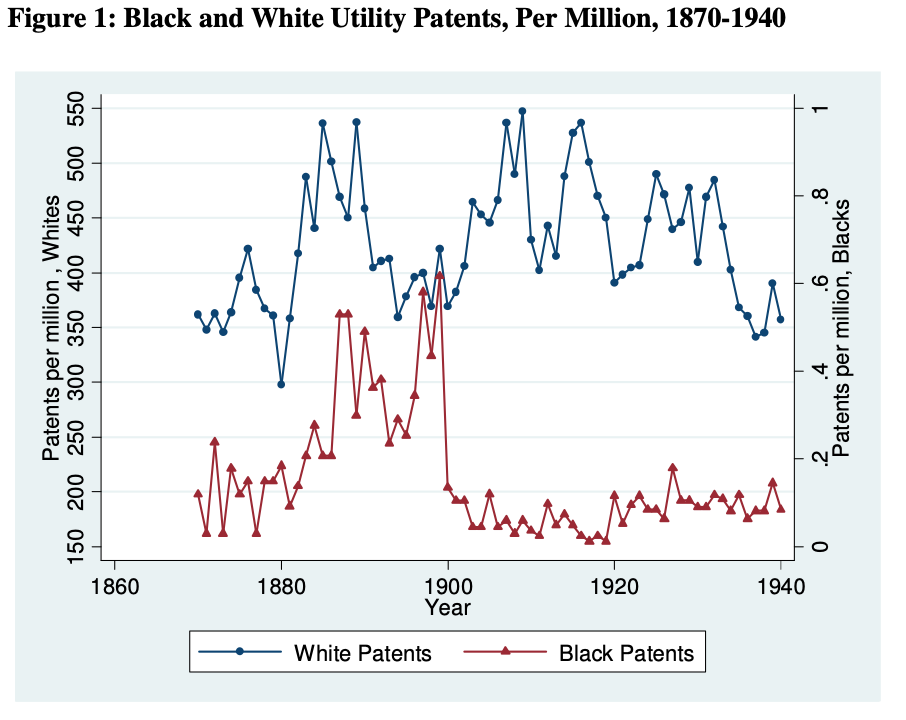
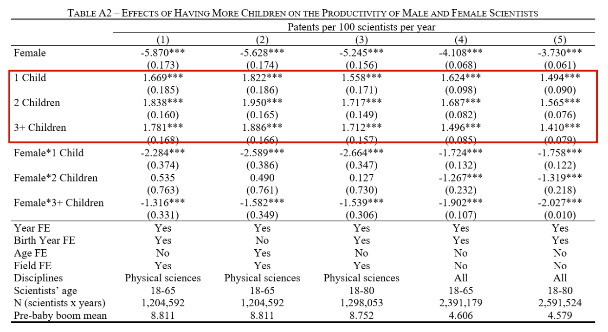

# Missing innovation
{: .no_toc }

1. TOC 
{:toc}

The key to productivity growth is research effort. And the more researchers we have, the more ideas we can generate to raise productivity. If exclude some people from taking part in the research and innovation process, we're throwing away the chance at ideas that could benefit everyone.

## Violence and African-American Patents
Dr. Lisa Cook has a [paper](https://lisadcook.net/wp-content/uploads/2014/02/pats_paper17_1013_final_web.pdf) that looks at whether the level of innovative activity (patents) changes in response to hate-related violence (lynchings, riots), or whether economic activity changes in response to the shift in property rights that result from hate-related violence. 

She has done a number of great interviews on the topic, which are worth listenting to as she does a good job explaining the consequence of this violence on African-American patenting activity. [NPR Interview](https://pca.st/nkjjnzuf).

The key figure shows patent activity per million persons for both white and Black citizens in the US over time. You can see that white patent activity stays relatively constant over time, although it fluctuates a bit. Compare that to the patent activity among the Black community. After the Civil War (1865) until around 1900 Black patent activity was on an upward trajectory. It was around 1900 that much of the "Jim Crow" era rollback of civil rights occurred in the South, alongside a rise in lynchings and race riots. At this point the patent activity of the Black community plummeted, and has stayed low every since.

The second figure gives you some sense of the timing of things. It plots again Black patent activity, but now alongside lynching activity and riots that took place in response to expansions in Black rights. You can see that lynching activity increased alongside the rate of Black patenting in the late 1800s, consistent with the white community responding to increased economic activity and innovation by the Black community. Once Black patent activity died down in the early 1900s, you can see how lynching activity declines as well. This isn't meant to show that patents were the *only* reasons for lynchings, but rather that patent activity in the Black community both affected and was affected by hate-based murders of Black people.

This kind of racial violence is horrific at a human and moral level, and let's be clear that even if there were *no* economic consequences these lynchings and riots are reprehensible. But *on top* of the moral aspect, there *were* economic consequences that had long-run effects on everyone. 

Remember the dyamics of productivity growth, and the fact that research effort $R_t$ appears in the numerator. 

$$
g_{A} = \theta \frac{R_{t}^{\lambda}}{A_t^{1-\phi}}.
$$

If you remove some people from the pool of researchers, then $R_t$ goes down, and therefore $g_A$ goes down. We know dynamically that eventually the growth rate $g_A$ will return to the growth rate $g_R$. 

But what does cutting out a portion of people from innovation do to the *level* of productivity, even in the long run? There is a case study in this topic on what happens if there is a one-time *positive* [shock to the number of researchers](applyideas.html). We can reverse that logic here, with a *negative* shock. Productivity will be *permanently* lower because of the loss of the Black researchers. 

## Lost Einsteins
A separate study by [Bell, Chetty, Jaravel, Petkova, and van Reenen](http://www.nber.org/papers/w24062) looks at who becomes an inventor in the United States, focusing on a more recent time frame that Cook's study. You can also see their own summary [here](https://voxeu.org/article/how-exposure-innovation-influences-who-becomes-inventor).

First, children from high-income (top 1%) families are ten times more likely to become inventors than children from families with below-median income. They provide the following figure showing the raw data on highly-cited patents and parents income. Kids with the richest parents have about 0.4 highly-cited inventors per thousand (i.e. 4 highly-cited inventors for every 10,000 kids). For kids from the 20th percentile of the income distribution only have about 0.04 per thousand (or 4 highly-cited invenstors for every *100,000* kids). 

There are similar sized gaps by race and gender, consistent with what Cook found above. This figure shows the percent of inventors who are female, over time. You can see this is well below 50%, and at the growth rate shown in the figure, it will be over a century before that percent hits 50%.

What about the role of innate ability? Are high-income or males just better at inventing? It doesn't appear to be the case. The authors use some incredibly detailed data on students from New York where they can link the 3rd-grade standardized test scores to who ended up filing a patent later in life! It gives them the ability to draw the following figure.

On the x-axis are the standardized test scores of kids. The y-axis shows the proportion of those kids at each score who became inventors. The orange line is for kids whose parents had income below the 80th percentile, and the blue line for kids with parents above the 80th percentile. You can see that both lines slope up, meaning that no matter what the income level, kids who do better on standardized tests in 3rd grade are more likely to invent later in life. 

But the important comparison here is between the two lines. At a lot of the low test scores, the blue line is slightly above the orange, indicating that conditional on having the same innate ability, kids from higher income backgrounds were slightly more likely to invent something. But if you look to the right side of the figure, among kids with the very best test scores, the gap becomes *huge*. Kids that are both bright *and* from well-off families are far more likely to become inventors (7 per thousand) while kids that are *just as bright* but from less well-off families only invent at a rate of 3 per thousand, less than half. 

The combination of all these facts means that there are a bunch of "Lost Einsteins", as the authors call them. People from poorer communities, women, and non-white people have the same capacity to invent, but apparently family income determines whether they can take advantage of that capacity. Limiting researchers and inventions based on family income robs the economy of ideas they might have invented, and reduces the level of productivity in the long-run. The logic here is identical to what I described above. If you artificially lower $R_t$ at each point in time by excluding poor, female, or non-white innovators, then you are lowering long-run productivity. 

## Women in science
[Kim and Moser](https://www.dropbox.com/s/2umv5go9umjdolm/KimMoser.pdf) have a recent paper documenting the differential career paths for women in science compared to men. They link together information on the family history of a scientist (date married, number of kids) with the timing of their important patents or inventions. This reveals some distinct differences on the role of family formation for the two genders on their activity, and suggests that because of the unequal expectations or demands on time, female scientists essentially a penalty for being women. What we lose as a society are the innovations these women *would* have come up with had they not been subject to the same limitations.

You can see some of the effects in the following tables. In this first table, the numbers highlighted in red are estimates of the effect of having their first child on the patent activity of mothers. The measure of patenting is patens per 100 scientists per year. So this table means that the number of patents per 100 female scientists with a first child was 2.2-2.6 patents lower than females without a child. The mean for the whole sample is around 8.8 patents, so that is a pretty massive effect. 

Perhaps that is just a reflection of having kids, and it affected fathers just as much? Not so much. The second table is identical to the first, only has a different section highlighted. These numbers are the estimated effect of having a first child on *fathers*. Here you can see that the first kid *raised* the number of patents by about 1.6-1.8 patents per 100 fathers per year. There was a distinct difference in the consequences of starting families on scientific output. Where it slowed down female innovation, it sped up innovation by male scientists.

This distinction between genders in patenting activity even extends to marriage, as the following figure is meant to show. Kim and Moser took all the scientists in their sample, and found in what year they got married. They then overlay everyone on the same scale, so that 0 means the year you were married, and -1 means it was one year before you were married, and 8 means it is your 8th year of marriage. 

The red line in the figure indicates the year before marriage for all scientists, and they normalize the patents per 100 scientists for their four groups to be equal in this period. Those four groups are mothers, fathers, other men (non-fathers) and other women (non-mothers). So starting from the same baseline, how did each group's patent activity fare after marriage? The light gray lines are for men (either fathers or non-fathers). You can see that patent activity rose substantially in the 10 years after marriage, by an average of about 5 patents per 100 men (remember, the average is about 8.8, so that is a lot). 

For women, the consequences of marriage were not as fruitful. They essentially flatlined after marriage until about 15 years. At that point mothers see their patent activity accelerate like crazy (perhaps after their kids are older?) while for other women their patent activity falls off in a manner similar to men who are about 15 years into marriage. 

The overall thrust is that forming a family and having kids tends to limit patent activity for women, while it enhances it for men. Even leaving aside the equity issue (which is substantial) the economy is sacrificing an amount of innovation through these effects. If marriage led to an acceleration of patent activity for both genders, we'd be getting a significant amount more patent activity. 

Even if that was not possible, the issue here is the distribution of who is innovating by ability. What I mean is that ability is distributed across genders equally, so by cutting off women from scientific activity due to family we are sacrificing scientists who would otherwise be at the forefront of their fields. The men who remain in those fields are going to have lower average ability. So even if the raising of children demands that *someone* sacrifice their time and career for the kids, we're losing out by focusing that sacrifice on women. 