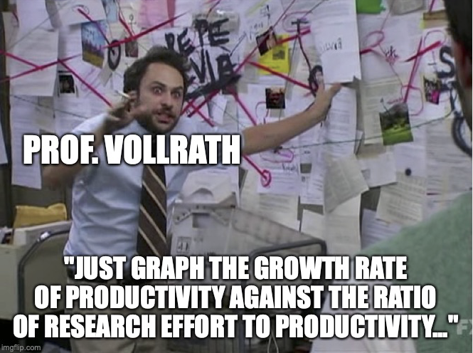

# Dynamics of productivity
{: .no_toc }

1. TOC 
{:toc}

## Research effort and productivity growth
We want to build a model that explicitly makes productivity growth a function of research and development effort, and that can match the fact that R&D effort has increased but the rate of productivity growth remained roughly stable.  

To do this we will set up an equation for the "accumulation" of productivity, sort of like the accumulation equation we had for capital. Here's how we'll set this up,

$$
A_{t+1} = A_t + \theta R_{t}^{\lambda} A_t^{\phi}.
$$

Productivity in period $t+1$ is equal to productivity in period $t$ plus this collection of terms (with the $\theta$) that represents the additional productivity gained in that period. Unlike capital, we don't have an explicit depreciation term for productivity, although we could do that (imagine old technologies becoming obsolete) at the cost of some more algebra. 

The important element here is the term $\theta R_{t}^{\lambda} A_t^{\phi}$, which tells us the additional productivity that innovative activity produces. The $\theta$ term is just there as a scaling parameters. You can think of it as translating the number of innovations into the actual effect of productivity (remember the stupid patents). 

$R_t$ measures the amount of R&D effort done. We could measure that either with total spending or with the number of R&D workers. We'll tend to use the number of R&D workers to keep things concrete. The exponent $\lambda$ is assumed to be $0 < \lambda \leq 1$. It tells us the elasticity of new productivity to the number of R&D workers. If $\lambda = 1$, then a 10% increase in R&D workers will increase the flow of new productivity by 10% (careful, it doesn't raise *productivity* by 10%, it raises the amount of new productivity being added by 10%). But R&D workers could interfere with one another, or duplicate efforts, so it is plausible that $\lambda<1$, so that a 10% increase in R&D workers may only increase the flow of new productivity by 3% or 6% or 8%. 

The $A_t^{\phi}$ term is the current productivity level, and it is assumed that this impacts the flow of new productivity. The value of $\phi$ could be anything, but we'll see below that the date are going to indicate that $\phi<1$. If $0<\phi<1$, so that $\phi$ is positive, then having a higher productivity level *increases* the flow of new productivity in the economy. This is sometimes called the "standing on shoulders" effect, for researchers being able to see new opportunities because of past innovation. 

If you feel like nerding out a little, check out the [history](https://en.wikipedia.org/wiki/Standing_on_the_shoulders_of_giants) of the phrase "standing on the shoulders of giants", which is kind of fun. 

It is also possible that $\phi<0$, which is sometimes called the "low-hanging fruit" effect. If $\phi$ is negative, then the higher is productivity, the *smaller* is the flow of new productivity. This might happen because prior researchers already found all the relatively easy ideas (fire, wheels, algebra) and what we're left with are harder problems (AI, genetic engineering). 

Regardless of the values, the term $\theta R_{t}^{\lambda} A_t^{\phi}$ tells us how much extra or new productivity we add in period $t$. We can re-arrange the original expression to figure out the growth rate of productivity. 

Subtract $A_t$ from both sides, and then divide by $A_t$,

$$
\frac{A_{t+1} - A_t}{A_t} = \theta R_{t}^{\lambda} A_t^{\phi-1}
$$

and note what is on the left-hand side, the growth rate of productivity. We called this $g_A$, but here let's be clear that this growth rate *could* be changing over time,

$$
g_{A} = \theta R_{t}^{\lambda} A_t^{\phi-1} = \theta \frac{R_{t}^{\lambda}}{A_t^{1-\phi}}.
$$

## Dynamics of productivity growth
The last equation describes how the growth rate of productivity changes over time. It depends on the interaction of the number of researchers, $R_t$, and the size of current productivity, $A_t$. Just like we did with the capital/output ratio, let's take a look at a simulation first to see how the growth rate of productivity changes as $R$ and $A$ change. 

For this simulation, I set the value of $\theta = 0.01$. Remember, this just translates the growth in ideas produced by researchers into productivity terms. Set $\lambda = 1$, and $\phi = 0$. This makes the growth rate equation simple, $g_A = .01 \times R_t/A_t$. Finally, let $g_R = 0.02$, or the number of researchers grows by 2% per year. The initial number of researchers is $R_0 = 10$. 

Just like with capital/output, the simulation is set up with two separate economies, A and B. In economy A, initial productivity is $A_0^A = 2$, so the ratio of $R_0/A_0^A = 5$. Economy has higher initial productivity, $A_0^B = 10$, and a ratio of $R_0/A_0^B = 1$. 

<iframe width="900" height="600" frameborder="0" scrolling="no" src="//plotly.com/~dvollrath/103.embed"></iframe>

We know that because economy A has a higher ratio of researchers to productivity it will start with a higher growth rate of $g_A = .01 \times 5 = .05$ or 5%. But the next period, productivity will be higher by 5%, and the number of researchers will only grow by 2%, so the ratio of R/A in economy A will *fall*, which will lower the productivity growth rate. 

In economy B, the initial growth rate of productivity is $g_A = 0.01 \times 1 = .01$, or only 1%. Because R grows at 2%, and productivity only grows at 1% in economy B, the R/A ratio for economy B will *rise*, and this will increase the productivity growth rate. 

When you play the simulation you see that both economies collapse towards a ratio of researchers/productivity of 2, and a common growth rate of productivity of 0.02, or 2%. This growth rate is identical to the growth rate of researchers, and that, it turns out, is not an accident. 

## Implications
The simulation showed that both economies have a common growth rate of productivity. Let's solve more generally for what that common growth rate is, given any set of parameters or starting values for $R_0$ and $A_0$. 

What we are after here is a value for $g_A$ such that $g_A$ no longer changes. In the Solow model, we found a steady state for the K/Y ratio, and at that ratio $g_{K/Y} = 0$. We're doing something similar here, looking for a steady state. But here the steady state will involve a ratio of R to A such that $g_A$ is *constant* (but not necessarily zero like with the capital/output ratio). This is an important point for us because we know from the data that along a BGP the growth rate of productivity is roughly constant. 

Intuitively, from the equation for $g_A$ we know that it will stay the same if $R_t^{\lambda}$ grows at the same rate as $A_t^{1-\phi}$, so that their ratio stays the same. 

To see in math what we're doing, we're going to find the *growth rate of the growth rate*. In other words, by what percent does $g_A$ itself change each period. We know how to do that. Take logs,

$$
\ln g_{A} = \ln \theta + \lambda \ln R_{t} - (1-\phi) \ln A_t.
$$

Then take the derivative of this with respect to time, or

$$
g_{g_A} = \lambda g_R - (1-\phi) g_A.
$$

That funky thing on the left is the growth rate ($g$) of the growth rate of productivity ($g_A$). It depends on how fast researchers grow ($g_R$) relative to how fast productivity is growing ($g_A$) at that moment. 

We're after the steady state point where the growth rate of productivity stops changing (remember the simulation), or where $g_{g_A} = 0$. Set that to zero and solve for

$$
g_A^{BGP} = \frac{\lambda}{1-\phi} g_R.
$$

I labelled this $g_A^{BGP}$ because this is the growth rate of productivity along a balanced growth path, when it is at steady state. Let's just confirm that our simulation is working the way we want. With $\lambda = 1$ and $\phi = 0$, and $g_R = 0.02$, then it must be that $g_A^{BGP} = 1/(1-0) \times .02 = .02$. Yes, the simulation delivers the result we expect. Or, the equation matches what we saw in the simulation.

This gives us a pretty clean result in determining the productivity growth rate.

Productivity growth and researcher growth
{: .label .label-green }
**Along a BGP the growth rate of productivity depends on the growth rate of the number of researchers according to $g_A^{BGP} = \frac{\lambda}{1-\phi} g_R$. It does not depend on the absolute number of researchers or the absolute size of productivity.**

More researchers means more ideas, and that pushes up the growth rate of productivity. But recall that higher productivity tends to push down $g_A$, so those two forces are fighting against one another. The economy can sustain a higher growth rate of $g_A$ along the BGP if it has a faster growth rate of researchers to keep overcoming the drag from the higher *level* of productivity. But simply having more researchers does not, by itself, lead to faster growth in productivity. 

And this is crucial in matching what we saw in the data. Recall the prior section said that while the absolute effort on R&D rose over time, the growth rate on productivity did not, across a number of countries. We can make this more tangible by plotting the growth rate of productivity against the log of R&D workers for several countries.

<iframe width="900" height="600" frameborder="0" scrolling="no" src="//plotly.com/~dvollrath/105.embed"></iframe>

Yes, there is some sense that in China there are both a lot of researchers *and* a relatively high productivity growth rate, but across most of this data there is no clear relationship. The US and Japan have substantially more R&D workers than Korea, Germany, or Great Britain, but their productivity growth is not higher. 

On the other hand, if we plot the growth rate of productivity against the *growth rate* of the number of researchers, we get a more robust picture. 

<iframe width="900" height="600" frameborder="0" scrolling="no" src="//plotly.com/~dvollrath/107.embed"></iframe>

Here, there is a tendency to see higher productivity growth when $g_R$ is higher. This doesn't prove the theory is right. First, this is just a handful of countries, and a simple correlation in the data is not the same thing as a causal relationship. Second, the theory was *designed* to produce this result. We were trying to come up with something that can mimic this relationship, and we did.

## Stability
The prior sub-section describes the productivity growth rate along the BGP. But just as with the Solow model and the K/Y ratio, we want to know if that is a *stable* outcome. If the economy starts out with a $g_A$ above or below the BGP growth rate, does it have a tendency to return to $g_A^{BGP}$? The simulation suggests that yes, it does. But why is that? 

Go back to the expression for $g_A$

$$
g_{A} = \theta \frac{R_{t}^{\lambda}}{A_t^{1-\phi}}.
$$

Take a look at a dynamic figure representing this relationship. Here, I've plotted the growth rate $(1-\phi)g_A$ (the sloped line), and the growth rate $\lambda g_R$ (the horizontal line). 

<iframe height="700" width="1200" frameborder="no" src="https://dietzvollrath.shinyapps.io/JustRA/"> </iframe>

No matter where you start, the system pushes you back to the point where the two lines cross, and where $g_A = g_R \times \lambda/(1-\phi)$, which is the BGP growth rate of productivity. This says that the productivity growth rate is *stable*. 

But try adjusting the value of $\phi$ up towards 1. It becomes almost horizontal, and in that case the $(1-\phi)g_A$ line may not intersect the $\lambda g_R$ line at all. In that case the system does not come to rest at a steady state. This means we've got another finding.

Stable productivity growth
{: .label .label-green }
**The growth rate of productivity along a BGP is stable at $g_A^{BGP} = g_R \lambda/(1-\phi)$ if the value of $\phi<1$.**

$\phi<1$ essentially says that the growth rate of productivity must fall as productivity rises. It means that getting more productive cannot lead to an acceleration of productivity growth. The data suggest that this must be true. We do not see that productivity growth accelerates as productivity rises.

## The level of productivity
Just like we did with the Solow model, we want to distinguish between the growth rate of productivity on the BGP ($g_A^{BGP}$) from the *level* of productivity on the BGP. Let's go back to our formula for how productivity growth works, and note that this still holds along the BGP.

$$
g_{A}^{BGP} = \theta \frac{R_{t}^{\lambda}}{A_t^{1-\phi}}.
$$

Since we know the growth rate along the BGP, this becomes

$$
\frac{\lambda}{1-\phi} g_R = \theta \frac{R_{t}^{\lambda}}{A_t^{1-\phi}}
$$

and this tells us how $A_t$ and $R_t$ are related *along* a BGP. To find the *level* of productivity at any given point in time on the BGP, start by taking logs

$$
\ln \frac{\lambda}{1-\phi} + \ln g_R = \ln \theta + \lambda \ln R_t - (1-\phi) \ln A_t.
$$

Now re-arrange this so that the $(1-\phi) \ln A_t$ is by itself on the left,

$$
(1-\phi) \ln A_t = \ln \theta - \ln \frac{\lambda}{1-\phi} - \ln g_R + \lambda \ln R_t.
$$

And finally divide by $(1-\phi)$ on both sides,

$$
\ln A_t = \frac{1}{1-\phi}\ln \theta - \frac{1}{1-\phi} \ln \frac{\lambda}{1-\phi} - \frac{1}{1-\phi}\ln g_R + \frac{\lambda}{1-\phi} \ln R_t.
$$

So productivity on the BGP depends on the level of $R_t$, not surprising. We can go a little further. If $R_t$ is growing at a constant rate, then we have that

$$
R_t = R_0 (1+g_R)^t
$$

and taking logs we get

$$
\ln R_t = \ln R_0 + t \ln (1+g_R) \approx \ln R_0 + g_Rt
$$

where the approximation comes from the properties of logs and small growth rates. Put this back into the expression for $\ln A_t$.

$$
\ln A_t^{BGP} = \frac{1}{1-\phi}\ln \theta - \frac{1}{1-\phi} \ln \frac{\lambda}{1-\phi} - \frac{1}{1-\phi}\ln g_R + \frac{\lambda}{1-\phi} \ln R_0 + \frac{\lambda}{1-\phi} g_R t.
$$

Much like in the Solow model, this expression looks like a pile of gibberish. But note that it is just the equation for a line. The y-variable here is $\ln A_t^{BGP}$, and the x-variable is $t$. I've used the notation $\ln A_t^{BGP}$ to indicate that this is the path of productivity on a BGP, and our actual productivity might not be on this BPG path (just like in the Solow model the K/Y ratio may not be on the BGP).

The slope (the growth rate) is exactly what we think it should be, $g_R \lambda/(1-\phi)$. 

The rest of the gibberish is the intercept of the line, and determines the *level* of productivity. The most important from our perspective is $R_0$. This is the baseline level of research effort that is done, and it dictates how big productivity will be. 

Here we have to be really careful, and don't over-interpret $R_0$ as the literal number of researchers. Think of it more as the baseline level of research effort done in the past. This number, as mentioned before, doesn't have to just include research effort from the country we are talking about. Ideas are non-rival, so the research effort and productivity level of a country may be determined in part by research done in *other* economies.

## Visualizing the dynamics
For a different way of seeing what is going on, you can also try this [spreadsheet](https://docs.google.com/spreadsheets/d/1nN9Di392qIkza7RYq6Tp6yqBWtyxx3JAtseMaX4aDvA/edit?usp=sharing) which lays out the dynamics of productivity period by period. You can adjust the parameters and initial values of R and A to see how productivity growth evolves over time.

<iframe src="https://docs.google.com/spreadsheets/d/e/2PACX-1vQKwEdw0tpHNsoB30siQ3vuEN55HET1JcMhZYdyUnwf7v6q91VkaPA0yBxfHSxd5wfWApd5SusIx0Bt/pubhtml?widget=true&amp;headers=false"></iframe>

Or similar to the Solow model, the following app allows you to adjust parameters and see the impact on the level of productivity, the growth rate of productivity, and how the dynamic system works. Rather than using the embedded app, <a href="https://dietzvollrath.shinyapps.io/ProdBasic/" target="_blank">this link</a> will take you directly to the app on its own page. 

<iframe height="800" width="100%" frameborder="no" src="https://dietzvollrath.shinyapps.io/ProdBasic/"> </iframe>