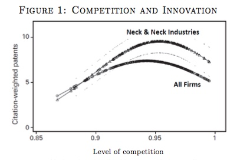

# Competition and growth
{: .no_toc }

1. TOC 
{:toc}

## Evidence on competition
The prior section explained that *some* profits are needed to stimulate innovation. What we will do here is establish that the relationship of innovation and profits is not as simple as "more profits, more innovation". 

To see what we're trying to explain, the following is taken from a paper by [Aghion, Bloom, Blundell, Griffith, and Howitt](https://ideas.repec.org/a/oup/qjecon/v120y2005i2p701-728..html) that looked at data from the UK to see how competition was related to innovation. They measure the "level of competition" using a formula like this

$$
Competition = 1 - \frac{Rev - Costs}{Rev} = \frac{Costs}{Rev}
$$

for each industry. The second fraction is the informative way to see their index. If costs are very close to total revenues, then profits (Revenue minus costs) are very close to zero, and this indicates the industry has a lot of competition. Either it is easy for new businesses to enter, driving down prices (and revenues) for existing competitors, or the existing businesses are selling similar products (HD TV's) with similar features and hence no one can charge much more than cost. Either way, if the index approaches 1, then the industry is highly competitive.

On the other hand, if the industry is *uncompetitive*, then this is going to show up as one or more firms have high revenues relative to their costs - high profits - and hence the competition index of costs/revenue is going to be *low*. 

In the figure below, this competition index for industries is on the X-axis. On the Y-axis is a measure of how innovative each industry was. That is measured by using not just by how many patents were issued by each industry, but by how *important* those patents were. When a patent is really useful, it will get cited a lot by *other* patents. The index of innovation captures whether industries were creating important patents. 

What you can see is a distinct hump-shape. When competition is *low*, innovation tends to be *low*. But it is also the case that when competition is very *high*, innovatino tend to be *low*. Innovation seems to be maximized in industries that have medium amounts of competition. The authors further break down the results by whether industries are "neck-and-neck", meaning the leading firms have very similar levels of productivity. In those industries, there is more innovation across the board, no matter how competitive the industry is to begin with. 

We can put together some mathematical models of how this works, but that takes us pretty far astray into doing what is really industrial organization research on firm-level forms of competition and innovation. These models are at the cutting edge of modern economic growth research, but won't add a lot to the basic intuition I'm about to describe. 

So what is going on in this figure? Let's think through three types of industries, and the incentives for innovation they have. 

1. Very competitive industries: In these industries, the economic (and accounting) profits that a firm can earn are very low. It is either very easy for competitors to enter the industry or the product is a homogenous product. Think of gas stations. Even if a firm were to innovate, the profits available to it are very small to begin with, and it may be easy for all its competitors to copy its innovation. There may be little IP protection for innovations in these industries. Again, think of gas stations. They can try to tell you they've innovated ("Chevron with Techron!") but let's face it, it's just gas. Firms in these industries don't have a lot of incentive to spend time innovating, because why bother?

2. Very un-competitive industries: In these industries, there is a dominant player or perhaps a few firms that have colluded to divide up a market. They face almost no competition to their product. It may be because the costs of entry are *huge* either because of technical reasons (cable companies, airlines) or because of network effects (Google) or something like that. These firms also do not have a lot of incentive to innovate, because why bother? They already earn profits, and since no one can steal their business, providing their product more cheaply or at a higher quality doesn't do them a whole lot of good. 

3. Medium-competitive industries: These are in the sweet spot. The firms that produce in these industries are able to earn significant profits because they make something that is differentiated and valuable to people (Apple, Samsung?), but the presence of a competitor and/or new entrants means they cannot just sit around or they'll lose market share. Each of the firms in these industries has to scramble all the time to innovate just to stay ahead of their competitors (or to keep up). 

We didn't prove anything formally here, but the intuition gives rise to this important point.

Growth and competition
{: .label .label-green }
**There is a medium level of competition among firms - neither perfect competition nor monopolies - that maximizes economic growth.** 

In economics we normally make a big deal about how perfect competition is the most efficient form of market organization. But note that this is a statement about the level of economic output *given* a level of productivity. If productivity were held constant, then we'd want all industries to be perfectly competitive, as that would maximize production. But if we're thinking about growth in productivity, we *don't* want perfect competition because this would limit innovation. 

Combine this with the finding from the last section about profits and the payments to rival inputs, and you see that growth *requires* the economy to be operating in a murky area far away from theoretical ideals. 

We don't know precisely where the sweet spot is, and thus it is very possible that we have too little or too much competition in the economy to maximize growth, or that we are over or under-paying rival inputs relative to what would maximize growth. There is no clean answer to what economic conditions maximize innovation and economic growth. 

## Competition and the level of innovation
[*Note to students*: I'm really unhappy with this section, so if you don't get it don't worry. I'm trying to work out something more intuitive and easier to follow.]

Having just said that we cannot get clean answers, let's make some assumptions and provide some explanation for the level of R&D that gets done, and it's growth rate, $g_R$. Recall that this $g_R$ dictates the long-run growth rate. 

First assumptions are that the *only* industries or firms that do R&D are those in medium-competitive industries. We're being very stark in saying that perfectly competitive industries do *zero* innovation, and industries with monopolies (or perhaps some colluding oligopolists) do *zero* innovation. 

Again, there are more thorough treatments of this we could do mathematically. Here we are just trying to get some sense of what drive things. The key idea we'll use is that firms (or individuals) are making decisions about how to allocate their time between two activities: R&D to create new innovations and "regular" work. R&D doesn't pay off today, it pays off tomorrow with new ideas that raise GDP. Regular work pays off today, but tomorrow it doesn't do anything to raise GDP.

What do firms get at the margin from having someone do regular production work? The marginal product of labor, which in our Cobb-Douglas function is $(1-\alpha)Y_t/L_t$. 

What do they get at the margin for someone doing R&D work? Well, that is more complicated. Let $s_{\pi M}$ be the share of GDP that is accounted for by profits in the medium-competitive industries. So $s_{\pi M} Y_{t+1}$ is the total amount of income up for grabs *next* year in the medium-competitive industries. And we'll assume that the $R_t$ researchers employed *today* are each equally good at innovating, so the amount of profits that any given researcher can capture for their employer by innovating are $s_{\pi M} Y_{t+1}/R_t$. 

As we said, the firm will switch people back and forth between work ($L_t$) and research ($R_t$) until the marginal product of these two activities are identical. For completeness, the firm doesn't care that the research pays off tomorrow rather than today. In other words, they act such that

$$
\frac{(1-\apha)Y_t}{L_t} = \frac{s_{\pi M} Y_{t+1}}{R_t}.
$$

We can do one more thing. We know that $Y_{t+1} = (1+g_A + g_L)Y_t$ along a BGP. That is, total GDP will grow from today to tomorrow, and if we're close to a BGP, we know that growth rate of *total* GDP is $g_A + g_L$.

Let's plug this in

$$
\frac{(1-\apha)}{L_t} = \frac{s_{\pi M}(1+g_A + g_L) }{R_t}
$$

and notice that $Y_t$ cancels out. The two activities are proportional to GDP today, so it falls out of the problem. Regardless, re-arrange this to

$$
R_t = L_t \frac{s_{\pi M}}{(1-\alpha)} (1+g_A + g_L)
$$

or that $R_t$ is proportional to the population, $L_t$. Next, notice that if the share of GDP going to profits of medium-competitive industries goes up, so does the number of researchers. This could occur because more industries become medium-competitive, perhaps because entry to some very competitive industries is reduced or because entry to low-competitive industries is expanded. But if more industries become either perfectly competitive or monopolized, then $s_{\pi M}$ would fall, and this would *lower* R&D efforts. This is just capturing the intuition of the prior sub-section.

The final piece of this is the term in parentheses with the growth rates. $g_A$ is the growth rate of productivity, and we know that this already depends on $g_R$, with $g_A = g_R \lambda/(1-\phi)$. In other words, the *level* of $R_t$ depends on the growth rate of $R$, $g_R$. Why? Because the faster R is growing, the faster productivity is rising, and the faster productivity is rising the faster total profits in these medium-competitive industries are growing. It pays to do research when the economy is growing. 

This also explains the presence of $g_L$. The faster population grows, the larger the economy gets, and the more customers you've got, basically. It pays to do more research when the economy is going to be larger next period. 

Finally, we can use the above equation to give ourselves an idea of how fast $R$ grows, since we already know this dictates $g_A$ on the BGP. Take logs of the last equation

$$
\ln R_t = \ln L_t + \ln s_{\pi M} - \ln (1-\alpha) + g_A + g_L
$$

where I used the trick that $\ln (1+g_A+g_L) \approx g_A + g_L$ because both of those growth rates tend to be close to zero. Now take the time derivative of this, assuming that since we're close to a BGP that both $g_A$ and $g_L$ are constants. In addition, $s_{\pi M}$ is assumed to not have any clear growth rate, but is just a parameter.

$$
g_R = g_L.
$$

In other words, the growth rate of researchers here is bound to be close to the growth rate of population in general. If you think about it, that makes some sense. $g_R$ cannot be *alot* higher than $g_L$ or we'd see the proportion of R&D workers in the economy approaching one, and we know that not everyone is a researcher. And $g_R$ cannot be a lot lower than $g_L$, or the share of R&D workers in population would go to zero, and that doesn't appear to be true either. In short, the growth rate of R&D workers should be close to the growth rate of population. 

Things like $s_{\pi M}$, the degree of medium-competition in the economy, has a *level* effect on R&D, but doesn't change the growth rate of R&D, and thus doesn't change the growth rate of productivity in the long run. 