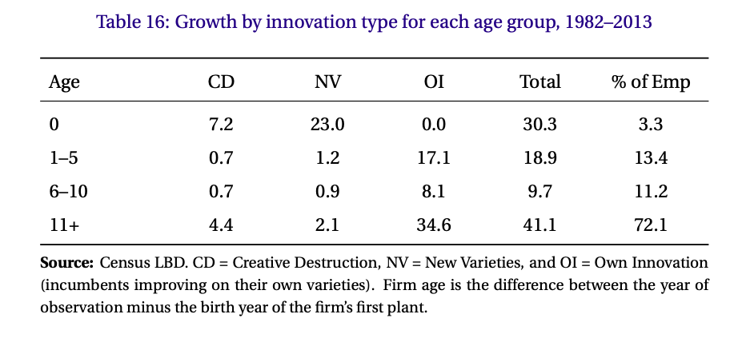
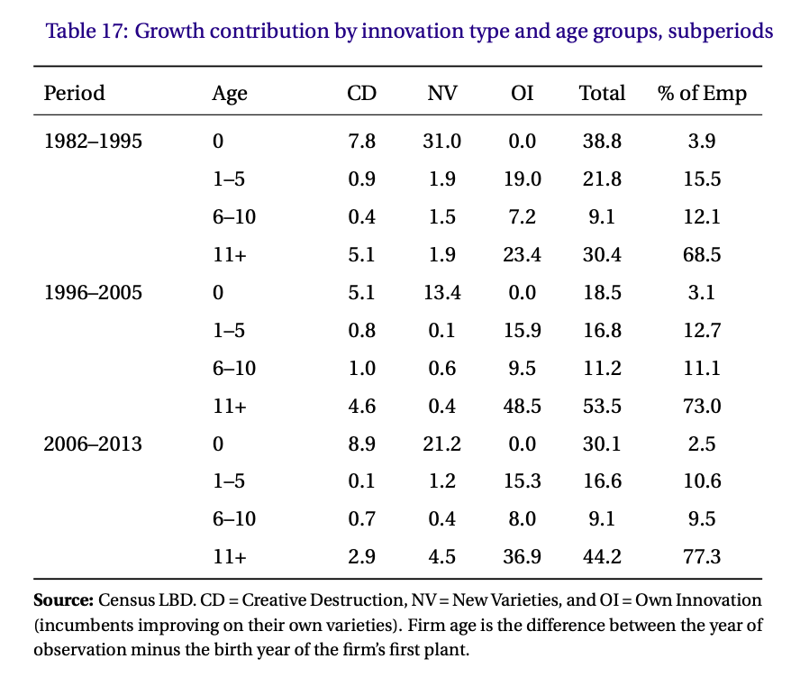
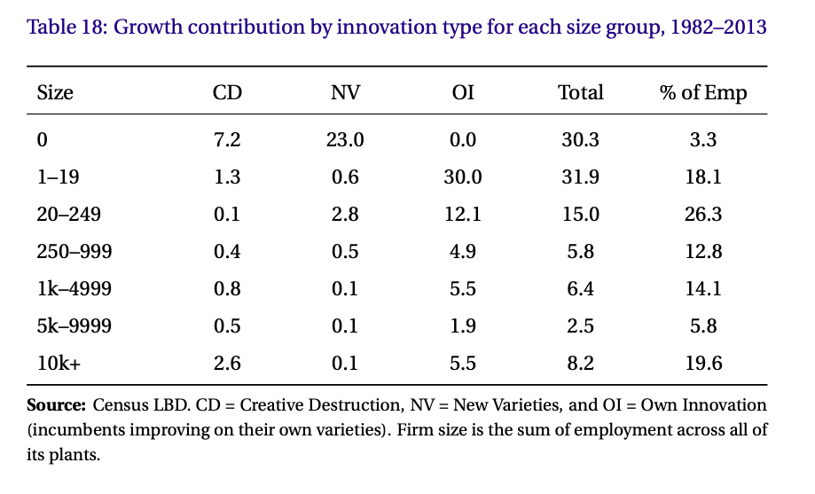

# Wheely suitcases and moonshots
{: .no_toc }

1. TOC 
{:toc}

## How do we innovate?
The Romer and Schumpeterian models have different takes on how innovation works. For Romer, it is new goods that are acquired, for Schumpeterian models it is better quality versions of existing products. Of course, both types exist, but how important are the two types?

[Pete Klenow and Huiyu Li](http://klenow.com/Innovative_Growth_Accounting_Klenow-Li.pdf) attempted to figure that out. It is hard to measure exactly what counts as a "new product" and "higher quality", but they try to make some progress by using available data on establishments. 

Here, you need to appreciate that an establishment is one instance of a firm. The Taco Cabana in the parking garage complex at UH is an establishment of the Taco Cabana firm, for example. Similarly, the Toyota plant in San Antonio is an establishment of the firm Toyota, is another example. 

Klenow and Li look essentially at three types of events that occur, and classify them as different types of innovation. 

1. Establishment entry and exit. Each time a new establishment opens (i.e. a new Taco Cabana location or a brand new manufacturing plant) that counts as a *new product*, as in Romer. An establishment that closes is the *loss* of a product, which we didn't talk about with Romer, but is certainly plausible. So establishments opening and closing tell them about varieties.

2. New establishment size versus exiting establishment size (in terms of employment). Rather than a count of entry and exit, they infer that if new establishments are larger than existing establishments, this implies a higher quality of the new products relative to the old products (if they are better, demand should be higher). So this comparison allows them to back out some sense of the Schumpeterian creative destruction going on. 

3. Establishments getting larger (in terms of employment). If an establishment increases in employment size, they infer from this that there was a quality improvement of the firm *on its own product*. This is a type of innovation that neither Romer nor Schumpeter covered. In both those models, once you were the monopolist, you were static. But the Schumpeterian framework can be expanded to think about this kind of innovation arising from close competitors (remember that the past incumbent is still out there, plotting to take back over). 

What do they find? In short, that *most* innovation - 60% -  is from the 3rd category, own-firm innovation. Quality improvements appear to come most often from existing firms making better products. Which is why there is a whole separate section of the [study guide](prodmodel.html) devoted to thinking about competition and innovation. 27% of innovation appears to be from new varieties and 13% from creative destruction. So the pure Schumpeterian model we talked about isn't super relevant, except as a way of learning the forces at work.

You can see their breakdown of the types of innovation by firm age in the table above. The rows show the "Total" amount of growth in productivity coming from firms of that age. So firms aged 0 (new firms) contributed 30.3% of productivity growth from 1982-2013, even though they only had 3.3% of employment. Of that 30.3%, 7.2 percentage points was due to creative destruction (CD), meaning their new establishments replaced smaller existing establishments. 23.0 percentage points were from new varieties (NV), their establishments created a new product. Zero was due to own-product innovation (OI) because these were brand new firms. 

Contrast that with the oldest firms eleven+ years old. There, only 4.4 percentage points of growth came from creative destruction - they didn't open new establishments that were larger than other establishments much. Very little was new varieties - they didn't open brand new establishments much at all. But 34.6 percentage points was due to own product innovation - their existing establishments got *bigger*.

Klenow and Li break this down by time period. The reason they do that is because 1982-1995 and 2006-2013 were both periods of very *slow* productivity growth overall. But 1996-2005 was a period of very *fast* productivity growth overall. Their table above shows some differences in the distribution of growth across the three periods. In 1996-2005, it tended to be old firms doing own-product innovation that accounted for a lot of productivity growth, moreso than in the other periods. New varieties were actually *less* important in that period than either before or after. Roughly, this is telling you that the IT revolution was mainly assisting existing firms get more efficient, rather than helping brand new firms create new products (no matter how many e-commerce firms got into business in this period). 

The last really interesting piece of information from the authors is the breakdown of innovative activity by the number of employees, as opposed to age of the firm. The above table shows you that firms with size zero (meaning they are brand new and so start with zero employees) mainly do new varieties of creative destruction. The own-innovation that drives most growth is done by small firms of 1-19 or 20-249 people. Once firms are over 250 people, they don't account for much of productivity growth. Now, because those larger firms are .... large, any productivity increase they do come up with has a big impact, but most productivity improvements are coming from small firms improving themselves. 

These facts help give us some context that what we're looking at in the Romer and Schumpeterian models has some economic meaning, although it does tell us we need to work harder to think about own innovation (which we will). It also tells us that the age and size distribution of firms is relevant to growth, and that is something we can talk about as an application of growth theory.

## Wheelies vs. Apollo
In kind of a weird seque, this somewhat dry recitation of facts can lead us to thinking about how innovation works. There is no right answer for how new innovations get created, and there are good arguments about what fosters innovative thinking or activity. You can go down an hours (days?) long rabbit-hole of TED talks and Youtube clips from people explaining how to be more innovative. 

A symbols of different types of innovation, for some reason people have settled on [wheelie suitcases and the Apollo moon missions](https://medium.com/@stianstian/darpa-vs-the-wheely-suitcase-d4ffc0a05f3a) as defining examples. The wheelie suitcase was one of those obvious-in-retrospect innovations that occurred through what was some combination of own-innovation by someone at a luggage company and more of a creative destruction moment by an airline pilot. [This article](https://www.nytimes.com/2010/10/05/business/05road.html) has some of the background. The major point about the invention of the wheelie suitcase was that it developed out of a bright idea without a whole lot of planning behind it. It took off because the market adopted the invention readily. 

This is contrasted with the idea of the Apollo moonshot, which involved *massive* technological change that spilled over into the wider economy. The need for integrated circuits that were not just reliable, but 99.9999% reliable, pushed the nascent Silicon Valley industries to innovate in production processes and design. It is plausible to claim that without the Apollo project most electronic innovations would have been delayed by a decade or two, at least? And that leaves out the solar panels, heart defribrilators, insulation, and other inventions.

<iframe width="560" height="315" src="https://www.youtube.com/embed/qsyTc4Su5vQ" frameborder="0" allow="accelerometer; autoplay; encrypted-media; gyroscope; picture-in-picture" allowfullscreen></iframe>

The point about the Apollo moonshot technologies is that it required a massive up-front investment and centralized direction. There was no single "great idea" that got us to the moon, and there was no single person or company that was going to put together that scale of a project. It required a coordinated effort run by the US government to accelerate the process. 

A similar story lies behind the origins of the internet. The essential bits and pieces that form the skeleton of the internet were all invented or developed by major public institutions: DARPA in the US, the CERN laboratory in Europe, and several other publicly-funded research labs. 

<iframe width="560" height="315" src="https://www.youtube.com/embed/21eFwbb48sE" frameborder="0" allow="accelerometer; autoplay; encrypted-media; gyroscope; picture-in-picture" allowfullscreen></iframe>

The argument here is that it takes big projects like this to develop the infrastructure for ongoing innovations. Yes, there is massive innovation on the internet today by private firms and individuals, but again, would any firm have the incentive to develop the internet in the first place? 

Neither approach - de-centralized wheelie bag development or centralized moonshots - is *right*. Obviously both took place. And we likely *need* both for innovation to occur, as these two types bounce back and forth. We can argue about the right amount of the two, however, and whether we are getting the maximum possible amount of innovation from our mix of public and private innovative efforts.
