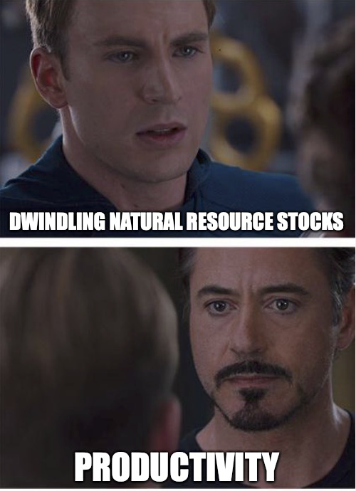

# Growth with natural resources
{: .no_toc }

1. TOC 
{:toc}

## Dynamics of nonrenewable resources
Understanding growth when resources are required for production is just an extension of our standard model. Let $X_t$ be the stock of a resource, and this stock could be agricultural land, oil, trees, copper, the ocean, or it could represent a composite of all resources. This stock could decline over time.

Let $E_t$ be the flow of resources used in production each year (think "Energy"). So $E_t$ is like the oil we pump this year, and $X_t$ is the stock of known reserves this year. Last, let's have $s_X$ be the share of $X_t$ used in any given year, so 

$$
E_t = s_X X_t
$$

We'll assume that $s_X$ is constant, in the sense that it doesn't respond to $X$ directly. We could decide to pump a larger fraction of the oil in the ground in a given year, but that is up to us, and not mechanically related to how much oil there is (we're assuming). 

We're going to want the growth rate of $E_t$, as that will matter for the growth rate of GDP. Taking logs, we know

$$
\ln E_t = \ln s_X + \ln X_t
$$

and therefore

$$
g_E = g_X
$$

because we assumed that $s_X$ is constant. So in order to know the growth rate of E, we need to know the growth rate of X. What is that?

The accumulation (actually, decumulation) dynamics of $X$ are

$$
X_{t+1} = X_t - E_t,
$$

or the stock tomorrow is the stock today minus whatever we use. Subtract $X_t$ from both sides, and then divide by $X_t$, and you get

$$
g_X = \frac{X_{t+1}-X_t}{X_t} = - \frac{E_t}{X_t} = -s_X.
$$

or the growth rate of this resource is just the negative of the share of the resource used each period. This means that

$$
g_E = -s_X
$$

as well. But we can go further, and also talk about the level of $E_t$ over time. To do that, we need to talk about the level of $X_t$. 

Since $X_t$ has a constant growth rate of $-s_X$, we can write

$$
X_t = X_0 (1-s_X)^t.
$$

Why can we write that? Because it's the basic formula for the level of something that grows exponentially, and we used a similar formula for population, with $L_t = L_0 (1+g_L)^t$. The only difference here is that the growth rate is negative, as opposed to positive. 

Take logs of $X_t$ and you get

$$
\ln X_t = \ln X_0 - s_X t
$$

and therefore we've got

$$
\ln E_t = \ln s_X + \ln X_0 - s_X t.
$$

The level of resource use (energy) in each period depends on the initial stock of resources, $X_0$, and the speed at which we draw those down. The slope of this relationship is $-s_X$. Note that the intercept also depends on $s_X$ positively. That is, if $s_X$ is higher, the amount of energy we draw out is *higher* today, but then declines at a faster rate.

Note that this formulation can be used to deal with different types of resources. If we were talking about the actual acreage of agricultural land, then $s_X$ might be close to zero. That doesn't decline just because we use it. But if we were talking about soil fertility, then $s_X>0$ and we are drawing down the stock of soil fertility when we plant crops. For oil or copper or lithium, it is more obvious that $s_X>0$ and the stock falls over time.

The fraction $s_X$ is going to be a lot like the fraction $s_I$, in a sense, because it tells us how a stock of something (here, natural resources) evolves over time. But we'll see that it has a slightly different effect on growth.

## Production and growth with resources
Now we want to incorporate natural resources into production and see what impact that has. Modify the regular Cobb-Douglas production function to be

$$
Y_t = K_t^{\alpha}E_t^{\beta} (A_t L_t)^{1-\alpha-\beta},
$$

where recall $E_t$ is the flow of resources we use in a year. Note that the elasticity on labor is different now. It depends on $\alpha$ *and* $\beta$. We use this formulation so that the production function still has constant returns to scale. And this is going to be important for what we find below.

Do what we always do, and take logs

$$
\ln Y_t = \alpha \ln K_t + \beta \ln E_t + (1-\alpha)\ln A_t + (1-\alpha) ln L_t.
$$

Here, we'll use the same trick we've used before, and subtract $\alpha \ln Y_t$ from both sides

$$
(1-\alpha)\ln Y_t = \alpha (\ln K_t - \ln Y_t) + \beta \ln E_t + (1-\alpha-\beta)\ln A_t + (1-\alpha-\beta) ln L_t.
$$

Divide both sides by $(1-\alpha)$

$$
\ln Y_t = \frac{\alpha}{1-\alpha} (\ln K_t - \ln Y_t) + \frac{\beta}{1-\alpha} \ln E_t + \frac{1-\alpha-\beta}{1-\alpha}\ln A_t + \frac{1-\alpha-\beta}{1-\alpha} ln L_t.
$$

Now subtract $\ln L_t$ from both sides so that we get GDP per capita on the left. But notice that this is going to leave a term involve labor "dangling" at the end of the right-hand side.

$$
\ln y_t = \frac{\alpha}{1-\alpha} (\ln K_t - \ln Y_t) + \frac{\beta}{1-\alpha} \ln E_t + \frac{1-\alpha-\beta}{1-\alpha}\ln A_t - \frac{\beta}{1-\alpha} \ln L_t.
$$

This says that if the absolute number of people goes up, GDP per person *falls*. We didn't get this in our original Solow model. Why does this happen? It happens because the two original inputs we worried about, capital and labor, no longer can achieve constant returns on their own. That is, doubling just capital and labor in this production function will give you *less* that double the output, because there is *another* rival input involved, $E_t$. Adding in resources as an additional rival input creates the possibility that living standards are declining with the size of population. 

What does this function tell us about the growth rate? Do what we normally do with an expression in logs like this and you get

$$
g_y =  \frac{\alpha}{1-\alpha} g_{KY} + \frac{\beta}{1-\alpha} g_E + \frac{1-\alpha-\beta}{1-\alpha} g_A - \frac{\beta}{1-\alpha} g_L.
$$

Growth in GDP per capita is now a little like a race. On one side you have the positive terms involving the capital/output ratio, energy use, and productivity. On the other you have population growth. We know the capital/output ratio cannot offer help forever, as we'll head to a BGP, so it really is a question of whether energy use and productivity can grow fast enough to offset population growth. 

But things get a little dicey here when you recall from the prior sub-section that $g_E = -s_X$, or that energy use is *negative*. Let's look at a BGP to make things a little more apparent. Along a BGP, we know $g_{KY} = 0$, so that will disappear.

$$
g_y^{BGP} = \left(1- \frac{\beta}{1-\alpha}\right)g_A - \frac{\beta}{1-\alpha}(s_X + g_L).
$$

The growth rate is like a weighted average of $g_A$ and *negative* $s_X + g_L$. The second two are negative for different reasons. $s_X$ has a negative effect because it tells us that the amount of resource use is falling over time, hurting production. $g_L$ is negative because we're trying to spread that resource use over a larger number of people. 

Growth along the BGP is positive only if

$$
\left(1- \frac{\beta}{1-\alpha}\right)g_A > \frac{\beta}{1-\alpha}(s_X + g_L)
$$

or if 

$$
g_A > \frac{\beta}{1-\alpha-\beta}(s_X + g_L).
$$

If productivity growth is high enough, then this can overcome the drag on growth from resource use and rising population. 

Growth with natural resources
{: .label .label-green }
**Using natural resources in production can create a drag on the growth rate of GDP per capita. Growth is only positive if produtcivity growth is sufficiently high and/or population growth is sufficiently low.**

It's important to see that this relationship depends on the size of $\beta$, which dictates the elasticity of resource use in production. It essentially tells us how relevant resources are for GDP. If $\beta$ is close to zero, then essentially resources don't matter, and we're back to our original Solow model. Growth is positive so long as $g_A>0$ in that case.

Here, the higher is $\beta$, and the more important resources are, the harder it is to achieve growth in GDP per capita on a BGP. We'll look more at this when we try to use this model to explain some real-world data.

## Level effects
To be clear on what this model implies for the use of resources per capita, and the level of both resources per capita and GDP per capita, let's work out a few values. First, let's look at the *stock* of resources per capita, using small letters to denote per-capita amounts, as normal.

$$
x_t = \frac{X_t}{L_t}
$$

and therefore in logs we've got $\ln x_t = \ln X_t - \ln L_t$, and using what we know from above, we've got

$$
\ln x_t = \ln X_0 - s_X t - \ln L_t
$$

and if we use what we know about population growth, $\ln L_t = \ln L_0 + g_L t$, gives us

$$
\ln x_t = \ln X_0 - \ln L_0 - (s_X + g_L) t.
$$

The level of resources per capita at any given time depends on the initial stock of resources per capita (the $X_0$ and $L_0$ terms), and then this declines at the rate $s_X + g_L$, which captures the fact that the stock of resources is declining and that stock is getting spread across more and more people.

How about the flow of resources per person (i.e. energy use per person)? This is

$$
e_t = \frac{E_t}{L_t}
$$

and similar logic to above is going to give us

$$
\ln e_t = \ln s_X + \ln X_0 - \ln L_0 - (s_X + g_L) t.
$$

Again, this is falling, and is basically identical to the stock per capita over time, except for the addition of the $\ln s_X$ term showing us what fraction of the resource is getting used.

Finally, let's go back to the level of GDP per capita. From above, this was

$$
\ln y_t = \frac{\alpha}{1-\alpha} (\ln K_t - \ln Y_t) + \frac{\beta}{1-\alpha} \ln E_t + \frac{1-\alpha-\beta}{1-\alpha}\ln A_t - \frac{\beta}{1-\alpha} \ln L_t.
$$

We know how to describe $\ln E_t$ from the first sub-section. Based on our knowledge of how innovation works, we can write $\ln A_t = \ln A_0 + g_A t$, and we know that $g_A$ depends on $g_R$, but to keep things clean let's just stick with this. Finally, we know $\ln L_t = \ln L_0 + g_L t$. Put it all together and we get

$$
\ln y_t = \frac{\alpha}{1-\alpha}\ln K_t/Y_t + \frac{\beta}{1-\alpha} \left(\ln s_X + \ln X_0 - s_X t \right) + \frac{1-\alpha-\beta}{1-\alpha}\left(\ln A_0 + g_A t \right) - \frac{\beta}{1-\alpha} \left(\ln L_0 + g_L t \right).
$$

This can be simplified(?) a little into

$$
\ln y_t = \frac{\alpha}{1-\alpha}\ln K_t/Y_t + \frac{\beta}{1-\alpha} \left(\ln s_X + \ln X_0 - \ln L_0 \right) + \frac{1-\alpha-\beta}{1-\alpha}\left(\ln A_0 \right) + \left(1- \frac{\beta}{1-\alpha}\right)g_A t - \frac{\beta}{1-\alpha} (s_X + g_L)t.
$$

Again, we've got an equation for a line. The intercept of this line (the level of GDP per capita) depends on:

1. The capital/output ratio. We know this ultimately should settle down to a stable ratio that depends on the savings rate, population growth, depreciation, and the growth rate of productivity.
2. The initial flow of resources per capita, $\ln s_X + \ln X_0 - \ln L_0$. No big surprise, an economy that has a higher initial flow of these resources will be richer. 
3. The initial value of productivity, $\ln A_0$. The more productive you are with the given capital and resources, the richer the economy.

The last two terms captures the growth rate, and as we know that can be positive or negative depending on how big $g_A$ is relative to $s_X$ and $g_L$. 

Note the conflicting effects of the extraction rate, $s_X$. If we draw down a large amount of resources each year to provide $E_t$, then this *raises* the level of GDP per capita, but *lowers* the growth rate. It is another one of these intertemporal trade-offs. High GDP per capita now, or soon, in exchange for low growth in GDP per capita in the future. If you raised $s_X$ high enough, you might generate a situation where you are very rich today, at the cost of a *negative* growth rate in the future, meaning GDP per capita would fall as the resource base ran out.