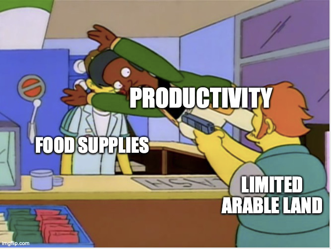

# What about food?
{: .no_toc }

1. TOC 
{:toc}

Does the data look different if we consider something like agricultural land? Or think about whether the planet can feed itself? 

Start with agricultural land per capita. 

<iframe src="https://ourworldindata.org/grapher/agricultural-area-per-capita?country=OWID_WRL~USA~GBR~KOR~NGA~IND~JPN~CHN" loading="lazy" style="width: 100%; height: 600px; border: 0px none;"></iframe>

This clearly fell across all countries, and at the world level. That doesn't mean we were running out of it, it more likely indicates that we just need less of it as we get more productive. Agricultural land isn't stricty fixed (you can open up new land to farm) but roughly speaking these lines reflect population growth on relatively fixed stocks of agricultural land over time.

Does this drop in land per capita imply that the output *of food* is also falling per capita? No. 

<iframe src="https://ourworldindata.org/grapher/daily-per-capita-caloric-supply?tab=chart&country=CHN~IND~NGA~JPN~KOR~GBR~USA" loading="lazy" style="width: 100%; height: 600px; border: 0px none;"></iframe>

Across all these countries (and over some very long time frames) there is an increase in the calories per capita. How do we explain this? Productivity growth. GDP is made up of more than food, of course, but using the rough relationship found above, we know that if $g_A$ is high enough, then GDP per capita will rise even though resources per capita are falling. That's what we're seeing here in the case of food. Productivity growth in food is high enough to offset the increased number of people. 

How do economies accomplish an increase in food consumption per capita while using less land per capita? It has to be productivity growth in agriculture. Use a ratio similar to "energy intensity", which is just $Land/Y$.

This ratio *should* be falling over time if the economy is getting more productive. "Land" is not changing (much), and GDP, Y, is growing.

<iframe src="https://ourworldindata.org/grapher/arable-land-pin?country=OWID_WRL~JPN~China%2C%20mainland~IND~NGA~KOR~USA~GBR" loading="lazy" style="width: 100%; height: 600px; border: 0px none;"></iframe>

This ratio indicates that it takes *less* land to produce each kilocalorie of food over time, our crude measure of food output. That is an indication of higher productivity in producing food. 

One interesting exception in the figure is Japan, where this ratio *rose* from 1980 to 2014. What does that indicate? It would be consistent with a *decline* in food per capita and/or an *increase* in land per capita used for agriculture. Japan's land per capita fell along with other countries, so production of food per capita probably was falling in Japan. That may not indicate a drop in food consumption per capita, if Japan was importing more food from abroad rather than growing it at home. 

But globally, the planet seems to be getting more and more productive in growing food, meaning we use less land per capita over time. 