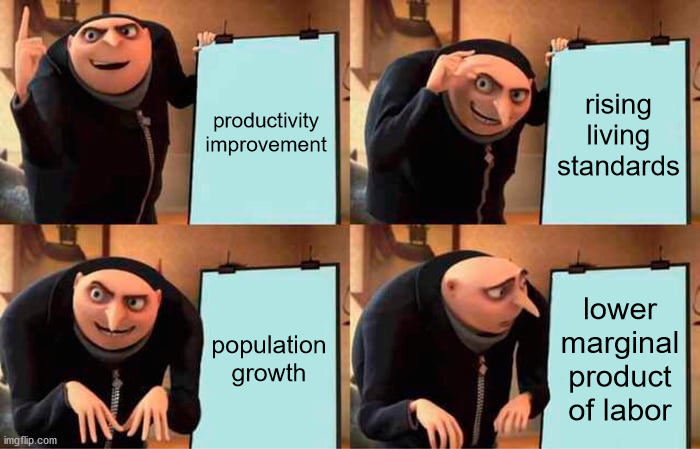

# Malthusian Demographics
{: .no_toc }

1. TOC 
{:toc}

A different perspective on the relationship of resources, environment, and economic growth comes from considering population itself. One of the common worries is that increases in population will lower living standards because they lower resources per capita and/or require more environmental damage. For the most part we've already allowed for this kind of effect in our models. Population growth $g_L$ does show up as having a negative effect in the Solow model (lowering the K/Y ratio) and lowering the growth rate in our model with resources (because it dilutes the resources available per person). But at the same time we saw in the ideas section that more people leads to more ideas and is positive for growth. On net the argument so far has been that this positive impact is greater than the negatives, as evidenced by the fact that the planet is richer - on a per person basis - with 9 billion people than it was in the past with fewer.

But what if population growth responds to living standards themselves? What if we breed our way into trouble? This was a real concern throughout much of history, as it very much appeared to be the case that rising living standards did in fact lead to higher fertility and hence put more pressure on fixed resources. Here we'll revisit that idea and see how and when it holds. 

## Demographics in the past
Farther back in the past, demographics appear to be associated with "Malthusian dynamics", named for Thomas Malthus. He speculated that population growth was positively associated with growth in GDP per capita and that this put a natural check on the growth rate of living standards. Let's see how that works, first by asking if Malthus was right about how population growth and living standards are related.

We can start by looking at historical fertility rates. If we extend backwards as best we can, the best data we have is that the fertility rates were very high for all countries when they were less developed. Places like the UK and US and Japan all appear to have had much higher fertility rates in the 1800s. 

<iframe src="https://ourworldindata.org/grapher/fertility-rate-complete-gapminder?tab=chart&country=CHN~IND~JPN~KOR~USA~GBR" loading="lazy" style="width: 100%; height: 600px; border: 0px none;"></iframe>

The level of fertility was been high in the past, when most countries were poor. Does the long-run relationship of fertility and living standards, though, imply that if GDP per capita *falls* that fertility goes *up* in the short run? That doesn't appear to be the case. In fact, using data from more modern times, [Chatterjee and Vogl](https://www.personal.psu.edu/sc20/papers/SC_TV_growth_fertility.pdf) find that negative shocks to GDP per capita are actually associated with *lower* fertility. This is consistent with Malthus' "preventive checks", where people act to control their fertility in stressful economic times. Chatterjee and Vogl don't have evidence that positive shocks are associated with *positive* shocks to fertility, but the fact that negative shocks lower fertility is consistent with Malthus' basic idea. 

A more direct connection of living standards and demographics in the Malthusian period involves mortality. This is Malthus' "positive" checks, where bad economic conditions lead to poor health, malnutrition, and ultimately higher mortality, lowering population growth. And in the periods we're talking about, mortality rates were very high to start with.

This chart gives some sense of how far child mortality rates have fallen since 1800. Think about the scale of these numbers for a moment. In 1800 about 30% of all children under 5 died before they hit age 5. Families, if they experienced 9 pregnancies, probably saw three of those children die before they turned five. As economies became richer, one of the most important changes that occurred was the drop in child mortality to less than 1% in all rich countries.

<iframe src="https://ourworldindata.org/grapher/child-mortality?tab=chart&country=SWE~USA~GBR~IND~BRA~JPN" loading="lazy" style="width: 100%; height: 600px; border: 0px none;"></iframe>

In a world with low living standards and high baseline mortality and fertility rates, then positive shocks to economic conditions (i.e. a good harvest) are probably associated with higher population growth due to lower mortality rates and (perhaps) higher fertility rates. Negative shocks to economic conditions (i.e. a poor harvest) are probably associated with lower population growth due to higher mortality rates and probably lower fertility rates as people either delay pregnancies or there is more material mortality. 

## Dynamics with positive population responses
How does economic growth work when resources are part of production (e.g. agricultural land) and population growth is *positively* related to GDP per capita? In other words, what does the world look like in a "Malthusian" environment? We are going to simplify (kind of) things on the production side because we then need to introduce some complications on the population growth side. 

Production is going to be

$$
Y_t = X^{\beta}\left(A_t^{\beta/(1-\beta)} L_t\right)^{1-\beta}.
$$

where $X$ is the fixed resource base and L is the number of people. $A$ is again productivity, but I've raised it to these weird powers of $\beta$ just so that things will cancel later and be more legible. There isn't anything really important to this. The value of $\beta$ is just like in our models of resource use, telling us how important the resources are for production.

GDP per capita is $Y_t/L_t$ and equals

$$
y_t = \left(\frac{A_tX}{L_t}\right)^{\beta}.
$$

It depends on the ratio of X/L, or resources per person, and on productivity. The crucial bit here is that GDP per capita is negatively related to population size. More L, lower living standards. This was the case in the Solow model as well, but there we were able to build capital to offset this. Here, X is fixed. But we still have productivity growth available, so GDP per capita can grow. By itself, this setup doesn't imply these terrible Malthusian outcomes of poverty.

Malthus takes hold by assuming that population growth depends on $y_t$ itself. He assumed (in words) something like this

$$
g_L = \nu (y_t - \overline{c})
$$

or that the growth rate of people depended *positively* on the level of GDP per capita, acting through those mortality and fertility effects I mentioned above. The $\nu$ thing is just a scaling parameter, and $\overline{c}$ represents some fixed consumption need for people. If GDP per capita gets really *low*, then this says $g_L<0$, allowing us to capture the idea that low incomes might mean mortality overwhelms fertility and the population drops. This is the doomsday scenario. 

Plug in the expression for $y_t$ and you get

$$
g_L = \nu \left(\frac{A_tX}{L_t}\right)^{\beta} - \nu \overline{c}.
$$

The only thing left to specify is that the growth rate of $A_t$ is equal to $g_A$. Productivity grows. 

You may not believe me but you know how to evaluate this for the steady state. What you've got on the left is the growth rate of population, and it depends on a ratio of A/L (X just kind of sits there). Just like our models with K/AL or with $L_R/A$ on ideas, we have a growth rate depending on a ratio. Just like those models we see that $g_L$ falls as the thing it is related to - L - goes up. That ratio is going to move around until it hits a steady state where it remains stable. If the economy doesn't start at that steady state, it is going to move towards the steady state. 

You know that in a steady state here that the ratio A/L has to remain constant, meaning that $g_A = g_L$. So we can plug in $g_A$ on the left-hand side of the above equation and solve for the steady state ratio

$$
\left(\frac{A_tX}{L_t}\right)^{ss} = \left(\frac{g_A}{\nu} +  \overline{c}\right)^{1/\beta}
$$

This isn't the prettiest equation, and by itself it doesn't tell us much. What we want to know is what happens to two things: living standards and population growth. We want to see if our GDP per capita collapses and if the population can continue to grow in this situation.

Plug this steady state ratio back into the production function for $y_t$, and you get:

$$
y^{ss} = \frac{g_A}{\nu} + \overline{c}.
$$

Don't get confused here, this is a constant. It says that GDP per capita gets "stuck" at some level depending on how fast productivity grows, as well as the subsistence level $\overline{c}$. Faster productivity growth allows GDP per capita to go up faster, but people respond by having more kids (and seeing fewer kids die) so that population increases faster, which because of the fixed factor lowers GDP per capita. It reaches a stable situation at this level of living standards.

{: .important }
With a fixed factor of production (X) and Malthusian population growth rates ($g_L$ is positively related to GDP per capita) then GDP per capita reaches a stagnant steady state level, with no growth. 

The inclination is to see this steady state level as very low, but it need not be the case. You could have a Malthusian steady state with a high living standard - maybe $g_A$ is really big or $\overline{c}$ is really big. What the Malthusian logic tells us is that GDP per capita is stagnant; no growth. 

What about population growth? If living standards are stagnant, does the population stall out? Using $y^{ss}$ we get

$$
g_L^{ss} = g_A
$$

which it had to be, because that's how we got to the steady state. Population can grow just as fast as productivity allows it to, but no faster. And no slower, because if population grew slower, GDP per capita would go up, and $g_L$ would go up until we're back at steady state. 

{: .important }
With a fixed factor of production (X) and Malthusian population growth rates ($g_L$ is positively related to GDP per capita) then population grows at a constant rate in steady state proportional to productivity growth ($g_A$). 

The Malthusian model doesn't imply a collapse of anything. It implies that the economy reaches some kind of stasis point where living standards are stagnant and population growth is limited by productivity growth.

## Global relationships
Recall that from the innovation section we tied the growth rate of productivity, $g_A$, to the size of population growth, $g_L$. The Malthusian model says that population growth depends positively on productivity growth. Innovation dynamics say productivity growth depends positively on population growth. This implies there is some kind of positive feedback loop at work, at least over the long run. 

In this Malthusian world, faster productivity growth should be associated with a higher living standard. If we take a look at some of the same data on world historical living standards as [before](prodlevel.html), but look at the *growth rate* of population, we get the following. 

<iframe width="900" height="600" frameborder="0" scrolling="no" src="../plotly/mad-global-y-gl.html"></iframe>

This isn't some kind of strict relationship, but there is something there. The faster population grew historically, the higher GDP per capita was at a global level, consistent with the Malthusian model for much of history. The only point this kind of breaks down is if you look at the last two points on the right (for 1973 and 2010). Here, their relationship is negative, consistent with modern demography taking hold. But otherwise Malthus gets things about right.

We can be even more daring. From the work on innovation, we know that the growth rate of productivity is associated with the number of researchers. Imagine we had a model where our productivity growth equation was

$$
g_A \approx \theta \frac{L}{A}
$$

where we made an assumption that $\lambda = 1$ and $\phi=0$.  

Use this with our expression above for the growth rate of population in a Malthusian world. 

$$
g_L^{ss} = \theta \frac{L}{A}
$$

Ignoring the effect of $A$ here (which we could make more concrete by assuming that $\phi$ was close to one), then this says that the population growth rate should be positively related to the *size* of population. At least historically, the logic would be that more people mean more ideas, which means faster productivity growth, which means the resource-based economy can support faster population growth. And this can get us on the good positive feedback loop of population growth and GDP per capita growth. 

How does this work? Well, [Michael Kremer](https://www.jstor.org/stable/2118405) put together some of this data for the period running from one million BC to the present. The population growth rates are obviously speculative, but here's what he came up with, along with a few extra data points collected by me on the last few decades.

<iframe width="900" height="600" frameborder="0" scrolling="no" src="../plotly/kremer-pop-gl.html"></iframe>

And what do you know? It kind of works. As world population grew, so did the growth rate of world population, consistent with the toy model we've got here.

What's the conclusion? Going back to the beginning, we saw that the Malthusian setting, where production depends on fixed resources and population growth is *positively* related to living standards, implies that living standards are *stagnant*. That explains economic growth conditions for much of human history. But it does not imply any kind of resource-based collapse. 

