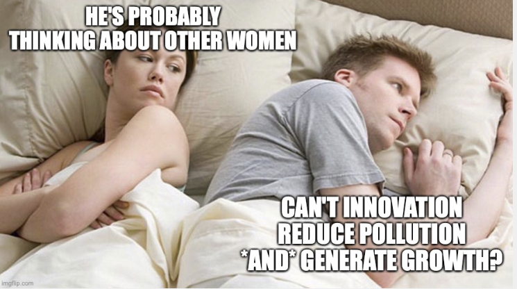

# Pollution and Growth
{: .no_toc }

1. TOC 
{:toc}

## Some facts on pollution
The story with respect to economic growth is mixed. There are several types of pollution that appear to decline as countries become rich, while there are others that have a strong positive relationship to GDP per capita.

Air pollution is one area that appears to get better once countries achieve a certain level of development. [Sulphur dioxide](https://www.epa.gov/so2-pollution/sulfur-dioxide-basics#effects) is the chemical that creates the smell when you light a match. It is also released as a byproduct of burning some fossil fuels. Most important, it creates health issues, both directly by irritating the lungs, but also by helping to form particulate matter in the air which has long-term consequences for people breathing it. It is one of the main air pollutants tracked by the EPA and other agencies.

<iframe src="https://ourworldindata.org/grapher/so-emissions-tonnes-per-year" loading="lazy" style="width: 100%; height: 600px; border: 0px none;"></iframe>

The figure shows the absolute amount of sulphur dioxide produced for several countries over a long time span. The amounts rose substantially from the late 1800s to the middle of the 20th century, but then in the most developed nations declined after that due in part to more awareness of the health issues. China still has growth in sulphur dioxide production as it continues to expand fossil fuel use.

Globally, these emissions have gone down in the last thirty to forty years. 

<iframe src="https://ourworldindata.org/grapher/so-emissions-by-world-region-in-million-tonnes" loading="lazy" style="width: 100%; height: 600px; border: 0px none;"></iframe>

Looking specifically at the US, you can see a similar downward trend in several types of air pollutants: sulphur dioxide, [nitrogen oxides](https://www.epa.gov/no2-pollution), and [volatile organic compounds](https://www.epa.gov/indoor-air-quality-iaq/volatile-organic-compounds-impact-indoor-air-quality). 

<iframe src="https://ourworldindata.org/grapher/air-pollutant-emissions?country=~USA" loading="lazy" style="width: 100%; height: 600px; border: 0px none;"></iframe>

Note that these are absolute amounts. The per-capita production of air pollutants in the US has fallen even faster than this.

[Particulate matter](https://www.epa.gov/pm-pollution/health-and-environmental-effects-particulate-matter-pm) (PM) is a different sort of air pollution, and this has not seen the same substantial declines as other pollutants. Developed countries like the US and UK seem to have a baseline level of PM pollution that is slightly lower than in places like Kenya or Brazil. The real worries here are places like India and China, which rely heavily on fossil fuel production and where air pollution is substantial. 

<iframe src="https://ourworldindata.org/grapher/PM25-air-pollution?tab=chart" loading="lazy" style="width: 100%; height: 600px; border: 0px none;"></iframe>

Particulate matter is the reason you get pictures like this from Delhi of smog limiting visibility to only a few feet.

An entirely different kind of pollution is from plastics. You may be familiar with micro-plastics or the amount of plastic that finds its way into oceans. The amount of plastic pollution appears to be strongly correlated with GDP per capita.

<iframe src="https://ourworldindata.org/grapher/per-capita-plastic-waste-vs-gdp-per-capita" loading="lazy" style="width: 100%; height: 600px; border: 0px none;"></iframe>

The last one we'll consider here is carbon dioxide, the greenhouse gas responsible for global warming. We can look at the trend in CO2 emissions per capita for several countries, and see a few different paths.

<iframe src="https://ourworldindata.org/grapher/co-emissions-per-capita?tab=chart&country=JPN~USA~GBR~CHN~IND~KOR" loading="lazy" style="width: 100%; height: 600px; border: 0px none;"></iframe>

The US level peaked from around 1975 to 2005, and then has been in decline, although it is at a much higher level than other countries. Japan and South Korea both had CO2 emissions rise as they became rich, and while Japan's levelled off, South Korea's continues to grow. The UK (and much of the rest of Europe) saw CO2 emissions drop substantially since 2000. China and India have very low per-capita CO2 emissions, consistent with their low levels of GDP per capita, and it remains to be seen how those per-capita emissions respond to further development. 

Of course, from the pollution perspective it is the absolute amount of CO2 that matters, not per-capita. 

<iframe src="https://ourworldindata.org/grapher/annual-co2-emissions-per-country?tab=chart&country=CHN~USA~IND~GBR~KOR~JPN" loading="lazy" style="width: 100%; height: 600px; border: 0px none;"></iframe>

Here the scale of China's population becomes apparent. Absolute emissions in the US have actually gone down in recent years, as they have in the UK and Japan. From the pollution perspective the question remains how much CO2 China and India will produce as they develop further. If you click on the "log" feature of this figure, you'll get a sense for the big differences in the growth rates of CO2 production, and they are substantial.

## Preferences for pollution
We've got several different relationships in the data regarding pollution and environmental consequences with GDP per capita. In some instances higher GDP per capita is associated with less pollution, and in others higher GDP per capita "de-couples" from environmental impact and countries get richer but do not see energy use (for example) continue to increase on a per-capita or absolute basis. On the other hand we've got examples of higher GDP per capita associated with more pollution or more use of environmental resources.

One thing that data should suggest is that there is no fixed relationship between GDP (or GDP per capita) and resource use or environmental impact. And that should make sense, knowing what we know about how GDP is calculated and constructed. It is the value of all goods and service produced, but doesn't depend on *how* those goods and services were produced. As countries become richer they may start producing more goods and services that economize on resources or that don't require as many resources. It is plausible for GDP to up while resource use or environmental impacts to go down. 

Whether in fact that happens depends in part on the demand side of things, meaning the willingness of people to substitute resource-"light" goods and services for resource-"heavy" goods and services. We can think a little about how this could work by setting up a simple optimization problem and asking how the choices coming from that problem would change as GDP per capita rises. 

Think of a simple problem from an intermediate micro class where someone is choosing between two goods (like pizza and beer). What you would have learned is that the solution to that problem (the point where the budget constraint and the indifference curve are tangent) is the point where the ratio of marginal utilities of the two goods is equal to the ratio of their prices. 

We'll use this same logic, but change what the two goods are, and then we'll have to think a little harder about what the prices are. For the preference side, let's guess that people care about two "goods": GDP per capita and environmental quality. And as with normal preferences, we'll assume that they like having more of both, *but* that the marginal utility of each declines as they get more and more. So as GDP per capita grows, the marginal utility of it declines. Once you have a lot of goods and services, a few more doesn't do much for you. 

Same with environmental quality. Once you have a high environmental quality, making the environment a little nicer doesn't make you feel that great. Note how this works in the opposite direction, however. As environmental quality does *down*, the marginal utility you get from improving it goes *up*. Think of the difference between the air quality in Delhi (awful) and Montana (amazing). The marginal utility of improving the air quality in Delhi is *huge*, but if you told the average Montanan that you could improve their air quality they'd wonder why you would bother. 

That takes care of preferences, but the key to thinking about this problem is the budget constraint. And in particular, the idea that there is a trade-off between higher GDP per capita and environmental quality. We'll assume that there is one. In other words, we'll build in the idea that you have to sacrifice some environmental quality (burning fossil fuels, strip-mining, smog, etc..) in order to increase GDP per capita. But as we discussed in the section on [resources](population.html) there are diminishing returns to using up the environment for producing GDP per capita. Using up more resources (and lowering environmental quality) will always increase GDP per capita by more (we are assuming) but the marginal effect will get smaller and smaller as you use up more resources. 

We have the intuition we want. The standard economics tells us that the choice people will make will involve setting the ratio of prices equal to the ratio of marginal utilities. Let y be GDP per capita, and X be environmental quality (so bigger X is better). The choice should be such that

$$
\frac{P_X}{P_y} = \frac{MU(X)}{MU(y)}.
$$

And to go forward we need to be more specific about those prices. We can set one of them to one (the numeraire) as we really only need to worry about the relative price. The natural choice is to set $P_y = 1$. All that means is that the dollar cost of a dollar of GDP per capita is ... one dollar. So our decision is

$$
P_X = \frac{MU(X)}{MU(y)}.
$$

What is the price of environmental quality? Before you answer that it involves beauty and sustainability and respect for the planet, note that those things are all part of the *marginal utility* we get from the environment. In our decision problem, the only price that we care about is the price of environmental quality relative to producing GDP per capita. 

Taking that narrow perspective (or pushing the other perspectives off into the utility function), what is the price of a "unit" of environmental quality? Recall from the [resources](population.html) section that we thought that what we extracted, E, from the environment (energy, minerals, etc..) was used in producing GDP. More E, more GDP. But that extraction subtracted from the stock X. We can use the same logic here. If we want more GDP, we need to extract more E, and that lowers X. 

Run that logic in reverse. If we want to *raise* X, we have to extract *less* E, and that has to *lower* GDP (and hence GDP per capita). So the price of raising X is lower GDP per capita. The price of one unit of X is the lost GDP per capita we'd have produced if we had instead extracted that 1 unit of X and used it in production. So the price of environmental quality is the marginal product of the extracted resources. That is

$$
P_X = MPE = \epsilon_E \frac{y}{E}
$$

or the price of X is the marginal product of E, which in turn is equal to the elasticity of production with respect to E, $\epsilon_E$, times the average product of E, $y/E$. That's a mouthful, but it captures the trade-off we have to make to get one more unit of X. Put that together with the choice condition above.

$$
\epsilon_E \frac{y}{E}= \frac{MU(X)}{MU(y)}.
$$

We can use this to tell ourselves about how the choice between GDP per capita and extraction of resources (or any kind of destruction of environmental quality) will change over time.

If we look at the data, for much of the world, and for long periods of time we see that GDP per capita rose and environmental quality fell (or we were extracting a lot of resources). So X was *falling* and y was *rising*. What does that do to the ratio of marginal utilities? With X going down, the MU of X was going up. And with GDP per capita rising, the MU of y was falling. The whole ratio on the right-hand side rose. 

That means the ratio on the left had to rise in our little setting. For that to happen, the ratio of GDP per capita to extraction, E, had to go up. We already saw that this was happening when we talked about [energy intensity](https://growthecon.com/StudyGuide/population/prfacts.html#energy-factor-share-and-intensity). In that case we measured E/Y, but here we are talking about y/E. The data showed that E/Y fell over time, which is consistent with y/E going up. As countries got richer and used more resources, their energy intensity (E/Y) fell, or their ratio of y/E rose, which is consistent with an increase in the marginal utility of the environment relative to GDP per capita.

Whether the rise in y/E means a literal *decline* in extraction, E (and hence higher X), depends on the shape of the utility functions and the nature of the production function. And that is one reason the data in this section may be a little ambiguous about what happens to different environmental measures as GDP per capita goes up. 

If the MU(X) goes up a *lot* when environmental quality falls, then this means y/E has to go up a lot, and that may only be possible by lowering E. This could be a good description of the air pollutants like sulphur dioxide. As air quality went down in the US or EU during the 20th century, it became very salient to people how awful it was, and hence the marginal utility of improving air quality became very *high*. This manifested itself as clean air laws and the like, and lowered E. 

In a different context, like say plastics, the salience of the environmental effects may not be as high for people. You know that there is a giant patch of floating garbage in the Pacific, and that this is killing some sea life and creating issues, but if tomorrow half of it magically disappeared you probably wouldn't notice. The point is that the marginal utility of having a garbage-free Pacific may not be as high as having clean air, and hence the force pushing up on the ratio of $y/E$ isn't as large, and hence we are extract more resources each year (oil) in order to produce plastics. 

We can also use this framework to think about developing countries and their environmental choices. You cannot infer from the data that poorer countries do not care about the environment. They probably have fundamentally similar preferences to anyone living in the US or EU or Japan. But when GDP per capita is very low, the MU of GDP per capita is very high, and hence the ratio of MU's is very low. This in turn leads to a choice of a low ratio of y/E, or a high energy intensity. It's not that the people in Delhi *like* the air pollution, it is more likely that they cannot imagine sacrificing their some of their limited consumption in order to clean it up. 

One last point about this setting related to production. Note that if you were to lower the elasticity, $\epsilon_E$, what would happen? To keep the equation in balance you would have to raise y/E, or reduce the energy intensity of production. One tangible way of lowering the environmental impact of growth is to make energy (or resources in general) less important for production. You could even view innovation in that direction (solar, wind, batteries) as an alternative response to the change in marginal utilities induced by growth and environmental quality decline. 
