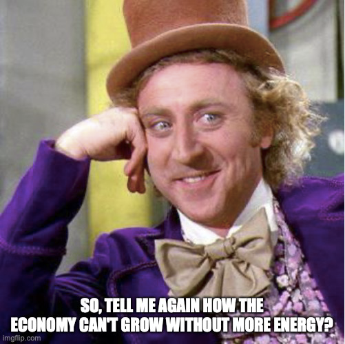
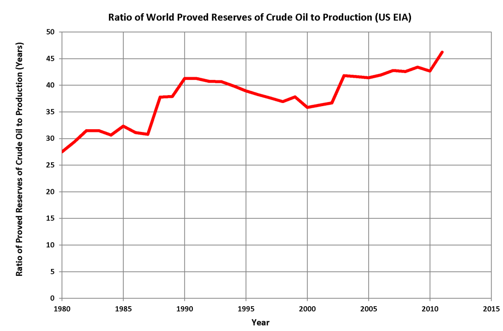

# Energy and growth
{: .no_toc }

1. TOC 
{:toc}

## Facts on energy use
The stock $X_t$ here is something like "total proven reserves" of things like oil and natural gas. The term $E_t$ is the flow of these resources, or "energy", that goes into production. Here's a plot of total energy use over time. One can see how this levelled off for places like the US, Japan, and the UK, but kept climbing in places like China and India.

<iframe src="https://ourworldindata.org/grapher/primary-energy-cons?tab=chart&country=USA~CHN~IND~KOR~GBR~JPN" loading="lazy" style="width: 100%; height: 600px; border: 0px none;"></iframe>

In per capita terms, things looked a little different.. This shows something interesting, which is that energy use *per-capita* does not necessarily keep rising over time. In particular, for richer countries like the US, UK, or Japan, energy use per capita started to fall in the last few decades. Of course, this was from a high starting point, so they still have higher per-capita energy use than places like China and India. But it isn't necessarily true that as economic growth continues, so does energy use per capita.

<iframe src="https://ourworldindata.org/grapher/energy-use-per-capita?tab=chart&country=CHN~IND~JPN~GBR~USA~KOR~OWID_WRL" loading="lazy" style="width: 100%; height: 600px; border: 0px none;"></iframe>

On the other hand, if we look across all countries, the relationship of energy use per capita and GDP per capita is strongly positive. 

<iframe src="https://ourworldindata.org/grapher/energy-use-per-capita-vs-gdp-per-capita?xScale=log&yScale=log&time=1990..2015" loading="lazy" style="width: 100%; height: 600px; border: 0px none;"></iframe>

Trying to put this data into context with the model is not straightforward. The cross-sectional relationship in the last figure we can make sense of. Countries that have large resource flows per capita, meaning a high $X_0$ or $s_X$, will have high GDP per capita in our model, holding everything else constant. Everything else is *not* the same, of course, across countries. But perhaps the other things that matter ($A_0$, $s_I$, $g_L$, etc..) turn out to be not very important compared to resources.

On the other hand, our model is a pretty *bad* fit for the time series evidence. For most countries at most times, energy use per capita (and total energy use) was *rising* over time, not falling. That's the exact opposite of what we assumed was going on. It's only the rich countries in the last few decades that have falling energy use per capita, and intuitively that seems to be less a question of diminishing stocks of resources than a conscious choice made with respect to environmental and climate concerns.

The most plausible explanation for rising energy consumption per capita is that the initial stock of resources, $X_0$, and or the extraction rate, $s_X$, rose over time. We in fact see that proved reserves of oil and natural gas worldwide rose over time. A lot of time and effort goes into exploring for oil and gas resources, so perhaps that isn't a huge shock. 

This figure shows, for oil, the world's proven reserves ($X_t$) over production ($E_t$) since 1980. In our model, this line should be flat as the ratio of $X_t/E_t$ is constant as both decline at the rate $s_X$. But in fact the ratio of reserves to production rose, indicating that discoveries of fossil fuel reserves were rising faster than energy use.

So it may well be true that resource use does put a drag on growth through the $s_X$ term, as we speculated in the model, but that a sufficient amount of *new* resources coming online raise $X_0$ enough to offset that. A more robust model would include some kind of decision to invest in discovery, similar to what we did in the section on innovation. At some point nonrenewable resources, by definition, *have* to run out. But for the last century or so we have not come close to that limit, from what the data indicate.

## Energy factor share and intensity
An open question given the above data is whether this kind of energy use can be sustained over time. Nonrenewable resources are, by definition, going to run out at some point. We may keep increasing $X_0$, but perhaps that will end at some point soon. Is there a way in which we can esacpe the consequences of using these kinds of resources? 

One possibility is that we find technologies that minimize our need to use these resources. Rather than thinking of this in terms of $A_t$, we could think of this as changing the actual production function itself. What I mean here is changing the value of $\beta$. If we made $\beta$ lower, then our need for resources would be lower. If $\beta=0$, in the extreme, then there is no reason to use any amount of the resource at all.

Is it plausible for $\beta$ to fall? Sure. Recall from the work on [cost shares](costshare.html) that the elasticity of GDP with respect to an input ($\beta$ in this case) is approximately equal to the payments made to that input (in the case, total payments for energy) divided by GDP. Yes, that should be divided by *costs*, but in this case we don't have a great measure of total costs including energy, so we're going to fudge this a little with GDP. 

$$
\beta \approx \frac{p_E E}{Y}
$$

The Energy Department produces data on the ratio on the right-hand side of this approximation. The figure here shows, on the left, the total real payments made for energy ($p_E E$) by year, and broken down by the use of that energy. Real costs rose over time, but in the last few years fell. On the right hand side is the figure we are more interested in. This measures those real costs as a fraction of real GDP, or $p_E E/Y$, which is our approximation of $\beta$. 

Note that despite a surge in the late 1970s and early 2000s, this ratio *declined* over time. In our simple Cobb-Douglas setting, this ratio should be constant. What this falling ratio indicates is that the importance of energy in production did fall, consistent with our production function becoming less reliant on energy use.

The decline in $\beta$ could be driven either by a fall in the price of energy, or by a fall in the ratio of $E/Y$, something sometimes called "energy intensity". This plot shows that ratio for a set of countries from 1990 forward. 

<iframe width="900" height="600" frameborder="0" scrolling="no" src="//plotly.com/~dvollrath/121.embed"></iframe>

In fact, it does look like energy intensity fell over time. Most countries are using less energy per unit of GDP now than in the past. This indicates some kind of increase in energy efficiency, and perhaps is driving a long-run drop in $\beta$.

The other thing to consider is a drop in price of energy was responsible for the drop in the ratio of $p_E E/Y$, which may also be part of the story. Here the data is less telling. The following figure shows you the relative price of energy for consumers compared to other non-energy (and non-food) goods, and is set to equal 1 in 2019 by construction. 

<iframe width="900" height="600" frameborder="0" scrolling="no" src="//plotly.com/~dvollrath/119.embed"></iframe>

There isn't an obvious pattern here. For a place like the US, the relative price of energy fluctuated quite a bit, and ended up somewhat higher in 2019 than in decades before, but there isn't a massive increase. On the other hand, in Japan the price fell dramatically. But in South Korea it increased quite a bit. There is no obvious answer here. 

While we cannot make very strong predictions from this limited data, there does appear to be plausible evidence that energy as a resource declined in importance for production. With a fall in $\beta$, the economy can keep growing over time and use fewer resources over time without threatening that growth. No guarantees, but is a plausible possibility for the future.