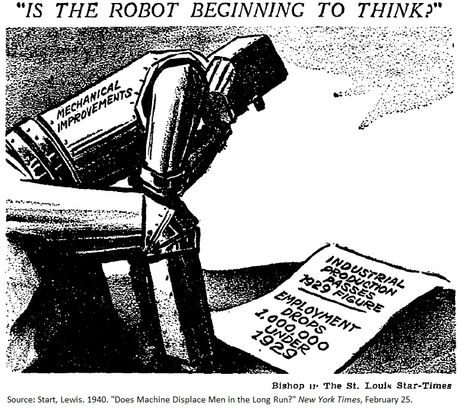

# Will robots take the jobs?
{: .no_toc }

1. TOC 
{:toc}

## Robots
Robots are capital goods, just more flexible and capable than things like trucks, buildings, or computers. And it is probably that flexibility that generates the most worry about how robots may affect employment of people. For example, here's a video of a robot cooking, something that up until now felt like it was inherently human-based.

<iframe width="560" height="315" src="https://www.youtube.com/embed/OUJe0Wmfo5g" frameborder="0" allow="accelerometer; autoplay; encrypted-media; gyroscope; picture-in-picture" allowfullscreen></iframe>

And this kind of replacement of human tasks by machines leads to worry about the ability to employ people in the long run. What if machines can do *everything* people can do. Won't companies just use robots, who don't complain, call in sick, or have HR issues?

One thing to make clear is that this kind of concern is not new. This drawing is from 1940.

## Automation and job loss
Timothy Taylor has collected a number of old references to worries about automation and job loss. This is not something new. 

From 1940, [an article titled](https://conversableeconomist.blogspot.com/2020/01/worries-about-automation-and.html) "Does Machine Displace Men in the Long Run? New Studies Cited as Old Argument is Renewed over Significance of Technological Unemployment" was in the NY Times. Note that this is an *old* argument, as far as they are concerned. 

> The cigar industry is a striking example of mechanization on productivity and employment, for the four-operator cigar machine reduced the amount of labor by 62 per cent as compared with the hand process. In terms of production costs, the reduction in labor time represented a difference in favor of the machine process of at least $3 per thousand of cigars. In 1921 the industry employed 112,000 wage earners ... By 1935 it was estimated that 44,000 hand workers had been severed from the industry due to use of the long-filler cigar machines alone and that concurrently jobs had been provided on the machine for 17,000 new workers, mostly unskilled. 

This quote has two aspects that are important. First, that automation or mechanization lowered the labor necessary per machine, lowered the price of the product, but put a bunch of people out of work. Second, that of the new people who were hired (that didn't quite add up to those who lost jobs), they were mainly *unskilled*. 

In a [different post](https://conversableeconomist.blogspot.com/2016/03/automation-and-job-loss-fears-of-1927.html?m=1) Taylor cites a 1927 speech by US Labor Secretary James J. Davis. From that speech:

> Take for example the revolution that has come in the glass industry. For a long time it was thought impossible to turn out machines capable of replacing human skill in the making of glass. Now practically all forms of glassware are being made by machinery, some of the machines being extraordinarily efficient. Thus, in the case of one type of bottle, automatic machinery produces forty-one times as much per worker as the old hand processes, and the machine production requires no skilled glass blowers. In other words, one man now does what 41 men formerly did. What are we doing with the men displaced?

Similar worries about displacement. But Davis really gets to a third major issue, which is the *pace* of innovation and the question of whether people could find new jobs.

> To-day when new machines are coming in more rapidly than ever,that period of adjustment becomes a more serious matter. Twenty years ago we thought we had reached the peak in mass production. Now we know that we had hardly begun. ... In the long run new types of industries have always absorbed the workers displaced by machinery, but of late we have been developing new machinery at a faster rate than we have been developing new industries. Inventive genius needs to turn itself in this direction.

As a last example, Taylor finds a [1961 Time Magazine article](https://conversableeconomist.blogspot.com/2014/12/automation-and-job-loss-fears-of-1964.html) on "The Automation Jobless":

> The number of jobs lost to more efficient machines is only part of the problem. What worries many job experts more is that automation may prevent the economy from creating enough new jobs. ... Throughout industry, the trend has been to bigger production with a smaller work force. ... Many of the losses in factory jobs have been countered by an increase in the service industries or in office jobs. But automation is beginning to move in and eliminate office jobs too. ... In the past, new industries hired far more people than those they put out of business. But this is not true of many of today's new industries. ... Today's new industries have comparatively few jobs for the unskilled or semiskilled, just the class of workers whose jobs are being eliminated by automation.

And this again hits on the *pace* of change. Where do those pushed out by automation go for work? 

## Debating the issue
The subject of whether robots are different than past capital accumulation and job displacement experiences has eaten up a lot of space on the internet. I think it would be fair to boil it down to two sides (if you had to) that are something like this. One option is "robots are not much different than other automation in the past, and while jobs will be displaced just like before, this will also create new jobs." The second less optimistic option is "robots are different than in the past because they are both more capable of mimicking human skills and because their abilities are growing much faster than prior experiences with automation. The pace of change will be too fast for people to adapt as they did in the past."

What follows are just a few deeper dives into these positions.

<iframe width="560" height="315" src="https://www.youtube.com/embed/76URvcmpmBQ" frameborder="0" allow="accelerometer; autoplay; encrypted-media; gyroscope; picture-in-picture" allowfullscreen></iframe>

[Matt Yglesias](https://www.vox.com/2015/7/27/9038829/automation-myth) questions whether robots are in fact even taking jobs at the rate we think. This is similar to this [Noah Smith](https://noahpinionblog.blogspot.com/2017/03/robuts-takin-jerbs.html?m=1) article about why this whole idea of robots stealing jobs is misguided.

From the other perspective you have [Richard Serlin](https://richardhserlin.blogspot.com/2015/11/robotai-revolution-decimating.html) who brings together a number of arguments to make the case that robots are going to have a differential effect than prior automation. This is partly based on speed of change and capability of robots.

## Formalizing the problem
One of the issues with these debates about robots is that it isn't exactly clear what we're arguing about. A value of having a model is that they help you clarify what people may be arguing about. In this case, I think a valuable way of considering the robot question is through the idea of changes in the elasticity of GDP with respect to capital (and hence labor). If robots are just capital goods (more K) or higher productivity (more A), then it isn't clear why they should act differently than any other K or A we've accumulated in the past. So it would need to be something else about production that makes robots a possible problem.

I think one way to frame the concerns about robots is that they are neither capital nor productivity, but that they are *substitutes* for workers. If we had $B$ robots available, then the argument is that production could be written as follows:

$$
Y = K^{\alpha}(A (L+B))^{1-\alpha}.
$$

Here, the capital stock is things like buildings and trucks and computers, and that doesn't change. The robots, though, are able to act as if they were people. 

What is the effect of adding B workers into the mix? That depends on what we are trying to measure and how we treat the B robots. 

If we are talking about *GDP per human-OR-robot*, that should go *down* because we're adding a bunch of these mechanized workers, but the capital stock K is roughly the same. 

$$
\frac{Y}{L+B} = A^{1-\alpha} \left(\frac{K}{L+B}\right)^{\alpha}.
$$

This is fine, but no one really cares about output per human-OR-robot. If we are talking about *GDP per human*, then that should go *up* because we're adding more of a productive factor, and dividing by the same number of people as before.

$$
\frac{Y}{L} = A^{1-\alpha} \left(\frac{K}{L+B}\right)^{\alpha} \frac{L+B}{L}.
$$

You can see the difference here with the GDP per human-OR-robot above. The difference is in that last ratio of $(L+B)/L$. That last term is one way to conceive of the arguments of the robot-optimists. Per-human, we will be better off. 

But just because GDP per human goes up, that does not mean all humans benefit. The "wage" paid to the robots who are put to work goes to the robot owner. So in essence we want to think about breaking down GDP into three different income components (capital payments, robot wage, and human wages), not two (capital payments and human wages). 

$$
Y = RK + wL + wB
$$

where we are operating on the assumption that humans and robots are perfect substitutes and get paid the same wage. That probably isn't true, but it helps us see the overall changes we're talking about. 

The wage paid to any human OR robot is going to (in our simplest version of the world) be equal to the marginal product. And we've already seen that this can be measured pretty easily by multiplying the average product of a human-or-robot by the elasticity of GDP with respect to human-or-robots.

$$
w = (1-\alpha) \frac{K^{\alpha}(A (L+B))^{1-\alpha}}{L+B} = (1-\alpha) A^{1-\alpha} \left(\frac{K}{L+B}\right)^{\alpha}.
$$

This is a lot like the GDP per human-OR-robot term above. So this wage is going to go *down*, even if all the humans are employed. Essentially, we've added a bunch of fake humans and they are competing with the real ones for jobs. That's the argument robot-pessimists make.

Or, the really robot-pessimistic out there will make a stronger argument that requires another assumption. What if when we added robots, instead of letting that increase GDP, we just used that to keep GDP the same as before, but took advantage of the robots to get rid of human workers? 

Prior to robots, GDP was $Y^{Before} = K^{\alpha} (AL)^{1-\alpha}$, and now with the robots we just want to keep the same GDP. How many human workers will still be employed in this new regime? In the new regime, GDP is $Y^{Robot} = K^{\alpha} (A (L^{Robot}+B))^{1-\alpha}$. That $L^{Robot}$ term doesn't mean people are robots. It is the number of human workers necessary in the robot-world. 

Holding GDP constant across the two regimes, we get

$$
K^{\alpha} (AL)^{1-\alpha} = K^{\alpha} (A (L^{Robot}+B))^{1-\alpha}
$$

and we can solve that for the size of $L^{Robot}$. A lot of things cancel nicely for us, so this turns out to be

$$
L^{1-\alpha} = (L^{Robot}+B)^{1-\alpha}
$$

or

$$
L^{Robot} = L - B.
$$

We'd replace people with robots one-for-one. We could tweak that by allowing for the idea that humans and robots are not perfect substitutes. And if they are not, then more people would be employed to hold GDP constant.

So this leads us to a couple of questions to think about when evaluating the effect of robots. First, do we think that after robots are used that the goal will be to keep GDP constant (humans get dropped from the labor force) or GDP will grow (humans stay in the labor force at a lower wage). Second, do you think that robots and humans are perfect substitutes? If they are, the consequences for humans are really bad. If they are not, then the consequences may not be as bad. 

What do I mean by that last one? Well, consider an alternative where robots are not substitutes for humans at all, but rather substitutes for *capital*. In that case, the production function is $Y = (K+B)^{\alpha} (AL)^{1-\alpha}$ and GDP per human is

$$
\frac{Y}{L} = A^{1-\alpha}\left(\frac{K+B}{L} \right)^{\alpha}
$$

and the wage is

$$
w = (1-\alpha)A^{1-\alpha}\left(\frac{K+B}{L} \right)^{\alpha}.
$$

In both of these cases, the outcome for humans is really *good*. What, though, if after the robots are introduced we just want GDP to stay the same, not grow? 

$$
K^{\alpha} (AL)^{1-\alpha} = (K+B)^{\alpha} (AL^{Robot})^{1-\alpha}
$$

and things are a little more complex. You can solve this for

$$
\frac{L^{Robot}}{L} = \left(\frac{K}{K+B}\right)^{\alpha/(1-\alpha)}.
$$

If GDP is just held constant, then the fraction of people employed in robot-world is lower, and how low depends on how many robots (B) are added to the economy. There is still some job elimination involved. Except that note this depends a lot on the assumption that GDP would be held *constant* even after the introduction of robots.

One reason to doubt that this would be the case is that we've never seen automation do this before. The articles above from past decades all suspected this was the case, that introducing automation would mean we'd produce the *same* amount using fewer people. Except we've always used the automation to *increase* GDP and build more stuff (or provide more services). 

The larger worry about robots is probably whether they serve as substitutes for *labor* rather than for *capital*. To the extent they substitute for people, they are more likely to lower wages and make people worse off. But we should be cognizant of both questions (what happens to GDP, are robots substitutes for labor or capital) before deciding what might happen.

