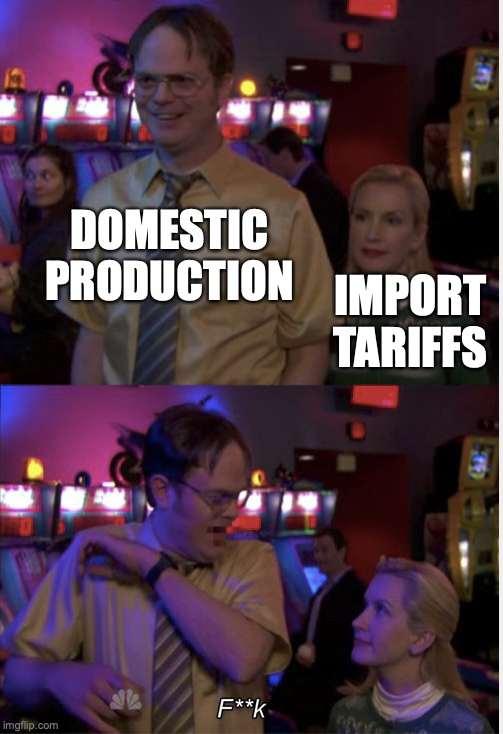

# Is trade good for growth?
{: .no_toc }

1. TOC 
{:toc}

## GDP and trade
Before we go too far, let's get some accounting straight to eliminate a common mistake when thinking about trade and GDP. You know the standard macro relationship

$$
Y = C + I + G + X - M
$$

where X is exports and M is imports. This is often mistakenly assumed to mean that if we import more, GDP must go down. That is categorically and absolutely *false*. The above statement is an accounting identity that has to hold by construction, not a production function. Until you show me the production function and how trade impacts it, you cannot tell me how imports affect GDP. 

To help clear this up, let's make one simple change. 

$$
Y + M = C + I + G + X.
$$

Now it may be more clear. What's on the left is "stuff we can consume" and this consists of stuff we produce ourselves (Y) and stuff we got from foreign countries (M). On the right is "how we consumed it" which consists of consumption goods (C), capital goods (I), government goods (G), or as goods we actually shipped out to someone else (X).

If imports rise, that means we have "more stuff we can consume", but it has no direct impact on GDP (Y). 

If there is a relationship of imports to the size of GDP, we have to work much harder to figure out what it is. But there is no simple rule that as imports go up, GDP goes down. 

## Basic relationships
That aside, one of the best things to do is look as some simple relationships in the data to see what it says. This first figure shows you the the relationship of the level of GDP per capita to the imports as a share of GDP for a selection of countries.

<iframe width="900" height="600" frameborder="0" scrolling="no" src="//plotly.com/~dvollrath/161.embed"></iframe>

Note that for each country, the relationship of the import share and the level of GDP per capita tends to be *positive*.

However, look across countries, and notice what is going on. The richest country in the figure tends to be the U.S., in the purplish dots in the upper left of the figure. It has high GDP per capita but a relatively low import/GDP ratio. On the other hand, South Korea, in the orange dots to the bottom right, tends to have lower GDP per capita but a relatively high import/GDP ratio. So while each country individually appears to import more in relationship to GDP when they are richer, across countries the richer ones tend to not import much relative to GDP. 

These kinds of relationships show up again if we look instead at exports/GDP. In this figure, below, the plot looks almost identical to the one for imports. There is a tendency for the export/GDP ratio to be larger when GDP per capita is larger for any given country.

<iframe width="900" height="600" frameborder="0" scrolling="no" src="//plotly.com/~dvollrath/159.embed"></iframe>

But, across countries the richer ones (US) tend to have lower export/GDP ratios than the poorer ones (South Korea). 

Neither of these figures prove anything. In particular, they do not tell us whether a policy or change that increased imports would increase or lower GDP per capita. Nor do they tell us whether a policy or change the increased exports would increase or lower GDP per capita. But they indicate that any explanation of how trade affects growth has to grapple with the fact that for any given country, they appear to trade more when they are richer. So we have our work cut out for us in thinking about how trade and growth or GDP per capita are related.

## Brie versus fuel injectors
One of the reasons trade has such an ambiguous relationship with growth is that a lot of trade takes a form that we usually do not think about: intermediate goods. A fuel injector produced in Brazil, for example, might be shipped to Mexico (and hence is an export for Brazil and an import for Mexico). That fuel injector is then used to assemble a car that is shipped to the US (which is now an import for the US, and an export for Mexico). That fuel injector, by the way, was probably *designed* in the United States, and so when you buy that car here a good portion of the purchase price will end up going to Ford or GM or whoever designed the fuel injector. As companies have expanded their supply chains, trade went up, but a lot of that trade is related to intermediate goods - the fuel injector - getting moved around before final assembly. 

These two videos are more "boring HS filmstrip" than "funny TikTok", but they get the point across on this.

<iframe width="560" height="315" src="https://www.youtube.com/embed/RZKX-0SK41U" frameborder="0" allow="accelerometer; autoplay; clipboard-write; encrypted-media; gyroscope; picture-in-picture" allowfullscreen></iframe>

<iframe width="560" height="315" src="https://www.youtube.com/embed/Bblo8_B32Co" frameborder="0" allow="accelerometer; autoplay; clipboard-write; encrypted-media; gyroscope; picture-in-picture" allowfullscreen></iframe>

This kind of trade in intermediates is different than how we are used to thinking about trade. We typically think of something like Brie, the runny cheese from France. French people (and cows) produce this, it gets put on a boat, it shows up in the grocery store, and you buy it. It is an export for France and an import for the US. But that kind of trade is now only a part of what we see happening between countries, and the intermediate good trade can help us think about why trade may be associated with higher GDP per capita for a country. 

## Tradable inputs
To think about this we have to be more clever with how production works. First, rather than saying that GDP depends on capital and labor (and productivity), we're going to say that GDP depends on intermediate inputs and labor (and productivity). And for the moment we'll say that there are N different kinds of intermediate inputs, and the amount of each one we use is denoted by $x_i$. The production function we'll use is now

$$
Y = \left(\sum_{i=1}^N x_i^{\alpha}\right) (A L)^{1-\alpha}.
$$

Notice that this kind-of looks like our Cobb-Douglas. We've got this summation of all these intermediate good terms, $x_i$, and they are each raised the $\alpha$ power, kind of like the Cobb-Douglas. The more we use of any individual intermediate good, the more GDP we get. If the country we are talking about here is Mexico, then one of the $x_i$ termd might be measuring fuel injectors imported from Brazil. 

This seems to have life more complicated, but we can simplify a little. First, we're going to assume that all intermediate goods are produced only using capital (no labor). That's not how life works, but will avoid even more annoyances with math. Second, some of those intermediate goods are produced domestically, and some are produced abroad and imported before being used to assemble the final good (like the fuel injector). 

Let D be the number of types of intermediate goods produced domestically. Let $z_i$ be the amount of each of those intermediate goods that is produced, and $z_i = K/D$, meaning that the amount of each type we produce is the capital stock divided by the number of types. We use our domestic capital stock to make an identical amount of each of the D different intermediate goods. 

We *produce* $z_i$ domestically, but we're only going to *use* $x_i$ of each ourselves. The rest we are going to sell to other countries so that we can import different intermediate goods from them. 

Let M be the number of foreign types of intermediates that we import. And for each of these, we are going to import $x_i$ units. So to balance everything out here, it will be that

$$
Dz_i - Dx_i = Mx_i.
$$

On the left is what we produce ($Dz_i$) minus what we keep for ourselves ($Dx_i$). The surplus there is used to purchase M different types of intermediate goods from abroad ($Mx_i$). Note that we're using an identical amount of each intermediate good no matter where it was built. That is because our production function treats all intermediates as similar. There is no reason to buy more or less of one or the other. 

Now, note that $Dz_i = K$, given what we said above. So this equation can be written as $K - Dx_i = Mx_i$, or

$$
K = x_i (D +M)
$$

and solved for

$$
x_i = \frac{K}{D+M}.
$$

So the amount of each variety we use depends on our own domestic capital stock. That is because our capital stock can be used to either (1) produce intermediate goods for ourselves or (2) to produce intermediate goods that we swap with other countries for their intermediate goods. There is no trade surplus or trade deficit here, everything balances out. That's not realistic, but adding in persistent deficits or surpluses creates a lot more problems, and is really a different question entirely. We're going to stick here with the rough relationship of trade and GDP, leaving aside the question of deficits.

Now we know $x_i$, so plug that into the production function from above. The only other thing to note is that $N = D + M$, or the total number of intermediates we use is equal to the number we produce plus the number we import.

$$
Y = \left(\sum_{i=1}^{D+M} \left(\frac{K}{D+M}\right)^{\alpha}\right) (A L)^{1-\alpha}.
$$

You can work with that summation, noting that the $K$ is common to each term, as is the $D+M$ in the denominator. That leaves us with

$$
Y = K^{\alpha} \left[(D+M) A L \right]^{1-\alpha}.
$$

Note that the total number of types of intermediate goods (D+M) acts like a productivity term. The more *variety* we have in our inputs, the higher is GDP. You can think of this as capturing gains from specialization. Because each individual intermediate good has diminishing returns (i.e. it is raised the $\alpha$ power) it means that we're better off having a little bit of a lot of different inputs, rather than having a lot of just a few inputs. And trade essentially is going to allow us to have a lot more types of inputs, raising productivity. 

Last, let's think about a measure of how open this economy is, like the size of imports ($M x_i$) divided by GDP, similar to what was measured in the figures above. 

$$
\frac{Imports}{Y} = \frac{M x_i}{Y} = \frac{M}{D+M} \frac{K}{Y}.
$$

With all this machinery, we can think about what happens if world trade because easier and there are more foreign varieties of intermediates to buy. Because of how production works, if there are more foreign intermediates, we will want to use them. All we're saying is that M goes up relative to D. If that occurs, then the ratio of Imports/Y goes *up*. We will use less of each type of intermediate, meaning we keep less of our own types, and use more of our own production to trade for foreign intermediates. 

But that also means GDP goes up, as $D+M$ increased due to $M$ increasing. We've created a positive connection between trade and GDP (and GDP per capita). This allows us to see some of why the data shows these strong correlations of GDP per capita and trade activity. Part of the reason is because trade allows a diversification of our production process with more inputs, raising productivity. 

We can also think a little about why across countries, it appeared that some (like the US) had relatively small Import/Y ratios, but were quite rich, and others (like South Korea) had high Import/Y ratios, but were not as rich. This could be due to variation in the domestic set of varieties produced. If D is very high in the United States, then this increases the things we can produce ourselves, and raises GDP and GDP per capita. It also makes the Import/Y ratio lower. In South Korea, if D is relatively small, then GDP and GDP per capita will be relatively small, and the Import/Y ratio will be relatively *large*. 

What this way of thinking about production doesn't tell us, by the way, is what the right trade policy is. It shows why an expansion of imported varieties is helpful to GDP per capita, and explains why that might be associated with more imports/GDP. But if you were trying to decide whether to promote more trade or to promote an expansion of the number of domestic varieties we produce (D), there isn't an obvious answer here. It would depend on how much it would cost to do those promotions. 

Last, it doesn't tell us (as noted) about trade balances. That is, we haven't talked about whether running a trade deficit is bad or good. That is because here we have no inter-termporal choice being made between importing extra varieties today (say) and then having to pay that back by exporting more in the future. Whether that is a good idea or not depends on whether you think the extra imports today will increase you GDP by enough in the future to make paying them back trivial or not. 

