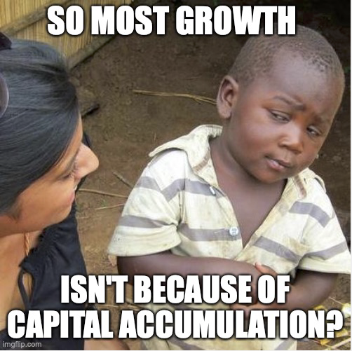

# Accounting for the sources of growth
{: .no_toc }

1. TOC 
{:toc}

## Accounting for growth
From the prior section we know that given a production function of $Y = K^{\alpha}(AL)^{1-\alpha}$ the growth rate of GDP per capita can be written as

$$
g_y = \alpha (g_K - g_A - g_L) + g_A.
$$

This divides up growth in GDP per capita into two parts. $\alpha(g_K - g_A - g_L)$ is the contribution of *net* capital growth. The "net" refers to the fact that we care about how fast capital grows relative to the growth rate of productivity and labor. Why? Because capital is itself something that is produced, so if it is growing quickly that may only indicate that the economy is growing for *other* reasons. Capital contributes to growth in living standards to the extent that it grows faster than the pace of productivity and labor; in that case we are actually accumulating more capital relative to our ability to use it. 

The second part is just $g_A$ itself, productivity growth. This contributes directly because it enhances our production given the stock of capital and labor available. 

The question here is how big these two contributions to growth are in the real world. Some of this is straightforward to find. We can look up (or calculate) the growth rate of GDP per capita, $g_y$, the growth rate of capital, $g_K$, and the growth rate of labor, $g_L$. Given what we learned about cost shares, we can infer a value of $\alpha$ of about 0.3. 

The one thing that isn't immediately clear here is what the growth rate of productivity will be, $g_A$. Productivity isn't something we can measure directly at all. But since we have all this other information, we can back out what $g_A$ *must* be to ensure this equation holds. 

First, re-arrange the above equation to be

$$
g_y = \alpha (g_K - g_L) + (1-\alpha) g_A.
$$

Second, re-arrange that again to put $g_A$ by itself

$$
g_A = \frac{1}{1-\alpha} g_y - \frac{\alpha}{1-\alpha} (g_K - g_L).
$$

We have all the information for the right-hand side, and it is easy to calculate the values for $g_A$ in any given year. The growth rate in productivity is just the growth rate of GDP per capita minus whatever is accounted for by the growth rate of capital relative to labor. Productivity growth is just the residual explanation for growth beyond what we can explain using $g_K$ and $g_L$.

The data to calculate these values for the USA, Japan, and South Korea is available at [This link](accountdata.xlsx).

Once you've got $g_A$, you can calculate size of the two contributions to growth: $g_A$ (productivity) and $\alpha(g_K - g_A - g_L)$ (capital accumulation). 

I've done this for a couple of countries already. In each case, the growth rates I've calculated are 10-year annualized rates, to avoid wild swings associated with business cycles. Here's Japan:

<iframe width="900" height="600" frameborder="0" scrolling="no" src="../plotly/pwt-account-basic-jpn.html"></iframe>

The contribution to growth of productivity (which remember, is everything we cannot explain with capital and labor, basically) is huge at the outset, and remains relatively large throughout. The contribution from capital accumulation (relative to productivity and labor) looks a lot smaller. Note that there is a period where Japan benefits a lot from capital accumulation, but by the end this has run out completely. 

If you look at the US, the story is slightly different. 

<iframe width="900" height="600" frameborder="0" scrolling="no" src="../plotly/pwt-account-basic-usa.html"></iframe>

Here, productivity growth is never as high as in Japan. But also note that the capital accumulation term is never that large. There is no burst like in Japan. For a country like the US that has experienced stable growth, the story is that the $\alpha(g_K - g_A - g_L)$ does not contribute a whole lot to the party. That won't mean that capital is unimportant, as we will see going forward. It's just that, on net, capital growth over and above productivity and labor growth is not a big contributor. 

For Japan, there is a period in which capital grows very fast (faster than $g_A$ and $g_L$), which boosts growth. But note that this is temporary. We'll also study why that burst cannot last forever, and how it came to be that Japan got this boost. The short version is that when you start with very *little* capital, as after World War II, then there is the potential for a spike in growth as you catch up. 

## What about affordability?
Back in [the section on measuring GDP growth](afford.html) I spent a lot of time telling you that growth is about products getting more affordable. How does the idea of a production function and all this accounting for capital and productivity connect to that concept? The basic idea is that more capital, labor, and productivity lower the cost of making things, which in turn lowers their price (relative to nominal spending), and hence leads to affordability growth. 

From that section we said that

$$
g_Y = \sum_i \left(g_{PY} - g_{Pi} \right)\frac{C_i P_i}{PY}
$$

and in per-capita terms this would still just be

$$
g_y = \sum_i \left(g_{Py} - g_{Pi} \right)\frac{C_i P_i}{PY}
$$

where the only difference is that $g_{Py}$ is the growth rate of per-capita nominal spending, which might be different than the aggregate growth in nominal spending. Regardless, growth in real GDP per capita depends on the expenditure-weighted sum of affordability growth of all the products.

From the production side we established that real GDP growth occurs because 

$$
g_y = \alpha (g_K - g_A - g_L) + g_A
$$

or it depends on capital, productivity, and labor. Together, these things have to give the same answer for $g_y$, so that means

$$
\sum_i \left(g_{Py} - g_{Pi} \right)\frac{C_i P_i}{PY} = \alpha (g_K - g_A - g_L) + g_A
$$

and you can read this as saying that the affordability growth of products must arise from the accumulation of capital, labor, and productivity. The right-hand side isn't specific about which products, it just says that if you have more $K$ or $A$ then you can make at least some products more affordable, and/or you can make the products with relatively bigger expenditure shares a little more affordable. In other words, if $g_K - g_A - g_L >0$ and $g_A>0$, then it must be that at least some of the terms $g_{Py} - g_{Pi} >0$, or that some products are getting more affordable. 

Can we pin down the growth in nominal GDP per capita, or the exact growth in the prices? No, all we can do studying growth is establish that the relative price goes down. The determination of $g_{Py}$ depends on things like the growth in the money supply and other things that we aren't worried about in this class. Regardless, real growth in per capita GDP occurs when the prices don't go up as fast as nominal GDP. 

