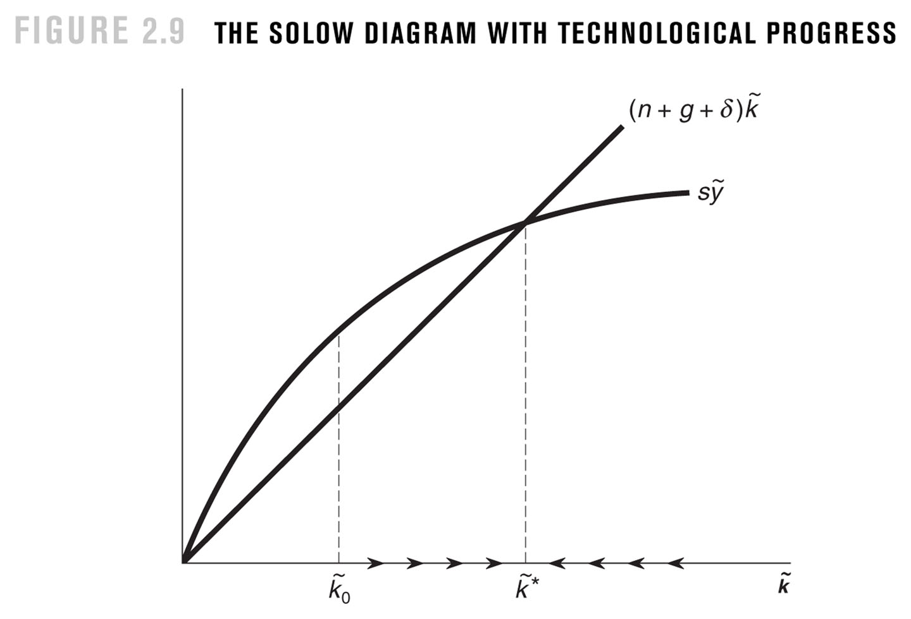

# Old school Solow
{: .no_toc }

1. TOC 
{:toc}

The way the Solow model is presented in the study guide is not the standard way used in textbooks (including the one I helped write). This subsection sets up the standard way.

## Efficiency units
Start again with the production function. 

$$ 
Y_t = K_t^{\alpha} (A_t L_t)^{1-\alpha}
$$

Now, divide both sides by $A_t L_t$, so you get

$$ 
\frac{Y_t}{A_t L_t} = \left(\frac{K_t}{A_t L_t} \right)K_t^{\alpha}.
$$

The term of the left is called *output per efficiency unit*. The term "efficiency unit" refers to the productivity adjusted amount of labor used, $A_t L_t$. Output per efficiency unit doesn't have any direct economic meaning. It is used as a mathematical convenience. On the right is *capital per efficiency unit*, for the same reason. 

Purely to eliminate extra writing, define the term $\tilde{y}_t = Y_t/(A_t L_t)$ as shorthand for output per efficiency unit, and $\tilde{k}_t = K_t/(A_t L_t)$ as shorthand for capital per efficiency unit. Then we can write

$$
\tilde{y}_t = \tilde{k}_t^{\alpha}.
$$

The Solow model cares about the dynamics of these per-efficiency unit items. And once we understand those dynamics, we can back out the dynamics of output per worker and capital per worker. 

Take logs and derivatives, just like normal, to find that

$$
g_{\tilde{y}} = \alpha g_{\tilde{k}}.
$$

So what is the growth rate of capital per efficiency unit? Go back to the definition of it, $\tilde{k}_t = K_t/(A_t L_t)$, and again take logs and derivatives

$$
g_{\tilde{k}} = g_K - g_A - g_L.
$$

We already know the [growth rate of capital](capital.html) so we can write

$$
g_{\tilde{k}} = s_I \frac{Y_t}{K_t} - \delta - g_A - g_L.
$$

This means the growth rate of capital per efficiency unit depends on the capital/output ratio. But *that* ratio can actually be framed in a different way. 

$$
\frac{K_t}{Y_t} = \frac{K_t}{K_t^{\alpha} (A_t L_t)^{1-\alpha}} = \left(\frac{K_t}{A_t L_t} \right)^{1-\alpha} = \tilde{k}^{1-\alpha}.
$$

The capital/output ratio is just a scaled version of capital per efficiency unit. Which leaves you with

$$
g_{\tilde{k}} = \frac{s_I}{\tilde{k}^{1-\alpha}} - \delta - g_A - g_L.
$$

Okay, so far it is just re-writing the model in different terms. Here's where we really think about the analysis in a different way. Take this last equation and put it this way

$$
g_{\tilde{k}} = \frac{s_I \tilde{k}^{\alpha}}{\tilde{k}} - \delta - g_A - g_L
$$

and think about how a growth rate is defined. It's the change in something divided by the level. So we've got

$$
\frac{\Delta \tilde{k}}{\tilde{k}} = \frac{s_I \tilde{k}^{\alpha}}{\tilde{k}} - \delta - g_A - g_L,
$$

where $\Delta \tilde{k}$ is the absolute change in the capital per efficiency unit. Multiply both sides by $\tilde{k}$, and you get

$$
\Delta \tilde{k} = s_I \tilde{k}^{\alpha} - (\delta + g_A + g_L \right)\tilde{k}.
$$

The change in the capital per efficiency unit depends on the positive contribution from the share of GDP allocated to new capital, minus the deterioration that occurs because of depreciation in capital, the growth in productivity, and the growth in labor. Note that faster productivity growth implies *less* growth in the change in capital per efficiency unit. It doesn't mean less capital, it means less capital relative to how productive workers are.

## The Solow diagram
We've got the above equation describing the change in capital per efficiency unit. Traditionally the figure used to describe the model is built using two curves. The first maps the value of $s_I \tilde{k}^{\alpha}$ against $\tilde{k}$, or the contribution of new capital relative to the size of capital per efficiency unit. Notice that because of the $\alpha$ power, this curve is ... curved. It flattens out as $\tilde{k}$ gets larger. This captures the diminishing marginal product of capital. 

The second curve maps the total amount of deterioration of $\tilde{k}$, $(\delta + g_A + g_L)$, against the size of $\tilde{k}$. This captures how much capital per efficiency unit declines for these three reasons, and note that this is a straight line, meaning as $\tilde{k}$ goes up the line continues with the same slope. 

Those two curves are shown in the above figure, which is taken from the Jones/Vollrath textbook. The only thing to note here is that the $s_I \tilde{k}^{\alpha}$ curve is written as $s \tilde{y}$, which is due to a (1) using $s$ in place of $s_I$, and (2) noting that $\tilde{y} = \tilde{k}^{\alpha}$. The $(\delta + g_A + g_L)\tilde{k}$ line has (1) $g$ to measure $g_A$ and (2) $n$n to measure $g_L$. 

Regardless, if actual capital per efficiency unit is to the left of where the two curves cross, it is the case that $s_I \tilde{k}^{\alpha} > (\delta + g_A + g_L \right)\tilde{k}$ and so the capital per efficiency unit must be *rising*. This is shown along the x-axis by the arrows pointing to the right. If actual capital per efficiency unit is to the right of where they cross, capital per efficiency unit shrinks, indicating by arrows. 

Everything about this pushes capital per efficiency unit towards the point where the curves cross. At that point, capital per efficiency unit is constant, with the addition offsetting the deterioration. Because everything pushes capital per efficiency unit towards this point, it is a stable steady state. This is just like the steady state discussed in the main study guide.

## Steady state
The dynamics of the Solow diagram say that $\tilde{k}$ should end up at a stable steady state, where the two curves cross. What is that value of $\tilde{k}$? Set the change in $\tilde{k}$ to zero, which is what that steady state means. 

$$
0 = s_I \tilde{k}^{\alpha} - (\delta + g_A + g_L \right)\tilde{k}.
$$

Moving terms around you can solve for

$$
\tilde{k}^{ss} = \left(\frac{s_I}{\delta + g_A + g_L} \right)^{1/(1-\alpha})}
$$

where the $ss$ indicates this is the steady state value.

Remember that we found above that $K/Y = \tilde{k}^{1-\alpha}$? This means that at the steady state value of $\tilde{k}^{ss}$, the value of the capital/output ratio is 

$$
\left(\frac{K}{Y}\right)^{ss} = \left( \tilde{k}^{ss} \right)^{1-\alpha} = \frac{s_I}{\delta + g_A + g_L}
$$
 
which is exactly what we found in the study guide. There is nothing different about the dynamics of the economy just because we are talking about capital per efficiency unit. It is just a different way of getting to the same answer.

The last thing to talk about is how to convert everything back to GDP per capita. Remember that $\tilde{y}_t = Y_t/(A_t L_t)$. So that means $y_t = \tilde{y}_t A_t$, or GDP per capita is productivity times the growth rate of GDP per efficiency unit. The growth rate of GDP per captia is

$$
g_y = g_{\tilde{y}} + g_A.
$$

At steady state, what is $g_{\tilde{y}}$? This is just $g_{\tilde{y}} = \alpha g_{\tilde{k}}$, so when capital per efficiency unit hits the steady state, so does $\tilde{y}$, meaning the growth rate of GDP per capita goes to zero. Which implies that in steady state, $g_y = g_A$. This is exactly what we found in the study guide. In other words, the Solow model tells us that the economy heads to a BGP no matter how we analyze the model.

## Marginal Revolution University
If you're looking for an alternative explanation of the Solow to help you understand, MRU has a nice series. This is the intro video, and you can follow links to follow-ups:

<iframe width="560" height="315" src="https://www.youtube.com/embed/eVAS-t83Tx0" frameborder="0" allow="accelerometer; autoplay; encrypted-media; gyroscope; picture-in-picture" allowfullscreen></iframe>
