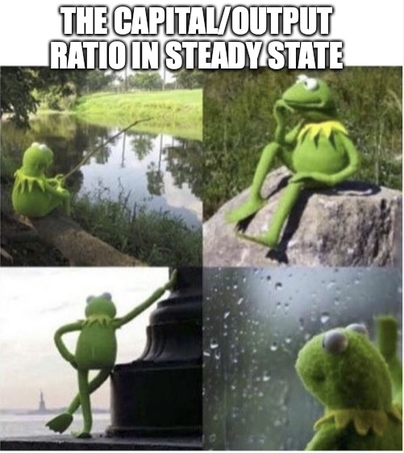
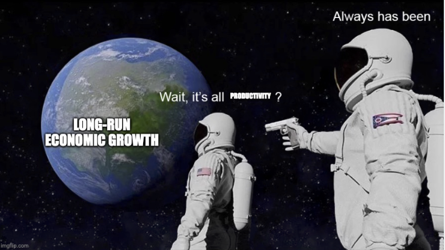

# The balanced growth path
{: .no_toc }

1. TOC 
{:toc}

## Tracking the level of GDP per capita
The simulations in the prior section showed that the two economies A and B seemed to be heading to common outcomes. Their $K/AL$ ratios were headed to about 3.7, and their growth rates were both headed to 2%. Rather than just seeing what happens to the growth rate and $K/AL$ ratio, it would be nice to see what this implies for the *level* of GDP per capita. Remember, this level is what we plotted on the figures that were used to establish that growth in developed countries was stable. 

We know we can write the level of GDP per capita as 

$$ 
y_t = \left(\frac{K_t}{A_t L_t}\right)^{\alpha} A_t.
$$

Taking logs, we have

$$
\ln y_t = \alpha \ln (K_t/A_tL_t) + \ln A_t.
$$

This says that the *level* of log GDP per capita at time $t$ depends on $\ln K/AL$, which is just the log of the $K/AL$ ratio. We know how to describe what happens to that already - it was the first figure in this section. 

But GDP per capita also depends on the level of productivity at time $t$, $\ln A_t$. We'll make the simplest assumption we can, that productivity has constant growth over time, so that

$$
A_t = (1+g_A)^t A_0.
$$

If you refer back to the [math preview](http://growthecon.com/StudyGuide/preliminaries/lines.html#theoretical-lines-and-slopes) you know we can take logs of this and get to

$$
\ln A_t = \ln A_0 + g_A t.
$$

The log of productivity at time $t$ depends on initial productivity, $A_0$, and on the growth rate of productivity, $g_A$. Put this together with the expression for log GDP per capita and we have

$$
\ln y_t = \alpha \ln (K_t/A_tL_t) + \ln A_0 + g_A t.
$$

We already said for economy A that the initial $K/AL$ ratio was 2, and for economy B it was 5. I already set the value of $\alpha=0.2$ and $g_A=0.02$. The only other thing we need is the value of $A_0$. Let's set that in both economy A and economy B to be $A_0 = 54$. There is nothing magic about that value, all that is important is that it is identical for A and B. 

Now we can find the level of GDP per capita in both during the first (t=0) period. In A it is

$$
\ln y_0^A = .3 (\ln 2) + \ln 54 + .02 \times 0 = 4.20.
$$

In B it is

$$
\ln y_0^B = .3 (\ln 5) + \ln 54 + .02 \times 0 = 4.47.
$$

So economy B has a *higher* GDP per capita to start thanks to the higher $K/AL$, but remember that it will have a *lower* growth rate. The actual numbers here don't really mean much by themselves. But we can look at log differences to tell us about relative GDP per capita. That is, 4.47-4.20 = 0.27. And $e^{0.27} = 1.31$. So country B has a GDP per capita about 1.31 times higher than in country A. 

Those are just the GDP per capita in period 0. What if we keep simulating this out, given that we know what happens to $K_t/Y_t$ in each period for both countries? 

<iframe width="900" height="600" frameborder="0" scrolling="no" src="../plotly/me-lny-animated.html"></iframe>

Once you hit play, you can see the big difference in initial GDP per capita. But you can also see that both countries are approaching the blue line in the middle I've labeled "BGP" over time. Again, the figures are a little jumpy, but ignore that. If we ran this figure out even further, you'd see that both countries have GDP per capita that ends up along that BGP line.

## Finding the BGP
Okay, we already knew that both economies had $K/AL$ ratios headed to about 3.7, and their growth rates were both headed to 2%. Now we know that both economies are headed towards a common path for GDP per capita. Recall as well that the production function elasticities were assumed to be constant, $\alpha = 0.3$ and there fore $1-\alpha = 0.7$. And finally, we assumed that the ratio of capital good formation to GDP, $s_I = 0.2$, was constant and identical in both. 

Go back and look at the definition of a [BGP](http://growthecon.com/StudyGuide/facts/bgp.html). Our simulated economies appear to have all the characteristics of a balanced growth path. Or rather, they both arrive very close to the characteristics of a BGP as time goes on. Despite starting out in very different positions given their capital/output ratios, A and B end up with a similar BGP. 

This worked for this specific simulation. The question for this section is whether that tendency to approach a BGP is true for any set of parameters we choose, and any initial value of the capital/output ratio. The answer is yes, but we are going to need to do a little math to see that.

### Finding a steady state
To see that the model we've set up implies that *all* economies end up on a balanced growth path, let's go back to the equation governing how capital grows,

$$
g_K = s_I \left(\frac{AL}{K}\right)^{1-\alpha} - \delta.
$$

To understand what happens to $g_K$ over time, we need to know what happens to $K/AL$, which depends on $g_K$, which depends on $K/AL$, and so on. To analyze this more formally we'll use a diagram that looks like the one in the app below. On the x-axis is the $K/AL$ ratio, and note that $g_K$ declines as $K/AL$ goes up, just like in our equation above. <a href="basic-KAL.html" target="_blank">Use this link to open the app in a separate tab</a>.

<iframe height="1500" width="900" frameborder="no" src="basic-KAL.html"> </iframe>

The combination of the two lines tells us everything about how the $K/AL$ ratio, and hence $g_K$, changes over time. Let's say that we start with a very small $K/AL$ ratio (close to zero). What does the diagram indicate? It says that $g_K > g_A + g_L$ (the blue line is above the green line). In this case the ratio must *rise*, because the numerator is growing faster than the denominator. In practice, the economy has very little capital relative to how productive it is and how many workers it has. So it can generate a high growth rate of capital by producing more capital relative to its small base. The dynamics keep pushing the $K/AL$ ratio to the right. 

If you start with a large $K/AL$ ratio, like 7, you get the opposite dynamics. There it is $g_K < g_A + g_L$ and so the ratio *falls*. The economy has a lot of capital relative to how productive it is and the number of workers. So even though it might produce a large absolute amount of capital, that additional capital is small compared to the initial amount, and the growth rate of capital is small. Everything about the dynamics push the $K/AL$ ratio to the left. 

No matter what, eventually the dynamics of the economy force it to the point where $g_K = g_A + g_L$, or the capital stock is growing just as fast as productivity and labor. At that point the economy can generate new capital, but just in balance with how fast it is getting more productive and adding more workers.

We can be specific about that point. If $g_K = g_A + g_L$, then

$$
s_I \left(\frac{AL}{K}\right)^{1-\alpha} - \delta = g_A + g_L
$$

and you can solve for

$$
\frac{K}{AL} = \left(\frac{s_I}{g_A + g_L + \delta}\right)^{1/(1-\alpha)}.
$$

This is the *steady-state* $K/AL$ ratio. It is the value towards which the economy is always evolving. Remember from before that the capital output ratio is just $K/Y = (K/AL)^{1-\alpha}$. That means the following:

{: .important }
The steady state capital/output ratio in the Solow model is $(K/Y)^{ss} = s_I/(\delta + g_A + g_L)$.

Let's make sure this all makes sense. Plug in the parameter values I used to create that figure for economies A and B: $\alpha = 0.3$, $s_I = 0.2$, $g_A = 0.02$, and $g_L = 0.01$. With those values we get that in steady state

$$
\frac{K}{AL} = \left(\frac{.2}{.02 + .01 + .05}\right)^{1/(1-.3)} = 3.702,
$$

which is exactly what our simulation said it would be. The capital output ratio, just a slightly different way of talking about things, is

$$
\left(\frac{K}{Y} \right)^{ss} = \frac{s_I}{\delta + g_A + g_L} = \frac{.2}{(.05 + .02 + .01)} = 2.5
$$

### Balanced growth and transitional growth

Now that we know that the capital/output ratio has a stable steady/state, we can go back and reconsider the definition of a balanced growth path, and what the combination of the data and theory imply. Here are the four characteristics of a BGP again:

1. The growth rate of GDP per capita ($g_y$) is stable
2. The ratio of gross capital formation to GDP ($I/Y$) is stable
3. Labor's share of *costs* ($\phi_L$) is stable
4. The capital/output ratio ($K/Y$) is stable

Two of these we can deal with easily, because we assume them a part of our model. We assumed that $s_I = I_t/Y_t$ was stable, matching the facts behind part 2 of the definition. We also assumed that the cost shares were stable when we decided to use the Cobb-Douglas production function, matching the facts behind part 3 of the definition. We could expand the model to try and explain *why* those things are stable, but for the moment we take them as given. 

Taking 2 and 3 as given, then, we're really after explaining what is behind parts 1 and 4. Remember, the data tell us that both 1 and 4 are (roughly) true. So we want the Solow model we just developed to match those facts, *and* to allow us to make some additional conclusions. 

Well, the Solow model tells us that any economy that accumulates capital in the way we described, and where production works the way we described, will end up with a steady state capital/output ratio. In other words, that the K/Y ratio will end up stable. So the Solow model tells us *why* part 4 of the definition of BGP holds. Even better, the Solow model tells us what that steady state level of the capital/output ratio *is*, $(K/Y)^{ss} = s_I/(\delta + g_A + g_L)$. So now it isn't just a stylized fact, we have some explanation for it. More important, we have some explanation for why it might be *different* across countries.

That leaves us with part 1 of the definition. Go back and recall that the growth rate of GDP per capita can be explained as

$$
g_y = \alpha(g_K - g_A - g_L) + g_A.
$$

What happens in steady state? We know that in steady state $g_K = g_A + g_L$, so the term in parenthese is zero. That means that along a BGP it must be that

$$
g_y = g_A.
$$

This is such an important conclusion that we'll set it off with some cool colors.

{: .important }
The growth rate of GDP per capita on a balanced growth path, $g_y^{BGP}$, depends only on the growth rate of productivity, $g_A$, or $g_y^{BGP} = g_A$.

The growth rate in all the countries that were on a balanced growth path (e.g. the US, UK, Australia, Canada, probably Mexico, probably Germany and Japan in the last few decades) is equal to the growth rate of productivity *only*. Productivity growth is the origin of the long-run growth in GDP per capita. This makes understanding the growth rate of productivity one of the most important things we can study. The whole next topic of the study guide is dedicated to thinking about why and how productivity grows, for that reason. 

By the way, I used the terminology $g_y^{BGP}$ just to be clear that this is the growth rate "on the BGP", and doesn't mean that the growth rate is *always* equal to $g_A$.

This stark finding on the importance of productivity growth for long-run growth in GDP per capita doesn't mean that $g_K$ or the $K/AL$ ratio (or $K/Y$) is irrelevant. It helps explain why growth rates might differ between countries, and why those growth rate differences are likely to be temporary. The whole term $\alpha (g_K - g_A - g_L)$ in fact deserves it's own name:

{: .important }
The growth due to changes in the $K/AL$ ratio, $\alpha (g_K - g_A - g_L)$, is called transitional growth.

This reason it is "transitional" is that eventually this term always dissipates. Like countries A and B in our simulation, you can have this term be not zero for a while, but ultimately the economy will end up at a steady state and $\alpha (g_K - g_A - g_L) = 0$. 

Let's be clear about what this means when we compare countries to one another. 

{: .important }
Given that $g_A$ is similar across countries, any observed differences in growth rates across countries are due to differences in transitional growth.

Moreover, the Solow model tells us how to explain transitional growth and tells us that because $K/AL$ has a steady state that transitional growth eventually disappears, leading to this conclusion.

{: .important }
Observed differences in growth rates across countries due to differences in transitional growth are temporary.

Thus the Solow model helps us understand *why* places like Germany, South Korea, or Japan could have very high growth rates for a while (transitional growth) but that eventually their growth rates fell until they were equal to a similar growth rate as countries like the US (productivity growth). The Solow model tells us that transitional growth is temporary, because the process of capital accumulation cannot keep up with the growth in output. It's important to know that just because it is transitional, doesn't mean it dissipates quickly. This transitional growth can last decades.
