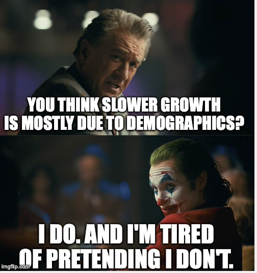
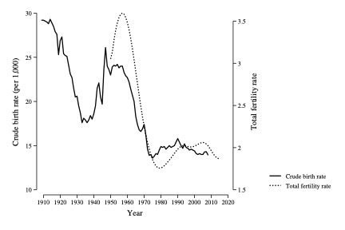
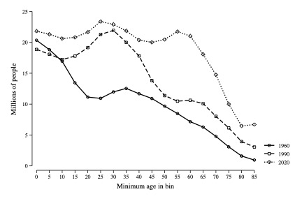

# Why is growth slowing down?
{: .no_toc }

1. TOC 
{:toc}

## 21st century slow growth
You may be vaguely aware of the complaint that the growth rate of GDP per capita (and of GDP) has slowed down. Here is the 10-year rolling growth rate of GDP per capita to illustrate when this really kicked in.

<iframe width="900" height="600" frameborder="0" scrolling="no" src="//plotly.com/~dvollrath/155.embed"></iframe>

From peaks of 2.5-3 percent per year in the 1960s, the growth rate of GDP per capita fell to below or around 1% during the 21st century. One thing to note here is that this predates the financial crisis of 2009 (or the coronavirus epidemic of 2020), and that growth was slowing down early in the 21st century. 

You can also see this in the log GDP per capita plot. In the 21st century the path of log GDP per capita dropped below the BGP it was on in the 20th century, apparently. So far we haven't returned to the old BGP, and hence it is worth wondering if this represents a permanent shift to a lower growth rate. 

<iframe width="900" height="600" frameborder="0" scrolling="no" src="//plotly.com/~dvollrath/61.embed"></iframe>

Let's think about what might be going on here. There are two possibilities, really. One, perhaps the growth rate of productivity, $g_A$, is now permanently lower. This might be the case if population growth slowed down (both in the US and around the world) meaning that the growth rate of researchers slowed down ($g_R$), and we are not innovating as quickly as before. Two, this might represent the beginnings of transitional growth to a lower BGP, but eventually we will return to a growth rate of GDP per capita around 1.8% once we get to that new, lower BGP.

I tend to favor the second option, as it isn't obvious (yet) that innovation slowed down. The evidence presented below suggests that what is going on is more of a one-time shift in demographics and the pattern of spending, and not some permanent change in how innovative we are as an economy. 

## Accounting for the slowdown
The first step here is to see what actually drove the slowdown. We can do this using the same kind of accounting that we did [here](https://growthecon.com/StudyGuide/solow/account.html). First, establish that the production function is

$$
y_t = \left(\frac{K_t}{Y_t}\right)^{\alpha/(1-\alpha)}h_t A_t
$$

and we can break down the growth rate of GDP per capita into 

$$
g_y = \frac{\alpha}{1-\alpha}g_{KY} + g_h + g_A.
$$

In what is about to follow, I'm going to do things over different periods. That is, I'll calculate the annualized growth rate of GDP per capita, $g_y$, from 1960-1970, say. And then I'll calculate the three growth rates on the right for the same periods, using $\alpha = 0.3$ as my assumption about the elasticity. 

| Period | $g_y$  | $\alpha/(1-\alpha)g_{KY}$ | $g_h$ | $g_A$ |
| :----- | :----- | :----- | :----- | :----- | 
|1950-2000 |     2.25|    -0.22|     0.96|     1.51 |
|          |         |         |         |          |
|1950-1960 |     1.78|     0.05|     0.08|     1.65 |
|1960-1970 |     2.92|    -0.21|     0.96|     2.16 |
|1970-1980 |     2.07|    -0.08|     1.63|     0.52 |
|1980-1990 |     2.32|    -0.37|     1.25|     1.44 |
|1990-2000 |     2.17|    -0.52|     0.88|     1.81 |
|          |         |         |         |          |
|2000-2016 |     1.03|    -0.13|    -0.14|     1.31 |
|2006-2016 |     0.67|    -0.15|    -0.25|     1.06 |
|1998-2008 |     1.62|    -0.09|     0.27|     1.43 |
|2000-2008 |     1.21|     0.05|     0.05|     1.11 |

The first line shows the accounting for the 20th century alone. Capital/output had a negative contribution, and growth was driven by a high rate of human capital growth (0.96) and productivity growth (1.51). As you step through the next few lines, you can see how things changed decade by deacde in the 20th century, with a surge of human capital growth in the 1970s and 1980s, and relatively high productivity growth in the 1960s and 1990s. 

The final four lines give you a few different takes on how the growth rate fell in the 21st century. From 2000-2016 the growth rate dropped to 1%, from 2.25% in the 20th, a drop of 1.25%. That is the overall growth slowdown that we can focus on. Note that this was driven by a significant drop in human capital growth, from 0.96 to *negative* 0.14 in the 21st century. By itself, that change in the human capital growth rate would have made the growth rate of GDP per capita decline by 1.1% per year. That is almost the entire growth slowdown we're talking about. Relative to that, there was a small decline in the productivity growth rate. 

The other few time periods, 2006-2016, 1998-2008, and 2000-2008 are there to illustrate that this was a distinct drop in growth throughtout the 21st century, and not simply a consequence of the financial crisis in 2009/10. *Prior* to the financial crisis, from 2000-2008, growth had slowed down, in large part due to slower human capital growth.

## Human capital changes
Okay, so why did human capital growth decline the way it did? Well, we can break down the growth rate of human capital similar to how we described it in [this section](human.html) of the study guide, with one additional tweak:

$$
h = e^{\gamma_S S + \gamma_X X}\frac{E}{L}\frac{Hours}{E}
$$

where the $Hours/E$ term accounts for the fact that the hours worked per employee may have changed over time. Otherwise $S$ is years of schooling, $X$ is years of experience (actually more complicated than that, but for this explanation keep it simple), and $E/L$ is the employment to population ratio. 

Take growth rates and you get

$$
g_h = \gamma_S \Delta S + \gamma_X \Delta_X + g_{E/L} + g_{H/E}
$$

and we can do a growth rate accounting same as before. Here you go:

| Period | $g_h$  | Education | Experience | E/L | Hours/E |
|1950-2000 |     0.96|     0.70|     0.05|     0.45|    -0.24|
|          |         |         |         |          |       |
|1950-1960 |     0.08|     0.62|     0.23|    -0.63|    -0.13|
|1960-1970 |     0.95|     0.87|    -0.18|     0.54|    -0.28|
|1970-1980 |     1.64|     0.92|    -0.27|     1.62|    -0.64|
|1980-1990 |     1.26|     0.57|     0.11|     0.70|    -0.12|
|1990-2000 |     0.88|     0.55|     0.35|     0.01|    -0.03|
|          |         |         |         |          |       |
|2000-2016 |    -0.15|     0.31|     0.08|    -0.35|    -0.19|
|2000-2008 |     0.06|     0.31|     0.18|    -0.09|    -0.34|

The *big* difference from the 20th to the 21st century was in the $E/L$ ratio, as it went from a positive 0.45 percentage point contribution to a *negative* 0.35 drag on growth. This means about 0.8 percentage points of the 1.25 points (or about two-thirds) slowdown were just due to fewer employees per person in the economy. What caused that? Aging.

The other contributor appears to be a slowdown in educational change, from 0.70 to 0.31. That is happening because high-school completion rates have plateaued (at about 85%) and college attendance rates have plateaued as well. 

## Demographic boom and bust
The big story here is that demographics are fundamentally changing the growth rate of GDP per capita. This is really the consequence of the Baby Boom in the 1940s-1960s and then the subsequent collapse in fertility rates that followed. It led to a surge of workers into the population in the mid-20th century and then a drop in the 21st. 

This figure shows two series on fertility. The dark line is the number of crude birth rate - children per 1,000 women - and you can see the Boom in the 1940s and 1950s. More relevant for the slowdown is the collapse in child/women into 1970 and afterwards. The dashed line is the total fertility rate, which accounts for age structure differences of women (e.g. crude births could be low if there are a lot of 5-15 year old girls). Even accounting for age structure, there is a distinc decline in fertility in the 1970s/1980s, and it has remained low. 

Okay, what consequence did this have? It changed the age structure across years, and in particular changed the fraction of the population that was of working age in different decades. 

This second figure shows the age structure in three different years. In 1960 note that there are *tons* of kids relative to older people. But there is a dip in working ages 20-65. This is when the Baby Boom are kids, and the distinct drop around 20-25 reflects lives missing due to World War II. 

Now look at 1990, thirty years later. The Boom in kids in 1960 has translated into a boom in working age population. So by 1990 the ratio of E/L expanded a *lot* as the Baby Boomers all were in the workforce. As they did *not* have a lot of kids, the E/L ratio remained large as they didn't fill in more people (kids). 

Which leaves us with 2020, where the consequences of this are now felt on the other end. The Boomers are now *leaving* the workforce (look at the 55-85 range) and while there are still a lot of people at younger ages, the proportion of the population that is of working age is *falling* as those Boomers leave. There is not another cohort that is filling in fast enough at the 20-year-old range to make up for retirements. 

The drop in growth from E/L declining from the 20th century to the 21st is primarily a consequence of the drying up of the demographic boom we had in the 20th. Growth was abnormally *high* in the 20th due to a one-time surge in E/L thanks to the Baby Boom. Growth is now abnormally *low* as they retire, and hence there is a big *drop* in the growth rate from the 20th to the 21st.

## Wait, something must be wrong
The demographic explanation works for a big part of the slowdown. It also tends to run counter to the narrative that the slowdown is due to something *wrong* with the economy: taxes, regulation, lack of innovation, trade, inequality, or whatever. All those things may be relevant to some small extent for growth (look at the section on government and taxes, or on trade, for example) but none of them have large effects. On the other hand, the demographic trends have *huge* effects that are kind of boring to think about, and so don't make for much of a narrative. 

I'll publicize myself here. My current book, [Fully Grown](https://amzn.to/3kCMKQc) is about exactly this subject - slowdowns and demographics. And there I explain more about why the demographic changes are really better seen as *successes* than failures. Why did fertility fall in the 1970s and 1980s? A couple of reasons. First, better access to contraceptives. The pill got approved for widespread use in the 1960s. This allowed women to manage their pregnancies, and that in part led to later marriage ages, and lower fertility. Second, higher living standards in general led to declines. All the available evidence is that as wages/incomes increase, people take advantage to have smaller families. Why? Because the returns to working are higher. People tend to work longer and build up more resources prior to marriage, and later marriage leads to lower fertility. So we're living with the consequences of a substantial increase in women's rights and family incomes during the 20th century. 

Okay, but for real, like isn't there *something* wrong? One common culpirt is a slowdown in innovation and productivity growth. One economist who argues for this is Robert Gordon. 

<iframe width="560" height="315" src="https://www.youtube.com/embed/PYHd7rpOTe8" frameborder="0" allow="accelerometer; autoplay; clipboard-write; encrypted-media; gyroscope; picture-in-picture" allowfullscreen></iframe>

He cites a few reasons beyond what we've discussed, but he doesn't account for the demographic changes and how important they are. 

It also relies a lot on the idea that *innovation* must be slow because GDP isn't growing very fast. That doesn't have to be true, however. This is a little debate between Gordon and an economist Eric Brynjolfsson about innovation in general, with Brynjolfsson being a lot more optimistic.

<iframe width="560" height="315" src="https://www.youtube.com/embed/ofWK5WglgiI" frameborder="0" allow="accelerometer; autoplay; clipboard-write; encrypted-media; gyroscope; picture-in-picture" allowfullscreen></iframe>

If Brynjolfsson is right, why don't we see faster economic growth? One reason is that we're just choosing to do different things with innovation. Here's what I mean. Think back to your production function, 

$$
Y = K^{\alpha} (AL)^{1-\alpha}.
$$

If $A$ goes up (through innovation), then what could we do? We *could* use the same amount of $K$ and $L$ as before, and because $A$ is higher, GDP would be higher. That is economic growth as we normally conceive of it. 

But what if we made a different choice? Again, let $A$ go up. But instead, what if we looked around and said "You know, we have enough stuff. Let's not increase GDP. Let's use *less* capital and labor"?  Hold $Y$ constant, and then an increase in $A$ could be used to *lower* K and L.

We already saw above that hours/employee were falling, and increased productivity could also be part of making people enter the workforce later or leave it earlier. We also saw that the capital/output ratio was *falling* over time. In short, we can take advantage of higher productivity to use *fewer* inputs. But if we do that, GDP *doesn't grow*. 

Are we better off? It depends on how you feel about input use. On some dimension, we must be better off. We have to set aside less of GDP to fund capital formation, and we have to work less. That sounds pretty good. And if we extended this to include resource use, then lower resource use could also be seen as a very good thing. 

Low growth doesn't necessarily mean failure. It *may* just mean that we are making different choices about how to manage the innovation we have. Add to that the demographic drag of Baby Boomers retiring, and you get slow economic growth. 